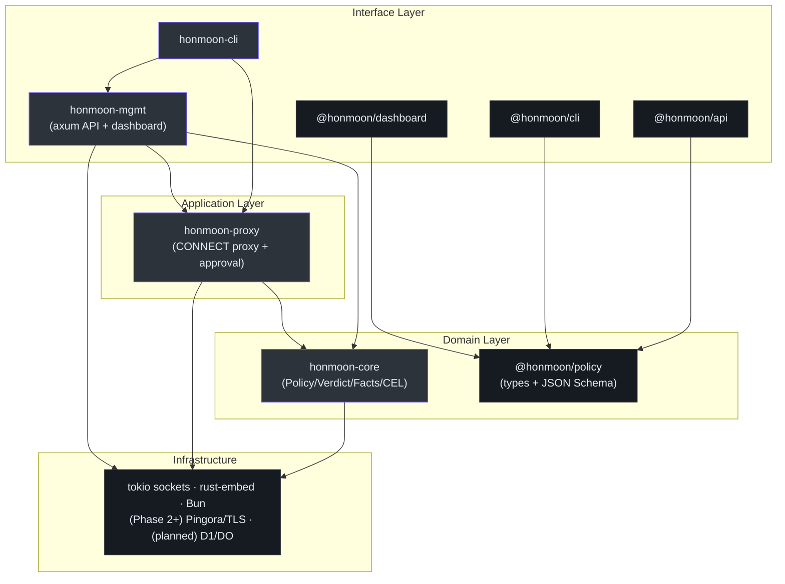
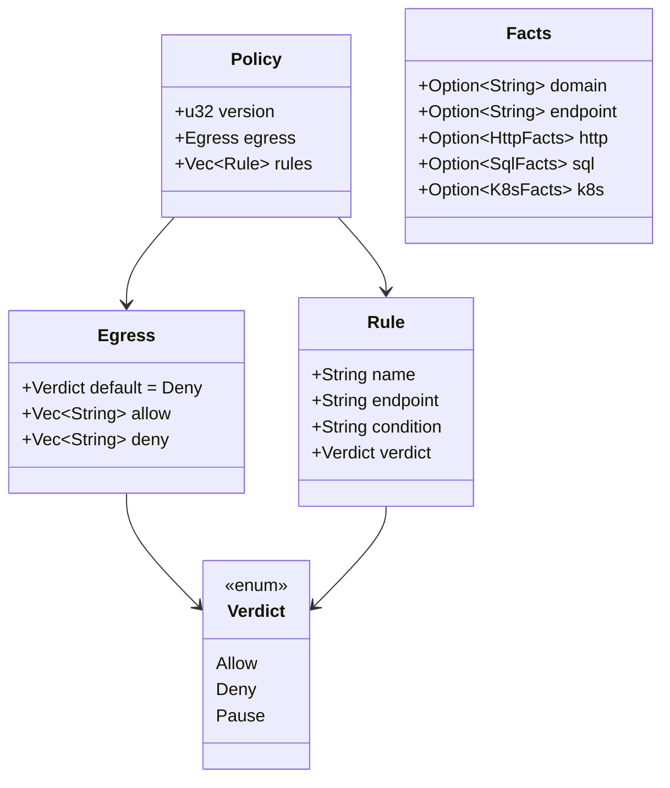
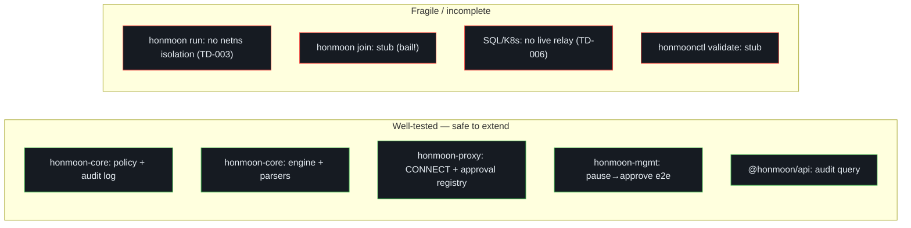

# Architecture

Honmoon is a monorepo that separates languages by responsibility: a **Rust data plane** that
touches the wire, and a **TypeScript/Bun control plane** plus a **React dashboard** that manage
and observe it. This page traces the dependency layers, the request lifecycle, and the
architectural invariants the codebase enforces. Everything here is grounded in
[ARCHITECTURE.md](https://github.com/pleaseai/honmoon/blob/master/ARCHITECTURE.md) and the source.

## At a glance

| Module | Responsibility | Key file | Plane | Source |
|--------|----------------|----------|-------|--------|
| `honmoon-core` | Policy model + `decide_explained()` + `audit` + protocol parsers | `src/lib.rs` | Data | [lib.rs](https://github.com/pleaseai/honmoon/blob/master/crates/honmoon-core/src/lib.rs) |
| `honmoon-proxy` | CONNECT egress proxy + `approval` (pause hold) | `src/gateway.rs` | Data | [gateway.rs](https://github.com/pleaseai/honmoon/blob/master/crates/honmoon-proxy/src/gateway.rs) |
| `honmoon-mgmt` | In-process axum management API + embedded dashboard | `src/lib.rs` | Data | [lib.rs](https://github.com/pleaseai/honmoon/blob/master/crates/honmoon-mgmt/src/lib.rs) |
| `honmoon-cli` | `honmoon` binary: `run` / `gateway` / `join` | `src/main.rs` | Data | [main.rs](https://github.com/pleaseai/honmoon/blob/master/crates/honmoon-cli/src/main.rs) |
| `@honmoon/policy` | TS policy types + runtime decision model + JSON Schema | `src/index.ts` | Control | [index.ts](https://github.com/pleaseai/honmoon/blob/master/packages/policy/src/index.ts) |
| `@honmoon/api` | Durable JSONL audit-query API (Bun.serve) | `src/audit.ts` | Control | [audit.ts](https://github.com/pleaseai/honmoon/blob/master/packages/api/src/audit.ts) |
| `@honmoon/cli` | `honmoonctl` control-plane CLI (stub) | `src/index.ts` | Control | [index.ts](https://github.com/pleaseai/honmoon/blob/master/packages/cli/src/index.ts) |
| `@honmoon/dashboard` | React SPA (overview/audit/policy/approvals) | `src/App.tsx` | UI | [App.tsx](https://github.com/pleaseai/honmoon/blob/master/apps/dashboard/src/App.tsx) |

## Dependency layers

Dependencies flow **downward only**. Lower layers must not import upper layers
([ARCHITECTURE.md:26-49](https://github.com/pleaseai/honmoon/blob/master/ARCHITECTURE.md#L26-L49)):


<!-- Sources: ARCHITECTURE.md:30-49, crates/honmoon-cli/src/main.rs:9-11, crates/honmoon-mgmt/src/lib.rs:25-27 -->

The critical invariant: **`honmoon-core` is transport-agnostic.** It has no `tokio` or
networking dependency — its `Cargo.toml` pulls only `serde`, `serde_json`, `serde_yaml`,
`thiserror`, `time`, `tracing`, and `cel-interpreter`. The proxy feeds it `Facts` and consumes a `Verdict`. This is
what lets the entire policy engine be unit-tested with zero I/O
([ARCHITECTURE.md:47-48](https://github.com/pleaseai/honmoon/blob/master/ARCHITECTURE.md#L47-L48), [tech-stack.md:18-19](https://github.com/pleaseai/honmoon/blob/master/.please/docs/knowledge/tech-stack.md#L18-L19)).

## The data-plane request lifecycle

A single agent request flows through three crates. The proxy owns the socket; the core owns the
decision; the parsers (in core) own fact extraction.

```mermaid
sequenceDiagram
  autonumber
  participant Agent
  participant Gateway as honmoon-proxy::gateway
  participant Parsers as honmoon-core::protocols
  participant Engine as honmoon-core::engine::decide
  participant Upstream
  Agent->>Gateway: CONNECT host:port (or wire bytes)
  Gateway->>Gateway: read head, canonicalize host
  opt protocol bytes available (Phase 3 parsers)
    Gateway->>Parsers: parse_postgres_query / parse_k8s_request
    Parsers-->>Gateway: SqlFacts / K8sFacts
  end
  Gateway->>Engine: decide(policy, Facts)
  Engine->>Engine: rules in order → CEL; else egress lists
  Engine-->>Gateway: Verdict (allow/deny/pause)
  alt Allow
    Gateway->>Upstream: TCP connect + copy_bidirectional
    Upstream-->>Agent: tunneled bytes
  else Deny / Pause
    Gateway-->>Agent: 403 Forbidden
  end
```
<!-- Sources: crates/honmoon-proxy/src/gateway.rs:62-112, crates/honmoon-core/src/engine.rs:19-28, crates/honmoon-core/src/protocols.rs:17-156 -->

::: tip What flows today vs later
Over a Phase 1 CONNECT tunnel the gateway sees only the **host** — it builds `Facts{domain,
http.host}` ([gateway.rs:81-92](https://github.com/pleaseai/honmoon/blob/master/crates/honmoon-proxy/src/gateway.rs#L81-L92)).
The `parse_*` steps above exist and are fully tested in `honmoon-core`, but are not yet wired to
a live socket relay (**TD-006**). So the "opt" block is engine-ready, not yet traffic-driven.
:::

## The dual policy model

The same policy is described twice — once in Rust, once in TypeScript — because each plane needs
it natively. They are kept in sync by hand (**TD-001**), with the JSON Schema as the intended
future single source of truth.


<!-- Sources: crates/honmoon-core/src/lib.rs:25-119, packages/policy/src/index.ts:7-31 -->

| Concept | Rust (`honmoon-core`) | TypeScript (`@honmoon/policy`) | Schema |
|---------|----------------------|-------------------------------|--------|
| Verdict | `enum Verdict` | `type Verdict` | `$defs/verdict` |
| Egress | `struct Egress` | `interface Egress` | `properties.egress` |
| Rule | `struct Rule` | `interface Rule` | `$defs/rule` |
| Policy | `struct Policy` | `interface Policy` | root object |

Sources: [lib.rs:14-70](https://github.com/pleaseai/honmoon/blob/master/crates/honmoon-core/src/lib.rs#L14-L70),
[index.ts:7-31](https://github.com/pleaseai/honmoon/blob/master/packages/policy/src/index.ts#L7-L31),
[policy.schema.json:23-39](https://github.com/pleaseai/honmoon/blob/master/packages/policy/schema/policy.schema.json#L23-L39).

## Architectural invariants

These are non-negotiable; violating them breaks the product
([ARCHITECTURE.md:82-100](https://github.com/pleaseai/honmoon/blob/master/ARCHITECTURE.md#L82-L100), [product-guidelines.md:19-27](https://github.com/pleaseai/honmoon/blob/master/.please/docs/knowledge/product-guidelines.md#L19-L27)):

| Invariant | What it means | Why | Source |
|-----------|---------------|-----|--------|
| **Fail closed** | Default egress verdict is `deny`; absence of a match never silently allows | A firewall that fails open is a no-op | [lib.rs:48-60](https://github.com/pleaseai/honmoon/blob/master/crates/honmoon-core/src/lib.rs#L48-L60) |
| **Data plane stays open source** | Anything inspecting traffic/credentials (`crates/*`) stays Apache-2.0 | Auditability is the trust that drives adoption | [ARCHITECTURE.md:87-89](https://github.com/pleaseai/honmoon/blob/master/ARCHITECTURE.md#L87-L89) |
| **`honmoon-core` is transport-agnostic** | No `tokio`/sockets/I/O in core | Embeddable + unit-testable | [ARCHITECTURE.md:91-93](https://github.com/pleaseai/honmoon/blob/master/ARCHITECTURE.md#L91-L93) |
| **Dual model stays in sync** | Rust + TS policy models match (TD-001) | One drifts → silent policy divergence | [ARCHITECTURE.md:95-97](https://github.com/pleaseai/honmoon/blob/master/ARCHITECTURE.md#L95-L97) |
| **No decryption surprises** | Extract only declared protocol facts at the wire | Trust; no DPI beyond what policy needs | [ARCHITECTURE.md:99-100](https://github.com/pleaseai/honmoon/blob/master/ARCHITECTURE.md#L99-L100) |

## Cross-cutting concerns

| Concern | Rust | TypeScript | Source |
|---------|------|-----------|--------|
| Error handling | `thiserror` (libs) · `anyhow` (binary); unimplemented modes `bail!` | — | [lib.rs:128-132](https://github.com/pleaseai/honmoon/blob/master/crates/honmoon-core/src/lib.rs#L128-L132), [main.rs:58-60](https://github.com/pleaseai/honmoon/blob/master/crates/honmoon-cli/src/main.rs#L58-L60) |
| Logging | `tracing` + `tracing-subscriber` (`RUST_LOG`) | `console` / Bun | [main.rs:46-48](https://github.com/pleaseai/honmoon/blob/master/crates/honmoon-cli/src/main.rs#L46-L48) |
| Testing | inline `#[cfg(test)]` + integration (`egress.rs`) + e2e (`honmoon-mgmt/tests/e2e.rs`) | `bun test` (`@honmoon/api` audit query) | [engine.rs](https://github.com/pleaseai/honmoon/blob/master/crates/honmoon-core/src/engine.rs), [audit.test.ts](https://github.com/pleaseai/honmoon/blob/master/packages/api/src/audit.test.ts) |
| Configuration | YAML policy, central `[workspace.dependencies]` | root `package.json` workspaces | [Cargo.toml:16-28](https://github.com/pleaseai/honmoon/blob/master/Cargo.toml#L16-L28) |

## Quality map

What is safe to extend versus fragile/incomplete, per
[ARCHITECTURE.md:117-129](https://github.com/pleaseai/honmoon/blob/master/ARCHITECTURE.md#L117-L129):


<!-- Sources: ARCHITECTURE.md:123-131, .please/docs/tracks/tech-debt-tracker.md:9-14 -->

## Related Pages

- [Policy Model & Decision Engine](/deep-dive/policy-engine) — the `decide()` algorithm in detail.
- [Egress Gateway (Data Plane)](/deep-dive/egress-gateway) — the proxy that owns the socket.
- [Control Plane & Dashboard](/deep-dive/control-plane) — the management API, audit query, and dashboard.
- [Roadmap & Open-Core Model](/deep-dive/roadmap-open-core) — the layering's monetization rationale.

## References

- [ARCHITECTURE.md](https://github.com/pleaseai/honmoon/blob/master/ARCHITECTURE.md)
- [.please/docs/knowledge/tech-stack.md](https://github.com/pleaseai/honmoon/blob/master/.please/docs/knowledge/tech-stack.md)
- [crates/honmoon-core/src/lib.rs](https://github.com/pleaseai/honmoon/blob/master/crates/honmoon-core/src/lib.rs)
- [.please/docs/tracks/tech-debt-tracker.md](https://github.com/pleaseai/honmoon/blob/master/.please/docs/tracks/tech-debt-tracker.md)
