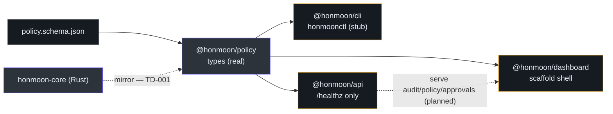
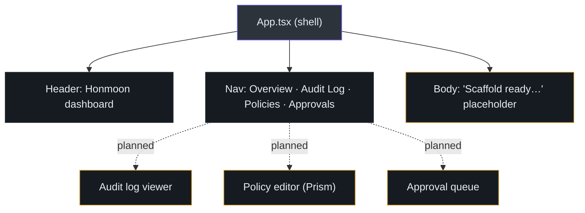
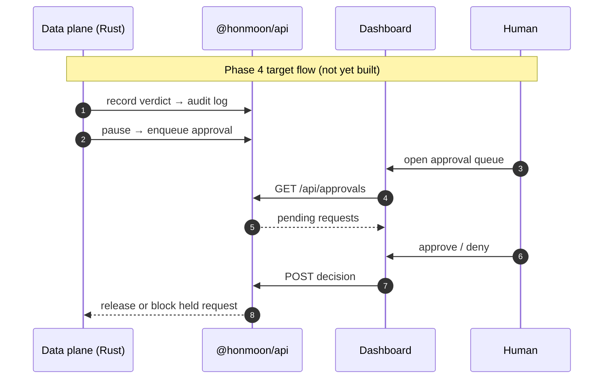

# Control Plane & Dashboard (Scaffold)

The control plane is the TypeScript half of the monorepo: policy types, a control-plane CLI, a
management/audit API, and a React dashboard. **Today these are scaffolds.** The data plane
(Rust) enforces policy; the control plane is where teams will *manage and observe* it, and most
of that surface is still `TODO`. This page documents what exists, marked honestly, so you can
tell shipped behavior from intent.

::: warning Read this first
Everything on this page is <span class="status-planned">scaffold / stub</span> unless explicitly
marked otherwise. The policy **types** are real and used; the API serves only `/healthz`; the
CLI `validate` does not yet validate; the dashboard is a placeholder shell. The CI JS job runs
lint/typecheck/build but no tests ([ci.yml:49-70](https://github.com/pleaseai/honmoon/blob/master/.github/workflows/ci.yml#L49-L70)).
:::

## At a glance

| Package | Purpose | Status | Key file | Source |
|---------|---------|--------|----------|--------|
| `@honmoon/policy` | Policy TS types + JSON Schema | <span class="status-done">used</span> (types) · schema not yet enforced in TS | `src/index.ts` | [index.ts](https://github.com/pleaseai/honmoon/blob/master/packages/policy/src/index.ts) |
| `@honmoon/cli` | `honmoonctl` control-plane CLI | <span class="status-planned">stub</span> | `src/index.ts` | [index.ts](https://github.com/pleaseai/honmoon/blob/master/packages/cli/src/index.ts) |
| `@honmoon/api` | Management & audit API (Bun.serve) | <span class="status-planned">`/healthz` only</span> | `src/index.ts` | [index.ts](https://github.com/pleaseai/honmoon/blob/master/packages/api/src/index.ts) |
| `@honmoon/dashboard` | React SPA | <span class="status-planned">scaffold shell</span> | `src/App.tsx` | [App.tsx](https://github.com/pleaseai/honmoon/blob/master/apps/dashboard/src/App.tsx) |


<!-- Sources: packages/policy/src/index.ts:1-31, packages/api/src/index.ts:1-22, packages/cli/src/index.ts:1-31, apps/dashboard/src/App.tsx:1-38 -->

## `@honmoon/policy` — the one real piece

This package is the TypeScript mirror of the Rust policy model. It exports `Verdict`, `Egress`,
`Rule`, and `Policy` types plus a `DEFAULT_EGRESS_VERDICT` constant, and ships the canonical
JSON Schema used by editors and (eventually) by validators
([index.ts:7-31](https://github.com/pleaseai/honmoon/blob/master/packages/policy/src/index.ts#L7-L31)).

```typescript
export type Verdict = 'allow' | 'deny' | 'pause'

export interface Rule {
  name: string
  endpoint: string
  condition: string   // CEL, e.g. "sql.verb == 'DROP'"
  verdict: Verdict
}

export const DEFAULT_EGRESS_VERDICT: Verdict = 'deny'
```

::: tip Dual model, kept in sync by hand (TD-001)
The file's own header says it all: *"Mirrors the Rust model in `crates/honmoon-core`. Keep the
two in sync."* ([index.ts:1-5](https://github.com/pleaseai/honmoon/blob/master/packages/policy/src/index.ts#L1-L5)).
The long-term fix is to generate both from the JSON Schema as the single source of truth.
:::

## `@honmoon/cli` — `honmoonctl` (stub)

`honmoonctl` is the intended control-plane CLI for policy tooling and talking to a running
gateway's API — distinct from the Rust `honmoon` data-plane binary
([cli/src/index.ts:1-8](https://github.com/pleaseai/honmoon/blob/master/packages/cli/src/index.ts#L1-L8)). It dispatches one
command, `validate`, which today reads the file but does **not** parse YAML or check the schema —
the validation is an explicit `TODO` ([cli/src/index.ts:14-23](https://github.com/pleaseai/honmoon/blob/master/packages/cli/src/index.ts#L14-L23)):

```typescript
async function validate(path: string | undefined): Promise<void> {
  // …
  const text = await Bun.file(path).text()
  // TODO: parse YAML + validate against @honmoon/policy/schema.
  const policy = text as unknown as Policy
  console.log(`validated ${path}`, policy ? '' : '')
}
```

## `@honmoon/api` — management & audit API (`/healthz` only)

The API is a Bun-native HTTP server. Its docstring describes its destiny — serve the audit log,
approval queue, and policy endpoints for the dashboard — but the implementation answers only
`/healthz`; the real routes are a `TODO`
([api/src/index.ts:1-20](https://github.com/pleaseai/honmoon/blob/master/packages/api/src/index.ts#L1-L20)):

| Route | Status | Source |
|-------|--------|--------|
| `GET /healthz` | <span class="status-done">works</span> → `{status:'ok'}` | [api/src/index.ts:13-15](https://github.com/pleaseai/honmoon/blob/master/packages/api/src/index.ts#L13-L15) |
| `GET /api/audit` | <span class="status-planned">TODO</span> | [api/src/index.ts:16](https://github.com/pleaseai/honmoon/blob/master/packages/api/src/index.ts#L16) |
| `GET /api/approvals` | <span class="status-planned">TODO</span> | [api/src/index.ts:16](https://github.com/pleaseai/honmoon/blob/master/packages/api/src/index.ts#L16) |
| `GET /api/policy` | <span class="status-planned">TODO</span> | [api/src/index.ts:16](https://github.com/pleaseai/honmoon/blob/master/packages/api/src/index.ts#L16) |

The port comes from `HONMOON_API_PORT` (default `8443`)
([api/src/index.ts:8](https://github.com/pleaseai/honmoon/blob/master/packages/api/src/index.ts#L8)).

## `@honmoon/dashboard` — React SPA (scaffold shell)

The dashboard is a React + Vite + Tailwind SPA. Today `App.tsx` renders a header, a static nav
(`Overview`, `Audit Log`, `Policies`, `Approvals`), and a placeholder body that literally reads
*"Scaffold ready. Wire up audit log, policy editor, and approval queue here."*
([App.tsx:1-36](https://github.com/pleaseai/honmoon/blob/master/apps/dashboard/src/App.tsx#L1-L36)).


<!-- Sources: apps/dashboard/src/App.tsx:1-38, .please/docs/knowledge/product-guidelines.md:28-33 -->

The planned UX — audit log viewer, syntax-highlighted policy editor, approval queue, light/dark
aware, data density over decoration — is documented in
[product-guidelines.md:28-33](https://github.com/pleaseai/honmoon/blob/master/.please/docs/knowledge/product-guidelines.md#L28-L33).
The built SPA is planned to be embedded into the Rust binary via `rust-embed` and served by the
management API (Phase 4, [roadmap.md:81-89](https://github.com/pleaseai/honmoon/blob/master/docs/roadmap.md#L81-L89)).

## How this becomes real (Phase 4)


<!-- Sources: docs/roadmap.md:81-89, packages/api/src/index.ts:16 -->

## Engineering conventions (TypeScript)

| Convention | Value | Source |
|-----------|-------|--------|
| Runtime / package manager | Bun 1.x | [tech-stack.md:45-46](https://github.com/pleaseai/honmoon/blob/master/.please/docs/knowledge/tech-stack.md#L45-L46) |
| Module system | ESM only, `verbatimModuleSyntax` | [product-guidelines.md:38-40](https://github.com/pleaseai/honmoon/blob/master/.please/docs/knowledge/product-guidelines.md#L38-L40) |
| TS strictness | `strict: true` | [product-guidelines.md:38-40](https://github.com/pleaseai/honmoon/blob/master/.please/docs/knowledge/product-guidelines.md#L38-L40) |
| Lint | `@pleaseai/eslint-config` + React plugins | [package.json:18-25](https://github.com/pleaseai/honmoon/blob/master/package.json#L18-L25) |

## Related Pages

- [Architecture](/deep-dive/architecture) — where the control plane sits in the layering.
- [Policy Authoring](/getting-started/policy-authoring) — the policy types this plane exposes.
- [Roadmap & Open-Core Model](/deep-dive/roadmap-open-core) — why the control plane is the paid boundary.

## References

- [packages/policy/src/index.ts](https://github.com/pleaseai/honmoon/blob/master/packages/policy/src/index.ts)
- [packages/cli/src/index.ts](https://github.com/pleaseai/honmoon/blob/master/packages/cli/src/index.ts)
- [packages/api/src/index.ts](https://github.com/pleaseai/honmoon/blob/master/packages/api/src/index.ts)
- [apps/dashboard/src/App.tsx](https://github.com/pleaseai/honmoon/blob/master/apps/dashboard/src/App.tsx)
- [.please/docs/knowledge/tech-stack.md](https://github.com/pleaseai/honmoon/blob/master/.please/docs/knowledge/tech-stack.md)
