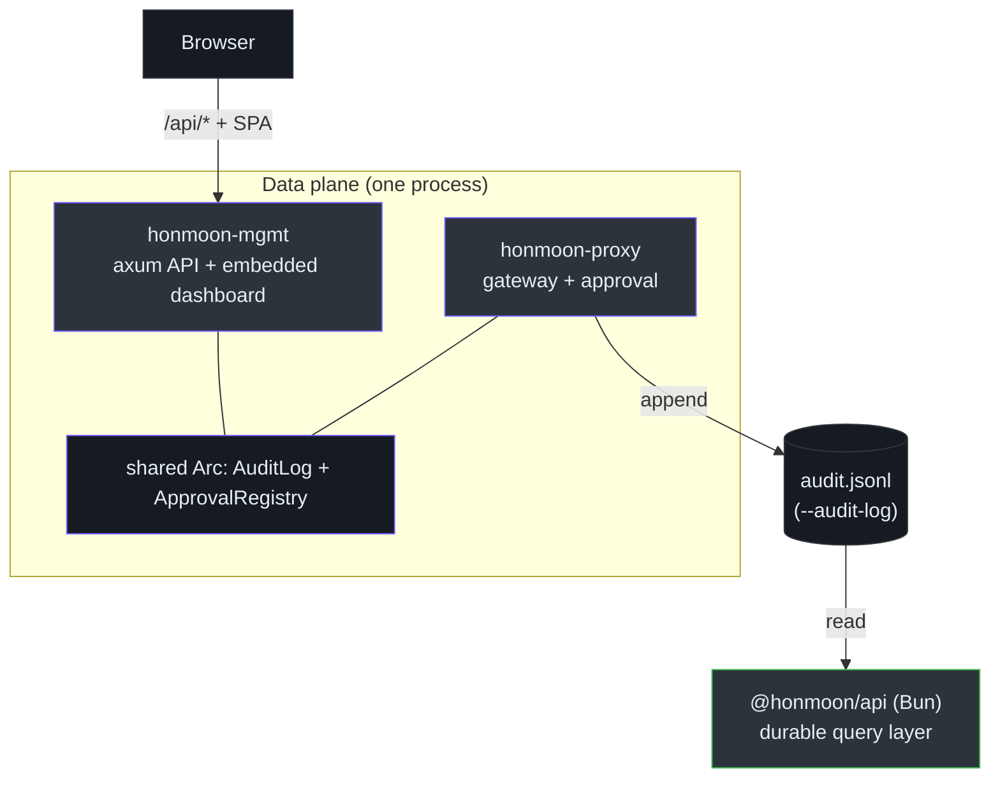
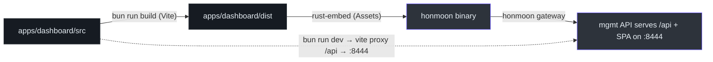
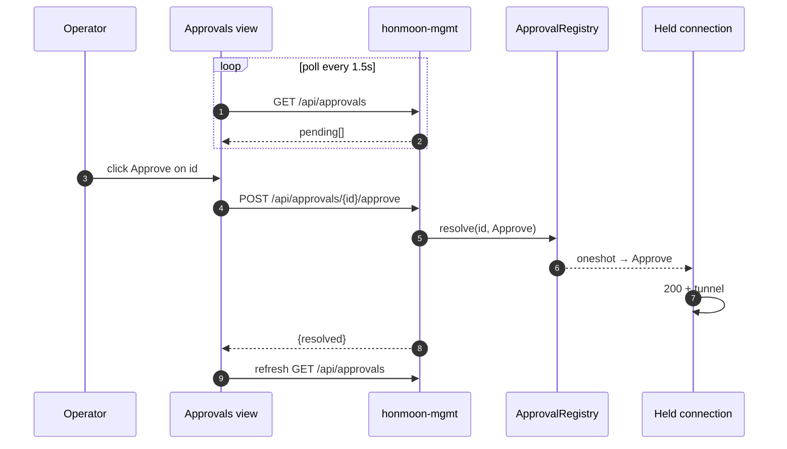

# Control Plane & Dashboard

The control plane is how a human **observes and operates** the data plane: it surfaces the audit
log, lists requests held for approval, lets an operator approve or reject them, and shows the
active policy. As of **Phase 4** this is real — not a scaffold. It spans two services and a React
dashboard, grounded in `crates/honmoon-mgmt`, `packages/api`, and `apps/dashboard`.

::: tip Two management surfaces, by design
There are **two** API surfaces, and the split is deliberate:
- **`honmoon-mgmt`** (Rust, axum) runs **in-process with the data plane** — it can both read the
  live audit ring and *resolve* held requests (which wakes the waiting connection). It also serves
  the embedded dashboard. This is what `honmoon gateway` exposes.
- **`@honmoon/api`** (TypeScript, Bun) is the **durable / historical** query layer over the JSONL
  audit file the gateway writes — read-only, offline-capable, no approval power.
:::

## At a glance

| Component | Purpose | Status | Key file | Source |
|-----------|---------|--------|----------|--------|
| `honmoon-mgmt` | In-process axum API + embedded dashboard; audit ring + approval resolution | Phase 4, tested | `src/lib.rs` | [lib.rs](https://github.com/pleaseai/honmoon/blob/main/crates/honmoon-mgmt/src/lib.rs) |
| `@honmoon/policy` | Policy types **+ runtime decision model** (AuditEvent, PendingApproval, Decision) | used | `src/index.ts` | [index.ts](https://github.com/pleaseai/honmoon/blob/main/packages/policy/src/index.ts) |
| `@honmoon/api` | Durable JSONL audit-log query API (`/api/audit`, `/api/audit/stats`) | Phase 4, tested | `src/audit.ts` | [audit.ts](https://github.com/pleaseai/honmoon/blob/main/packages/api/src/audit.ts) |
| `@honmoon/dashboard` | React SPA: Overview, Audit Log, Policies, Approvals | Phase 4 | `src/App.tsx` | [App.tsx](https://github.com/pleaseai/honmoon/blob/main/apps/dashboard/src/App.tsx) |
| `@honmoon/cli` | `honmoonctl` — policy validate/lint | `validate` still a TODO stub | `src/index.ts` | [index.ts](https://github.com/pleaseai/honmoon/blob/main/packages/cli/src/index.ts) |

<!-- Sources: crates/honmoon-mgmt/src/lib.rs:1-75, crates/honmoon-proxy/src/gateway.rs:34-59, packages/api/src/index.ts:1-18 -->

## `honmoon-mgmt` — the in-process management API

`honmoon-mgmt` is a small [axum](https://github.com/tokio-rs/axum) service that runs **in the same
process as the data plane**, so it can observe decisions and resolve held requests through the
shared `GatewayState`. `honmoon gateway` runs the proxy and this API on one tokio runtime
([lib.rs:1-16](https://github.com/pleaseai/honmoon/blob/main/crates/honmoon-mgmt/src/lib.rs#L1-L16), [main.rs:78-128](https://github.com/pleaseai/honmoon/blob/main/crates/honmoon-cli/src/main.rs#L78-L128)).

| Route | Method | Returns | Source |
|-------|--------|---------|--------|
| `/api/audit?limit=N` | GET | Recent audit events, newest first (default 200, cap 1000) | [lib.rs:86-93](https://github.com/pleaseai/honmoon/blob/main/crates/honmoon-mgmt/src/lib.rs#L86-L93) |
| `/api/approvals` | GET | Requests held pending approval | [lib.rs:95-97](https://github.com/pleaseai/honmoon/blob/main/crates/honmoon-mgmt/src/lib.rs#L95-L97) |
| `/api/approvals/{id}/approve` | POST | Resolve → wakes the held connection | [lib.rs:104-106](https://github.com/pleaseai/honmoon/blob/main/crates/honmoon-mgmt/src/lib.rs#L104-L106) |
| `/api/approvals/{id}/reject` | POST | Resolve → blocks the held connection | [lib.rs:108-110](https://github.com/pleaseai/honmoon/blob/main/crates/honmoon-mgmt/src/lib.rs#L108-L110) |
| `/api/policy` | GET | Active policy (raw YAML + parsed) | [lib.rs:129-134](https://github.com/pleaseai/honmoon/blob/main/crates/honmoon-mgmt/src/lib.rs#L129-L134) |
| `/healthz` | GET | `{status:"ok"}` | [lib.rs:77-79](https://github.com/pleaseai/honmoon/blob/main/crates/honmoon-mgmt/src/lib.rs#L77-L79) |
| anything else | — | Embedded dashboard (SPA fallback) | [lib.rs:138-168](https://github.com/pleaseai/honmoon/blob/main/crates/honmoon-mgmt/src/lib.rs#L138-L168) |

One careful detail: the SPA fallback **refuses to mask an unmatched `/api/...` path as `200 text/html`**
— those 404 honestly, so a failed management action is never hidden behind the dashboard shell
([lib.rs:142-146](https://github.com/pleaseai/honmoon/blob/main/crates/honmoon-mgmt/src/lib.rs#L142-L146)).

## The embedded dashboard pipeline

The dashboard is built by Vite into `apps/dashboard/dist`, then compiled **into the Rust binary**
with `rust-embed` so a single binary serves both policy enforcement and its UI
([lib.rs:30-36](https://github.com/pleaseai/honmoon/blob/main/crates/honmoon-mgmt/src/lib.rs#L30-L36)). A `build.rs` drops a
placeholder `index.html` when `dist/` is absent so a bare `cargo build` always succeeds before the
dashboard is built ([build.rs:1-36](https://github.com/pleaseai/honmoon/blob/main/crates/honmoon-mgmt/build.rs#L1-L36)).

<!-- Sources: crates/honmoon-mgmt/build.rs:1-36, apps/dashboard/vite.config.ts:1-21, crates/honmoon-mgmt/src/lib.rs:30-36 -->

In `vite dev`, API calls are proxied to a locally-running gateway's management API on
`127.0.0.1:8444`, so the UI and the binary can iterate independently
([vite.config.ts:13-20](https://github.com/pleaseai/honmoon/blob/main/apps/dashboard/vite.config.ts#L13-L20)).

## The dashboard — four live views

`App.tsx` is a tab shell over four views, with a live pending-approval count driving a sidebar
badge (polled every 1.5s) ([App.tsx:9-62](https://github.com/pleaseai/honmoon/blob/main/apps/dashboard/src/App.tsx#L9-L62)):

| View | Shows | Source |
|------|-------|--------|
| Overview | Decision counts / activity summary | [Overview.tsx](https://github.com/pleaseai/honmoon/blob/main/apps/dashboard/src/components/Overview.tsx) |
| Audit Log | Recent `AuditEvent`s | [AuditLog.tsx](https://github.com/pleaseai/honmoon/blob/main/apps/dashboard/src/components/AuditLog.tsx) |
| Policies | Active policy (Prism-highlighted YAML) | [PolicyView.tsx](https://github.com/pleaseai/honmoon/blob/main/apps/dashboard/src/components/PolicyView.tsx) |
| Approvals | Held requests with Approve / Deny buttons | [Approvals.tsx](https://github.com/pleaseai/honmoon/blob/main/apps/dashboard/src/components/Approvals.tsx) |

Data flows through a typed client (`api.ts`) and a `usePolling` hook that guards against
overlapping/stale responses ([api.ts:1-49](https://github.com/pleaseai/honmoon/blob/main/apps/dashboard/src/api.ts#L1-L49), [hooks.ts:18-60](https://github.com/pleaseai/honmoon/blob/main/apps/dashboard/src/hooks.ts#L18-L60)).

<!-- Sources: apps/dashboard/src/components/Approvals.tsx:7-71, crates/honmoon-mgmt/src/lib.rs:104-121, crates/honmoon-proxy/src/approval.rs:148-160 -->

## `@honmoon/api` — the durable audit-query layer

The Rust management API serves the **live, in-memory** ring (bounded, process-local). For
durable, historical queries `@honmoon/api` reads the **JSONL file** the gateway writes with
`--audit-log`. It is pure-function query logic (`audit.ts`) wired to `Bun.serve` (`index.ts`)
([audit.ts:1-9](https://github.com/pleaseai/honmoon/blob/main/packages/api/src/audit.ts#L1-L9)):

| Route | Filters | Source |
|-------|---------|--------|
| `GET /api/audit` | `limit`, `decision`, `since`, `domain` | [audit.ts:43-72](https://github.com/pleaseai/honmoon/blob/main/packages/api/src/audit.ts#L43-L72), [index.ts:45-48](https://github.com/pleaseai/honmoon/blob/main/packages/api/src/index.ts#L45-L48) |
| `GET /api/audit/stats` | counts by decision | [audit.ts:74-83](https://github.com/pleaseai/honmoon/blob/main/packages/api/src/audit.ts#L74-L83) |
| `GET /healthz` | — | [index.ts:41-43](https://github.com/pleaseai/honmoon/blob/main/packages/api/src/index.ts#L41-L43) |

Two correctness details worth noting: results are sorted **by timestamp, not id** (ids restart
from 1 after a gateway restart, so a reused JSONL file would otherwise misorder)
([audit.ts:59-69](https://github.com/pleaseai/honmoon/blob/main/packages/api/src/audit.ts#L59-L69)), and a 1-second read cache coalesces
polling bursts ([index.ts:20-34](https://github.com/pleaseai/honmoon/blob/main/packages/api/src/index.ts#L20-L34)). This is the repo's
**first real TypeScript test suite** — `audit.test.ts` ([audit.test.ts](https://github.com/pleaseai/honmoon/blob/main/packages/api/src/audit.test.ts)).

## `@honmoon/policy` — now carries the runtime model

Beyond the policy types, `@honmoon/policy` now also exports the **runtime decision model** that
the management API serializes and the dashboard/query layer consume — mirroring
`honmoon-core::audit` and `honmoon-proxy::approval` ([index.ts:33-92](https://github.com/pleaseai/honmoon/blob/main/packages/policy/src/index.ts#L33-L92)):

| Type | Mirrors (Rust) |
|------|----------------|
| `Decision` (`allowed`/`denied`/`paused`/`approved`/`rejected`) | `honmoon_core::audit::Decision` |
| `AuditEvent`, `FactsSummary`, `HttpFacts`/`SqlFacts`/`K8sFacts` | `honmoon_core::audit::*` |
| `PendingApproval` | `honmoon_proxy::approval::PendingApproval` |

::: warning Still hand-synced (TD-001)
The dual model now spans the **runtime types too**, so TD-001 (Rust↔TS sync) covers more surface.
The JSON Schema remains the intended single source of truth.
:::

## What's still a stub

`honmoonctl validate` continues to read the file without parsing/validating it — an explicit
`TODO` ([cli/src/index.ts:14-23](https://github.com/pleaseai/honmoon/blob/main/packages/cli/src/index.ts#L14-L23)). Policy validation in practice happens
via the editor JSON Schema and the Rust `Policy::from_yaml` loader.

## Related Pages

- [Egress Gateway (Data Plane)](/deep-dive/egress-gateway) — where decisions are made, audited, and held.
- [Policy Model & Decision Engine](/deep-dive/policy-engine) — `decide_explained()` and the audit `Decision`.
- [Roadmap & Open-Core Model](/deep-dive/roadmap-open-core) — why control-plane scale is the paid boundary.

## References

- [crates/honmoon-mgmt/src/lib.rs](https://github.com/pleaseai/honmoon/blob/main/crates/honmoon-mgmt/src/lib.rs)
- [packages/api/src/audit.ts](https://github.com/pleaseai/honmoon/blob/main/packages/api/src/audit.ts)
- [packages/policy/src/index.ts](https://github.com/pleaseai/honmoon/blob/main/packages/policy/src/index.ts)
- [apps/dashboard/src/App.tsx](https://github.com/pleaseai/honmoon/blob/main/apps/dashboard/src/App.tsx)
- [crates/honmoon-mgmt/build.rs](https://github.com/pleaseai/honmoon/blob/main/crates/honmoon-mgmt/build.rs)
