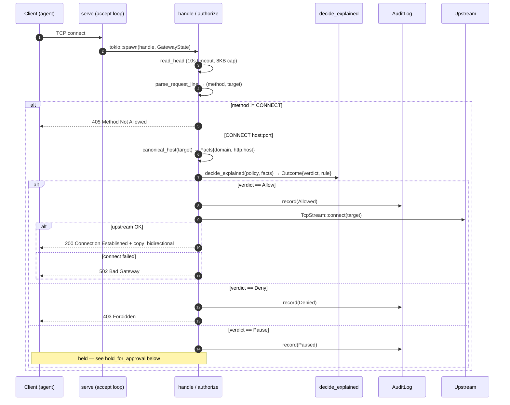
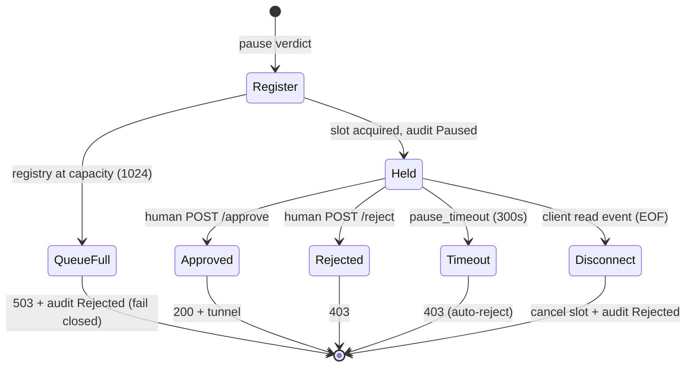
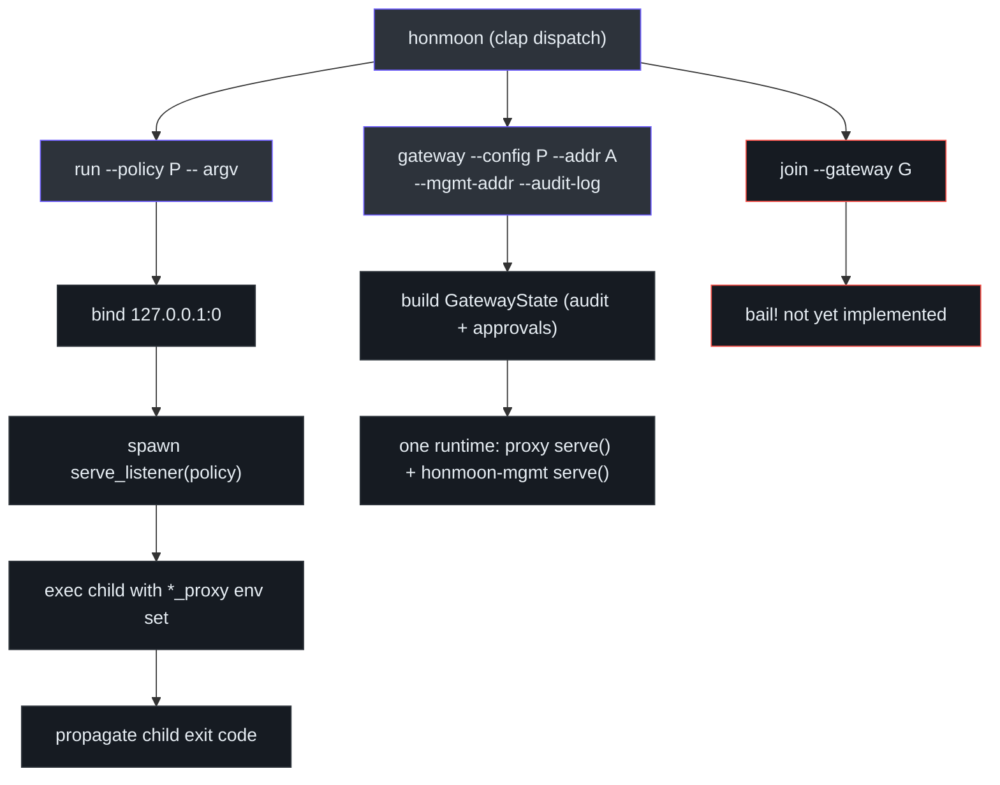

# Egress Gateway (Data Plane)

The egress gateway is the part of Honmoon that actually owns a socket. It is a **terminating
HTTP `CONNECT` forward proxy** implemented directly on tokio in `honmoon-proxy::gateway`, plus
the `honmoon-cli` wiring that runs it. An agent points `https_proxy` at the gateway, and only
policy-allowed hosts are reachable. Since **Phase 4** the gateway also **records every decision
to the audit log** and, for a `pause` verdict, **holds the connection pending human approval**
([gateway.rs:1-11](https://github.com/pleaseai/honmoon/blob/main/crates/honmoon-proxy/src/gateway.rs#L1-L11), [gateway.rs:164-201](https://github.com/pleaseai/honmoon/blob/main/crates/honmoon-proxy/src/gateway.rs#L164-L201)).

## At a glance

| Element | Role | Source |
|---------|------|--------|
| `GatewayState` | Shared `Arc`s: policy + `AuditLog` + `ApprovalRegistry` + pause timeout | [gateway.rs:34-59](https://github.com/pleaseai/honmoon/blob/main/crates/honmoon-proxy/src/gateway.rs#L34-L59) |
| `run(policy, addr)` | Bind `addr`, serve forever | [gateway.rs:62-65](https://github.com/pleaseai/honmoon/blob/main/crates/honmoon-proxy/src/gateway.rs#L62-L65) |
| `serve_listener(policy, listener)` | Serve a pre-bound listener (no TOCTOU) | [gateway.rs:71-74](https://github.com/pleaseai/honmoon/blob/main/crates/honmoon-proxy/src/gateway.rs#L71-L74) |
| `serve_listener_with_state` / `serve` | Serve with caller-provided shared state (used by `honmoon gateway`) | [gateway.rs:78-109](https://github.com/pleaseai/honmoon/blob/main/crates/honmoon-proxy/src/gateway.rs#L78-L109) |
| `handle(client, state)` | One connection: parse → authorize → tunnel | [gateway.rs:112-162](https://github.com/pleaseai/honmoon/blob/main/crates/honmoon-proxy/src/gateway.rs#L112-L162) |
| `authorize` | Decide + audit; routes `pause` to the hold | [gateway.rs:169-201](https://github.com/pleaseai/honmoon/blob/main/crates/honmoon-proxy/src/gateway.rs#L169-L201) |
| `hold_for_approval` | Register, wait for human/timeout/disconnect, audit resolution | [gateway.rs:206-](https://github.com/pleaseai/honmoon/blob/main/crates/honmoon-proxy/src/gateway.rs#L206) |
| `read_head` / `canonical_host` | Slowloris-guarded head read; host canonicalization | [gateway.rs](https://github.com/pleaseai/honmoon/blob/main/crates/honmoon-proxy/src/gateway.rs) |

## Why a hand-rolled tokio proxy (and not Pingora)

The original plan ([ADR-0001](https://github.com/pleaseai/honmoon/blob/main/.please/docs/decisions/0001-adopt-pingora-http-data-plane.md))
was to build the data plane on Cloudflare's Pingora. During Phase 1 implementation that premise
was tested against Pingora 0.8.1 and **disproven** for this use case
([ADR-0002](https://github.com/pleaseai/honmoon/blob/main/.please/docs/decisions/0002-phase1-connect-proxy-on-tokio.md)):

| Finding | Consequence |
|---------|-------------|
| Pingora's `HttpProxy` is reverse-proxy oriented; rejects absolute-form targets | Not a forward proxy |
| `allow_connect_method_proxying` does proxy **chaining**, not terminating tunnels | Wrong CONNECT semantics |
| A terminating CONNECT proxy at host/SNI level needs no HTTP modeling | ~130 LOC suffices |

Decision: ship Phase 1 on raw tokio; **defer** Pingora (and its heavy dependency) to the phase
that terminates TLS and inspects HTTP requests, where its hooks actually pay off (YAGNI)
([ADR-0002:32-44](https://github.com/pleaseai/honmoon/blob/main/.please/docs/decisions/0002-phase1-connect-proxy-on-tokio.md#L32-L44)).

## Connection handling

`serve` accepts connections in a loop and spawns a task per connection, sharing the
`GatewayState` (policy + audit + approvals) via `Arc`. Each task runs `handle`, which parses the
CONNECT head, then calls `authorize` to decide, audit, and — for `pause` — hold
([gateway.rs:89-162](https://github.com/pleaseai/honmoon/blob/main/crates/honmoon-proxy/src/gateway.rs#L89-L162)).

<!-- Sources: crates/honmoon-proxy/src/gateway.rs:42-112 -->

## Robustness details

The proxy is small but defensive — several deliberate guards
([gateway.rs:20-22](https://github.com/pleaseai/honmoon/blob/main/crates/honmoon-proxy/src/gateway.rs#L20-L22), [gateway.rs:114-161](https://github.com/pleaseai/honmoon/blob/main/crates/honmoon-proxy/src/gateway.rs#L114-L161)):

| Guard | Mechanism | Source |
|-------|-----------|--------|
| Slowloris | 10s `HEAD_READ_TIMEOUT` on reading the request head → `408` | [gateway.rs:21-22](https://github.com/pleaseai/honmoon/blob/main/crates/honmoon-proxy/src/gateway.rs#L21-L22), [gateway.rs:64-67](https://github.com/pleaseai/honmoon/blob/main/crates/honmoon-proxy/src/gateway.rs#L64-L67) |
| Oversized head | 8 KB `MAX_REQUEST_HEAD` cap → reject as `400` | [gateway.rs:20](https://github.com/pleaseai/honmoon/blob/main/crates/honmoon-proxy/src/gateway.rs#L20), [gateway.rs:131-133](https://github.com/pleaseai/honmoon/blob/main/crates/honmoon-proxy/src/gateway.rs#L131-L133) |
| Tunnel-byte safety | `read_head` reads one byte at a time, stops at `\r\n\r\n` — never consumes tunnel bytes | [gateway.rs:119-135](https://github.com/pleaseai/honmoon/blob/main/crates/honmoon-proxy/src/gateway.rs#L119-L135) |
| Host canonicalization | `GitHub.com:443` / `github.com.` → `github.com` so a rule can't be bypassed by case or FQDN root | [gateway.rs:157-161](https://github.com/pleaseai/honmoon/blob/main/crates/honmoon-proxy/src/gateway.rs#L157-L161) |
| IPv6 authority | `host_of` handles `[::1]:443` | [gateway.rs:147-154](https://github.com/pleaseai/honmoon/blob/main/crates/honmoon-proxy/src/gateway.rs#L147-L154) |
| No TOCTOU on bind | `serve_listener` adopts a pre-bound socket | [gateway.rs:30-40](https://github.com/pleaseai/honmoon/blob/main/crates/honmoon-proxy/src/gateway.rs#L30-L40) |

::: tip CONNECT exposes only the host
Over a CONNECT tunnel the proxy sees `host:port` but not the method/path/body — those stay
encrypted until TLS termination (a later phase). So the gateway populates `Facts{domain,
http.host}` only ([gateway.rs:81-92](https://github.com/pleaseai/honmoon/blob/main/crates/honmoon-proxy/src/gateway.rs#L81-L92)).
HTTPS rules are **host-level** today; body/path rules need Phase 2 (**TD-004**).
:::

## Pause, approval & audit (Phase 4)

`authorize` is where the verdict becomes an outcome. It calls `decide_explained` (verdict + the
rule that fired), records the decision to the shared `AuditLog`, and dispatches on the verdict
([gateway.rs:169-201](https://github.com/pleaseai/honmoon/blob/main/crates/honmoon-proxy/src/gateway.rs#L169-L201)):

| Verdict | Audit `Decision` | Client response | Source |
|---------|------------------|-----------------|--------|
| `Allow` | `Allowed` | tunnel (`200`) | [gateway.rs:177-186](https://github.com/pleaseai/honmoon/blob/main/crates/honmoon-proxy/src/gateway.rs#L177-L186) |
| `Deny` | `Denied` | `403 Forbidden` | [gateway.rs:187-198](https://github.com/pleaseai/honmoon/blob/main/crates/honmoon-proxy/src/gateway.rs#L187-L198) |
| `Pause` | `Paused` → `Approved`/`Rejected` | held, then tunnel or `403` | [gateway.rs:199](https://github.com/pleaseai/honmoon/blob/main/crates/honmoon-proxy/src/gateway.rs#L199), [gateway.rs:206-](https://github.com/pleaseai/honmoon/blob/main/crates/honmoon-proxy/src/gateway.rs#L206) |

For `pause`, `hold_for_approval` registers the request in the `ApprovalRegistry` and **waits** on
a `oneshot` channel, racing three outcomes with `tokio::select!`
([gateway.rs:206-271](https://github.com/pleaseai/honmoon/blob/main/crates/honmoon-proxy/src/gateway.rs#L206-L271), [approval.rs:101-129](https://github.com/pleaseai/honmoon/blob/main/crates/honmoon-proxy/src/approval.rs#L101-L129)):

<!-- Sources: crates/honmoon-proxy/src/gateway.rs:206-271, crates/honmoon-proxy/src/approval.rs:101-179 -->

Two fail-closed properties hold here too: a **full pending queue** rejects new pauses with `503`
rather than growing unbounded ([gateway.rs:218-230](https://github.com/pleaseai/honmoon/blob/main/crates/honmoon-proxy/src/gateway.rs#L218-L230), [approval.rs:61-64](https://github.com/pleaseai/honmoon/blob/main/crates/honmoon-proxy/src/approval.rs#L61-L64)), and a
**timeout auto-rejects** a held request so it never hangs forever
([gateway.rs:250-255](https://github.com/pleaseai/honmoon/blob/main/crates/honmoon-proxy/src/gateway.rs#L250-L255)). The resolution travels back through
the same `Arc<ApprovalRegistry>` shared with the management API — see
[Control Plane & Dashboard](/deep-dive/control-plane).

::: tip Which `pause` rules fire today
Over a CONNECT tunnel only `http.host`-based rules see facts, so host-level `pause` rules hold
right now. SQL/K8s `pause` rules need the live inline relay + TLS termination (**TD-006**).
:::

## CLI wiring: `run` vs `gateway`

`honmoon-cli` exposes three subcommands via `clap`. Two drive the gateway; one is a stub
([main.rs:21-43](https://github.com/pleaseai/honmoon/blob/main/crates/honmoon-cli/src/main.rs#L21-L43)).

<!-- Sources: crates/honmoon-cli/src/main.rs:24-128 -->

### `honmoon run`

`run` binds the proxy socket itself on `127.0.0.1:0`, hands the listener to a background thread,
then execs the child with every proxy env var (`http_proxy`, `https_proxy`, `all_proxy`, and
uppercase variants) pointed at the ephemeral proxy. The child's exit code is propagated
([main.rs:131-165](https://github.com/pleaseai/honmoon/blob/main/crates/honmoon-cli/src/main.rs#L131-L165)).
Binding in one place closes the TOCTOU window where another process could steal the port
([main.rs:140-148](https://github.com/pleaseai/honmoon/blob/main/crates/honmoon-cli/src/main.rs#L140-L148)). `run` uses an
in-memory audit ring and does **not** expose the management API — it is the ephemeral,
single-command mode.

::: warning Advisory, not enforcing (TD-003)
`run` only **sets env vars**. A child that ignores them reaches the network directly. Turning
this into real isolation (Linux netns / macOS NetworkExtension) is the High-priority **TD-003**
and a Phase 5 goal ([tech-debt-tracker.md:11](https://github.com/pleaseai/honmoon/blob/main/.please/docs/tracks/tech-debt-tracker.md#L11)).
:::

### `honmoon gateway`

`gateway` builds a `GatewayState` (policy + audit + approvals) and runs **both** the egress proxy
and the `honmoon-mgmt` management API on **one tokio runtime**, sharing that state — so a request
held by the proxy can be approved from the dashboard ([main.rs:78-128](https://github.com/pleaseai/honmoon/blob/main/crates/honmoon-cli/src/main.rs#L78-L128)). It binds both
listeners up front and uses `tokio::select!` so an unexpected proxy exit surfaces instead of
silently leaving egress filtering down ([main.rs:104-127](https://github.com/pleaseai/honmoon/blob/main/crates/honmoon-cli/src/main.rs#L104-L127)).

| Flag | Default | Purpose | Source |
|------|---------|---------|--------|
| `--addr` | `127.0.0.1:8443` | Egress proxy listen address | [main.rs:39-40](https://github.com/pleaseai/honmoon/blob/main/crates/honmoon-cli/src/main.rs#L39-L40) |
| `--mgmt-addr` | `127.0.0.1:8444` | Management API + dashboard address | [main.rs:42-43](https://github.com/pleaseai/honmoon/blob/main/crates/honmoon-cli/src/main.rs#L42-L43) |
| `--audit-log` | (in-memory only) | Append every verdict to a JSONL file | [main.rs:45-46](https://github.com/pleaseai/honmoon/blob/main/crates/honmoon-cli/src/main.rs#L45-L46), [main.rs:89-95](https://github.com/pleaseai/honmoon/blob/main/crates/honmoon-cli/src/main.rs#L89-L95) |

## Hermetic integration test

Phase 1's exit criteria are proven by `tests/egress.rs` — no external processes; an in-process
TCP upstream and a hand-rolled CONNECT client over loopback exercise the **real** `serve_listener`
proxy ([egress.rs:1-46](https://github.com/pleaseai/honmoon/blob/main/crates/honmoon-proxy/tests/egress.rs#L1-L46)):

| Test | Asserts | Source |
|------|---------|--------|
| `denied_host_is_blocked_with_403` | Denied host → `403` | [egress.rs:74-87](https://github.com/pleaseai/honmoon/blob/main/crates/honmoon-proxy/tests/egress.rs#L74-L87) |
| `allowed_host_tunnels_through_to_upstream` | Allowed host → `200` then real bytes flow | [egress.rs:89-112](https://github.com/pleaseai/honmoon/blob/main/crates/honmoon-proxy/tests/egress.rs#L89-L112) |
| `non_connect_method_is_rejected` | `GET` → `405` | [egress.rs:114-127](https://github.com/pleaseai/honmoon/blob/main/crates/honmoon-proxy/tests/egress.rs#L114-L127) |

The test starts the proxy the same way `honmoon run` does — bind, then hand the listener to a
thread — and polls up to 250× for readiness, keeping it deterministic
([egress.rs:35-46](https://github.com/pleaseai/honmoon/blob/main/crates/honmoon-proxy/tests/egress.rs#L35-L46)).

Phase 4 adds an end-to-end test in `crates/honmoon-mgmt/tests/e2e.rs`: a `pause` rule holds a live
CONNECT, the held request appears on the management API's approval queue, approving it over HTTP
lets the tunnel through (`200`) while rejecting blocks it (`403`) — and every step (`paused` →
`approved`/`rejected`) is recorded in the audit log
([e2e.rs](https://github.com/pleaseai/honmoon/blob/main/crates/honmoon-mgmt/tests/e2e.rs)).

## Related Pages

- [Policy Model & Decision Engine](/deep-dive/policy-engine) — `decide_explained()` and the audit `Decision`.
- [Control Plane & Dashboard](/deep-dive/control-plane) — the management API that resolves held requests.
- [Protocol-Aware Parsing](/deep-dive/protocol-parsing) — the parsers a live relay (TD-006) will feed.
- [Quick Start](/getting-started/quick-start) — running `run` and `gateway`.

## References

- [crates/honmoon-proxy/src/gateway.rs](https://github.com/pleaseai/honmoon/blob/main/crates/honmoon-proxy/src/gateway.rs)
- [crates/honmoon-cli/src/main.rs](https://github.com/pleaseai/honmoon/blob/main/crates/honmoon-cli/src/main.rs)
- [crates/honmoon-proxy/tests/egress.rs](https://github.com/pleaseai/honmoon/blob/main/crates/honmoon-proxy/tests/egress.rs)
- [.please/docs/decisions/0002-phase1-connect-proxy-on-tokio.md](https://github.com/pleaseai/honmoon/blob/main/.please/docs/decisions/0002-phase1-connect-proxy-on-tokio.md)
