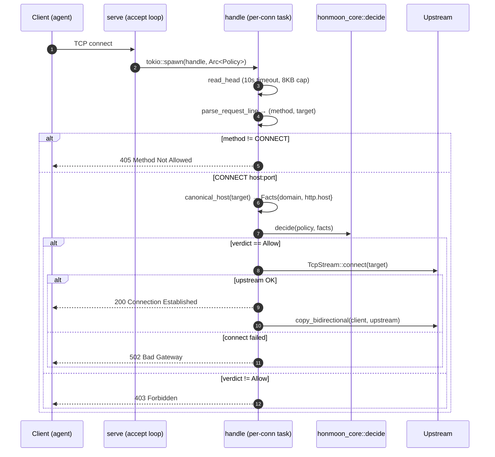
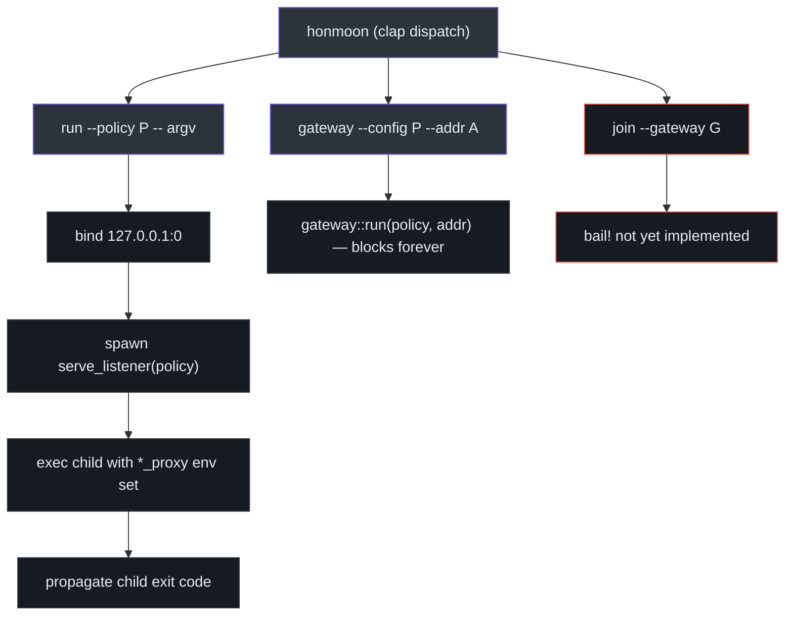

# Egress Gateway (Data Plane)

The egress gateway is the part of Honmoon that actually owns a socket. It is a **terminating
HTTP `CONNECT` forward proxy** implemented directly on tokio in `honmoon-proxy::gateway`, plus
the `honmoon-cli` wiring that runs it in two modes. This is the Phase 1 vertical slice: an agent
points `https_proxy` at the gateway, and only policy-allowed hosts are reachable
([gateway.rs:1-11](https://github.com/pleaseai/honmoon/blob/master/crates/honmoon-proxy/src/gateway.rs#L1-L11)).

## At a glance

| Element | Role | Source |
|---------|------|--------|
| `run(policy, addr)` | Bind `addr`, serve forever | [gateway.rs:25-28](https://github.com/pleaseai/honmoon/blob/master/crates/honmoon-proxy/src/gateway.rs#L25-L28) |
| `serve_listener(policy, listener)` | Serve a pre-bound listener (no TOCTOU) | [gateway.rs:34-40](https://github.com/pleaseai/honmoon/blob/master/crates/honmoon-proxy/src/gateway.rs#L34-L40) |
| `handle(client, policy)` | One connection: parse → decide → tunnel | [gateway.rs:62-112](https://github.com/pleaseai/honmoon/blob/master/crates/honmoon-proxy/src/gateway.rs#L62-L112) |
| `read_head` | Read request head to `\r\n\r\n` (slowloris-guarded) | [gateway.rs:114-135](https://github.com/pleaseai/honmoon/blob/master/crates/honmoon-proxy/src/gateway.rs#L114-L135) |
| `canonical_host` | Strip port, trailing dot, lowercase | [gateway.rs:147-161](https://github.com/pleaseai/honmoon/blob/master/crates/honmoon-proxy/src/gateway.rs#L147-L161) |

## Why a hand-rolled tokio proxy (and not Pingora)

The original plan ([ADR-0001](https://github.com/pleaseai/honmoon/blob/master/.please/docs/decisions/0001-adopt-pingora-http-data-plane.md))
was to build the data plane on Cloudflare's Pingora. During Phase 1 implementation that premise
was tested against Pingora 0.8.1 and **disproven** for this use case
([ADR-0002](https://github.com/pleaseai/honmoon/blob/master/.please/docs/decisions/0002-phase1-connect-proxy-on-tokio.md)):

| Finding | Consequence |
|---------|-------------|
| Pingora's `HttpProxy` is reverse-proxy oriented; rejects absolute-form targets | Not a forward proxy |
| `allow_connect_method_proxying` does proxy **chaining**, not terminating tunnels | Wrong CONNECT semantics |
| A terminating CONNECT proxy at host/SNI level needs no HTTP modeling | ~130 LOC suffices |

Decision: ship Phase 1 on raw tokio; **defer** Pingora (and its heavy dependency) to the phase
that terminates TLS and inspects HTTP requests, where its hooks actually pay off (YAGNI)
([ADR-0002:32-44](https://github.com/pleaseai/honmoon/blob/master/.please/docs/decisions/0002-phase1-connect-proxy-on-tokio.md#L32-L44)).

## Connection handling

`serve` accepts connections in a loop and spawns a task per connection, sharing the policy via an
`Arc`. Each task runs `handle`, which parses the CONNECT head, applies policy, and either tunnels
or rejects ([gateway.rs:42-60](https://github.com/pleaseai/honmoon/blob/master/crates/honmoon-proxy/src/gateway.rs#L42-L60)).

<!-- Sources: crates/honmoon-proxy/src/gateway.rs:42-112 -->

## Robustness details

The proxy is small but defensive — several deliberate guards
([gateway.rs:20-22](https://github.com/pleaseai/honmoon/blob/master/crates/honmoon-proxy/src/gateway.rs#L20-L22), [gateway.rs:114-161](https://github.com/pleaseai/honmoon/blob/master/crates/honmoon-proxy/src/gateway.rs#L114-L161)):

| Guard | Mechanism | Source |
|-------|-----------|--------|
| Slowloris | 10s `HEAD_READ_TIMEOUT` on reading the request head → `408` | [gateway.rs:21-22](https://github.com/pleaseai/honmoon/blob/master/crates/honmoon-proxy/src/gateway.rs#L21-L22), [gateway.rs:64-67](https://github.com/pleaseai/honmoon/blob/master/crates/honmoon-proxy/src/gateway.rs#L64-L67) |
| Oversized head | 8 KB `MAX_REQUEST_HEAD` cap → reject as `400` | [gateway.rs:20](https://github.com/pleaseai/honmoon/blob/master/crates/honmoon-proxy/src/gateway.rs#L20), [gateway.rs:131-133](https://github.com/pleaseai/honmoon/blob/master/crates/honmoon-proxy/src/gateway.rs#L131-L133) |
| Tunnel-byte safety | `read_head` reads one byte at a time, stops at `\r\n\r\n` — never consumes tunnel bytes | [gateway.rs:119-135](https://github.com/pleaseai/honmoon/blob/master/crates/honmoon-proxy/src/gateway.rs#L119-L135) |
| Host canonicalization | `GitHub.com:443` / `github.com.` → `github.com` so a rule can't be bypassed by case or FQDN root | [gateway.rs:157-161](https://github.com/pleaseai/honmoon/blob/master/crates/honmoon-proxy/src/gateway.rs#L157-L161) |
| IPv6 authority | `host_of` handles `[::1]:443` | [gateway.rs:147-154](https://github.com/pleaseai/honmoon/blob/master/crates/honmoon-proxy/src/gateway.rs#L147-L154) |
| No TOCTOU on bind | `serve_listener` adopts a pre-bound socket | [gateway.rs:30-40](https://github.com/pleaseai/honmoon/blob/master/crates/honmoon-proxy/src/gateway.rs#L30-L40) |

::: tip CONNECT exposes only the host
Over a CONNECT tunnel the proxy sees `host:port` but not the method/path/body — those stay
encrypted until TLS termination (a later phase). So the gateway populates `Facts{domain,
http.host}` only ([gateway.rs:81-92](https://github.com/pleaseai/honmoon/blob/master/crates/honmoon-proxy/src/gateway.rs#L81-L92)).
HTTPS rules are **host-level** today; body/path rules need Phase 2 (**TD-004**).
:::

## CLI wiring: `run` vs `gateway`

`honmoon-cli` exposes three subcommands via `clap`. Two drive the gateway; one is a stub
([main.rs:21-43](https://github.com/pleaseai/honmoon/blob/master/crates/honmoon-cli/src/main.rs#L21-L43)).

<!-- Sources: crates/honmoon-cli/src/main.rs:21-104 -->

### `honmoon run`

`run` binds the proxy socket itself on `127.0.0.1:0`, hands the listener to a background thread,
then execs the child with every proxy env var (`http_proxy`, `https_proxy`, `all_proxy`, and
uppercase variants) pointed at the ephemeral proxy. The child's exit code is propagated
([main.rs:64-98](https://github.com/pleaseai/honmoon/blob/master/crates/honmoon-cli/src/main.rs#L64-L98)).
Binding in one place closes the TOCTOU window where another process could steal the port
([main.rs:74-77](https://github.com/pleaseai/honmoon/blob/master/crates/honmoon-cli/src/main.rs#L74-L77)).

::: warning Advisory, not enforcing (TD-003)
`run` only **sets env vars**. A child that ignores them reaches the network directly. Turning
this into real isolation (Linux netns / macOS NetworkExtension) is the High-priority **TD-003**
and a Phase 5 goal ([tech-debt-tracker.md:11](https://github.com/pleaseai/honmoon/blob/master/.please/docs/tracks/tech-debt-tracker.md#L11)).
:::

### `honmoon gateway`

`gateway` loads the policy, logs the rule count, and calls `gateway::run(policy, &addr)` which
blocks forever serving the proxy ([main.rs:53-57](https://github.com/pleaseai/honmoon/blob/master/crates/honmoon-cli/src/main.rs#L53-L57)).
The default address is `127.0.0.1:8443` ([main.rs:35](https://github.com/pleaseai/honmoon/blob/master/crates/honmoon-cli/src/main.rs#L35)).

## Hermetic integration test

Phase 1's exit criteria are proven by `tests/egress.rs` — no external processes; an in-process
TCP upstream and a hand-rolled CONNECT client over loopback exercise the **real** `serve_listener`
proxy ([egress.rs:1-46](https://github.com/pleaseai/honmoon/blob/master/crates/honmoon-proxy/tests/egress.rs#L1-L46)):

| Test | Asserts | Source |
|------|---------|--------|
| `denied_host_is_blocked_with_403` | Denied host → `403` | [egress.rs:74-87](https://github.com/pleaseai/honmoon/blob/master/crates/honmoon-proxy/tests/egress.rs#L74-L87) |
| `allowed_host_tunnels_through_to_upstream` | Allowed host → `200` then real bytes flow | [egress.rs:89-112](https://github.com/pleaseai/honmoon/blob/master/crates/honmoon-proxy/tests/egress.rs#L89-L112) |
| `non_connect_method_is_rejected` | `GET` → `405` | [egress.rs:114-127](https://github.com/pleaseai/honmoon/blob/master/crates/honmoon-proxy/tests/egress.rs#L114-L127) |

The test starts the proxy the same way `honmoon run` does — bind, then hand the listener to a
thread — and polls up to 250× for readiness, keeping it deterministic
([egress.rs:35-46](https://github.com/pleaseai/honmoon/blob/master/crates/honmoon-proxy/tests/egress.rs#L35-L46)).

## Related Pages

- [Policy Model & Decision Engine](/deep-dive/policy-engine) — the `decide()` this proxy calls.
- [Protocol-Aware Parsing](/deep-dive/protocol-parsing) — the parsers a live relay (TD-006) will feed.
- [Quick Start](/getting-started/quick-start) — running `run` and `gateway`.
- [Roadmap & Open-Core Model](/deep-dive/roadmap-open-core) — Phase 2 (TLS) and Phase 5 (isolation).

## References

- [crates/honmoon-proxy/src/gateway.rs](https://github.com/pleaseai/honmoon/blob/master/crates/honmoon-proxy/src/gateway.rs)
- [crates/honmoon-cli/src/main.rs](https://github.com/pleaseai/honmoon/blob/master/crates/honmoon-cli/src/main.rs)
- [crates/honmoon-proxy/tests/egress.rs](https://github.com/pleaseai/honmoon/blob/master/crates/honmoon-proxy/tests/egress.rs)
- [.please/docs/decisions/0002-phase1-connect-proxy-on-tokio.md](https://github.com/pleaseai/honmoon/blob/master/.please/docs/decisions/0002-phase1-connect-proxy-on-tokio.md)
