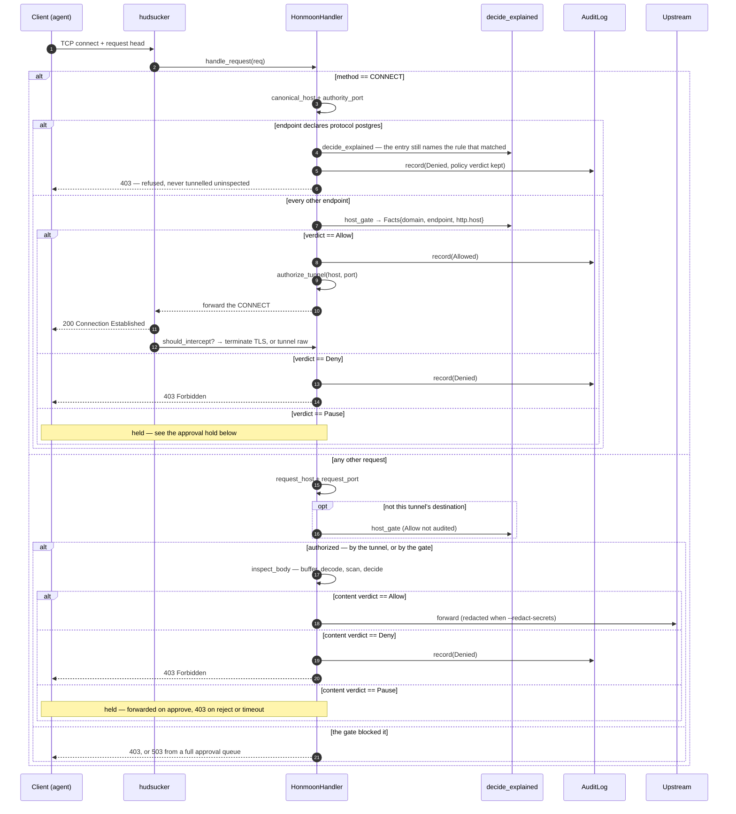
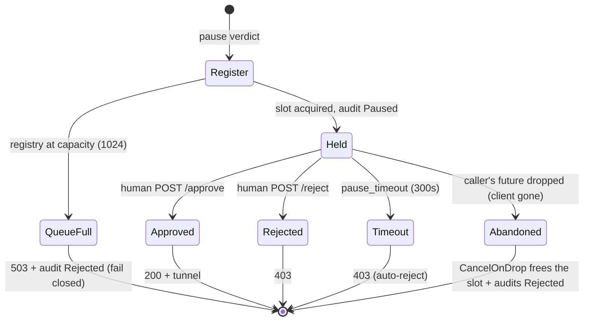
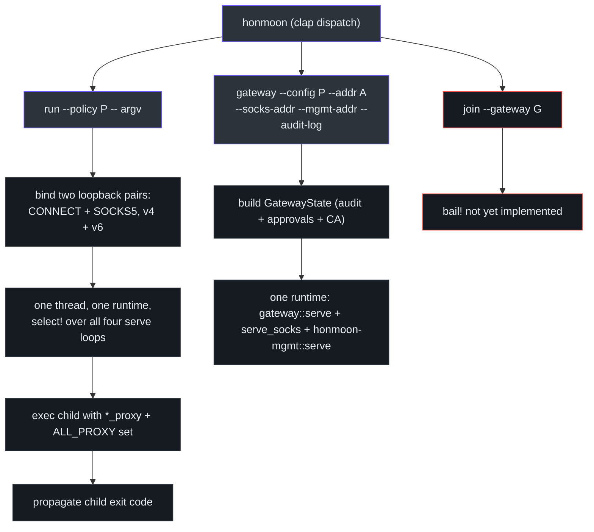

# Egress Gateway (Data Plane)

The egress gateway is the part of Honmoon that owns the agent's egress socket. An agent points
`https_proxy` at it, and only policy-allowed hosts are reachable. Since **Phase 5** it runs on
[hudsucker](https://github.com/omjadas/hudsucker), a MITM HTTP/S proxy library, rather than the
hand-rolled tokio `CONNECT` proxy of Phase 1 ([ADR-0003](https://github.com/pleaseai/honmoon/blob/main/.please/docs/decisions/0003-adopt-hudsucker-for-tls-termination.md)).

That split is the thing to hold on to when reading the code. **hudsucker owns the connection
lifecycle** — the accept loop, head parsing, the `CONNECT` upgrade, TLS termination, and the
upstream leg. **Honmoon owns the decisions**, supplied as an `HttpHandler`
([gateway.rs:177-203](https://github.com/pleaseai/honmoon/blob/main/crates/honmoon-proxy/src/gateway.rs#L177-L203), [mitm.rs:927-1046](https://github.com/pleaseai/honmoon/blob/main/crates/honmoon-proxy/src/mitm.rs#L927-L1046)).
So `gateway.rs` holds the shared state and the four entry points, and every per-request decision —
the host gate, the body scan, the approval hold — lives in `mitm.rs`.

The gateway records its refusals and its holds to the audit log, and a `pause` verdict holds the
request pending human approval ([mitm.rs:296-336](https://github.com/pleaseai/honmoon/blob/main/crates/honmoon-proxy/src/mitm.rs#L296-L336), [approval.rs:235-260](https://github.com/pleaseai/honmoon/blob/main/crates/honmoon-proxy/src/approval.rs#L235-L260)). It does **not**
record every allow. The `CONNECT` that opens a connection is logged, and so is a request whose body
scan found PII, but an ordinary forwarded request is deliberately quiet: recording each one would
flood the bounded audit ring and cycle out the refusals that matter
([mitm.rs:853-867](https://github.com/pleaseai/honmoon/blob/main/crates/honmoon-proxy/src/mitm.rs#L853-L867)).

::: tip This is not the only egress path
A `CONNECT` proxy carries HTTP and TLS. A PostgreSQL or Redis client speaks neither, so a **SOCKS5
listener** runs beside this one and gates every connection the same way
([socks.rs:1-29](https://github.com/pleaseai/honmoon/blob/main/crates/honmoon-proxy/src/socks.rs#L1-L29)).
`honmoon run` always starts it; `honmoon gateway` does too unless `--socks-addr off` declines it.
See [Quick Start](/getting-started/quick-start).
:::

## At a glance

`honmoon-proxy::gateway` — shared state and the entry points:

| Element | Role | Source |
|---------|------|--------|
| `GatewayState` | Shared `Arc`s: policy + `AuditLog` + `ApprovalRegistry` + CA + pause timeout + intercept/PII/redaction settings | [gateway.rs:115-135](https://github.com/pleaseai/honmoon/blob/main/crates/honmoon-proxy/src/gateway.rs#L115-L135) |
| `InterceptPolicy` | Which tunnels to TLS-terminate: `None` (the default), `All`, or a host set | [gateway.rs:37-51](https://github.com/pleaseai/honmoon/blob/main/crates/honmoon-proxy/src/gateway.rs#L37-L51) |
| `PiiMode` | Whether body PII findings only inform audit (`Detect`) or enforce the verdict (`Block`) | [gateway.rs:53-61](https://github.com/pleaseai/honmoon/blob/main/crates/honmoon-proxy/src/gateway.rs#L53-L61) |
| `RedactionState` | Wire-level secret redaction: HMAC salt, placeholder store, signed-body policy | [gateway.rs:78-93](https://github.com/pleaseai/honmoon/blob/main/crates/honmoon-proxy/src/gateway.rs#L78-L93) |
| `run(policy, addr)` | Bind `addr`, serve forever | [gateway.rs:155-159](https://github.com/pleaseai/honmoon/blob/main/crates/honmoon-proxy/src/gateway.rs#L155-L159) |
| `serve_listener(policy, listener)` | Serve a pre-bound listener (no TOCTOU) | [gateway.rs:161-168](https://github.com/pleaseai/honmoon/blob/main/crates/honmoon-proxy/src/gateway.rs#L161-L168) |
| `serve_listener_with_state` | The same, with caller-provided shared state | [gateway.rs:170-175](https://github.com/pleaseai/honmoon/blob/main/crates/honmoon-proxy/src/gateway.rs#L170-L175) |
| `serve(state, listener)` | Build the hudsucker `Proxy` around `HonmoonHandler` and start it | [gateway.rs:177-203](https://github.com/pleaseai/honmoon/blob/main/crates/honmoon-proxy/src/gateway.rs#L177-L203) |
| `host_of` / `authority_port` / `canonical_host` | Authority parsing and host canonicalization | [gateway.rs:205-235](https://github.com/pleaseai/honmoon/blob/main/crates/honmoon-proxy/src/gateway.rs#L205-L235) |

`honmoon-proxy::mitm` — the request path. This is where the Phase 1 control logic was **ported**,
not rewritten ([ADR-0003:42-64](https://github.com/pleaseai/honmoon/blob/main/.please/docs/decisions/0003-adopt-hudsucker-for-tls-termination.md#L42-L64)):

| Element | Role | Source |
|---------|------|--------|
| `HonmoonHandler` | The `HttpHandler` hudsucker drives; cloned per connection and per request | [mitm.rs:160-172](https://github.com/pleaseai/honmoon/blob/main/crates/honmoon-proxy/src/mitm.rs#L160-L172) |
| `handle_request` | Every request, in all three shapes: `CONNECT`, cleartext, decrypted inner | [mitm.rs:928-973](https://github.com/pleaseai/honmoon/blob/main/crates/honmoon-proxy/src/mitm.rs#L928-L973) |
| `host_gate` | Decide + audit; routes `pause` to the hold. The old `authorize` | [mitm.rs:296-336](https://github.com/pleaseai/honmoon/blob/main/crates/honmoon-proxy/src/mitm.rs#L296-L336) |
| `hold` | Render the hold's outcome as `Gate::Proceed` / `403` / `503`. The old `hold_for_approval` | [mitm.rs:338-363](https://github.com/pleaseai/honmoon/blob/main/crates/honmoon-proxy/src/mitm.rs#L338-L363) |
| `AuthorizedTunnel` | What this handler clone's connection earned at its `CONNECT` | [mitm.rs:71-91](https://github.com/pleaseai/honmoon/blob/main/crates/honmoon-proxy/src/mitm.rs#L71-L91) |
| `uninspectable_endpoint` / `refuse_uninspectable_connect` | Refuse a `CONNECT` to an endpoint this listener could only tunnel uninspected | [mitm.rs:217-294](https://github.com/pleaseai/honmoon/blob/main/crates/honmoon-proxy/src/mitm.rs#L217-L294) |
| `inspect_body` | Buffer, decode, scan for PII, decide, forward or block | [mitm.rs:614-924](https://github.com/pleaseai/honmoon/blob/main/crates/honmoon-proxy/src/mitm.rs#L614-L924) |
| `handle_response` | Restore known placeholders in identity-encoded responses | [mitm.rs:975-1034](https://github.com/pleaseai/honmoon/blob/main/crates/honmoon-proxy/src/mitm.rs#L975-L1034) |
| `should_intercept` | Apply `InterceptPolicy` to one tunnel | [mitm.rs:1036-1045](https://github.com/pleaseai/honmoon/blob/main/crates/honmoon-proxy/src/mitm.rs#L1036-L1045) |
| `status_response` | The `Content-Length: 0`, `Connection: close` refusal every gate returns | [mitm.rs:1601-1610](https://github.com/pleaseai/honmoon/blob/main/crates/honmoon-proxy/src/mitm.rs#L1601-L1610) |

::: warning Names that moved
Anything you read elsewhere about `gateway::handle`, `gateway::authorize`,
`gateway::hold_for_approval` or `gateway::read_head` is describing the Phase 1 proxy. `handle` has
no successor by that name — the per-request entry point is `HonmoonHandler::handle_request`;
`authorize` is now `host_gate`; `hold_for_approval` is now `hold` over
[approval.rs:235-260](https://github.com/pleaseai/honmoon/blob/main/crates/honmoon-proxy/src/approval.rs#L235-L260); and `read_head` is gone
entirely, because hudsucker parses the head.
:::

## How the data plane got here

The original plan ([ADR-0001](https://github.com/pleaseai/honmoon/blob/main/.please/docs/decisions/0001-adopt-pingora-http-data-plane.md))
was Cloudflare's Pingora. During Phase 1 that premise was tested against Pingora 0.8.1 and
**disproven** for this use case
([ADR-0002](https://github.com/pleaseai/honmoon/blob/main/.please/docs/decisions/0002-phase1-connect-proxy-on-tokio.md)):

| Finding | Consequence |
|---------|-------------|
| Pingora's `HttpProxy` is reverse-proxy oriented; rejects absolute-form targets | Not a forward proxy |
| `allow_connect_method_proxying` does proxy **chaining**, not terminating tunnels | Wrong CONNECT semantics |
| A terminating CONNECT proxy at host/SNI level needs no HTTP modeling | ~130 LOC suffices |

Phase 1 therefore shipped on raw tokio and **deferred** the framework question to the phase that
terminates TLS and inspects HTTP requests (YAGNI)
([ADR-0002:33-45](https://github.com/pleaseai/honmoon/blob/main/.please/docs/decisions/0002-phase1-connect-proxy-on-tokio.md#L33-L45)).

Phase 5 is that phase, and it answered with **hudsucker** rather than Pingora: hudsucker already
ships and tests the security-critical parts — CA management, per-host leaf caching, the TLS
acceptor, HTTP/2, selective bypass — and its `HttpHandler` maps onto Honmoon's policy engine
directly ([ADR-0003:42-64](https://github.com/pleaseai/honmoon/blob/main/.please/docs/decisions/0003-adopt-hudsucker-for-tls-termination.md#L42-L64)).
The hand-rolled accept loop, head reader and tunnel copy went with it.

## Request handling

`serve` hands hudsucker a bound listener, a CA authority and one `HonmoonHandler`, then starts the
proxy; the accept loop and the task-per-connection are hudsucker's
([gateway.rs:177-203](https://github.com/pleaseai/honmoon/blob/main/crates/honmoon-proxy/src/gateway.rs#L177-L203)). Every request reaches
`handle_request`, in one of three shapes
([mitm.rs:1-36](https://github.com/pleaseai/honmoon/blob/main/crates/honmoon-proxy/src/mitm.rs#L1-L36)):

1. **The `CONNECT` request** — host-level policy runs here, for every tunnel, intercepted or not.
2. **Cleartext `http://` forward-proxy requests** — host-gated too, so the allowlist cannot be
   bypassed by skipping `CONNECT`. Bodies are scanned as well.
3. **Decrypted inner requests** over a terminated tunnel — already authorized at the `CONNECT`, so
   only the body is inspected.

Which shape a request is in is decided by the `AuthorizedTunnel` the handler clone carries — the
connection it arrived on must have made an authorized `CONNECT` to exactly that `host:port` — and
**not** by the URI scheme. A client can send an absolute-form `GET https://…` without `CONNECT`, or
spoof `:authority` over h2, and trusting the scheme would let it skip the gate
([mitm.rs:71-120](https://github.com/pleaseai/honmoon/blob/main/crates/honmoon-proxy/src/mitm.rs#L71-L120), [mitm.rs:928-973](https://github.com/pleaseai/honmoon/blob/main/crates/honmoon-proxy/src/mitm.rs#L928-L973)).

```mermaid
sequenceDiagram
  autonumber
  participant C as Client (agent)
  participant HS as hudsucker
  participant H as HonmoonHandler
  participant Core as decide_explained
  participant Audit as AuditLog
  participant U as Upstream
  C->>HS: TCP connect + request head
  HS->>H: handle_request(req)
  alt method == CONNECT
    H->>H: canonical_host + authority_port
    alt endpoint declares protocol postgres
      H->>Core: decide_explained — the entry still names the rule that matched
      H->>Audit: record(Denied, policy verdict kept)
      H-->>C: 403 — refused, never tunnelled uninspected
    else every other endpoint
      H->>Core: host_gate → Facts{domain, endpoint, http.host}
      alt verdict == Allow
        H->>Audit: record(Allowed)
        H->>H: authorize_tunnel(host, port)
        H-->>HS: forward the CONNECT
        HS-->>C: 200 Connection Established
        HS->>H: should_intercept? → terminate TLS, or tunnel raw
      else verdict == Deny
        H->>Audit: record(Denied)
        H-->>C: 403 Forbidden
      else verdict == Pause
        Note over H,C: held — see the approval hold below
      end
    end
  else any other request
    H->>H: request_host + request_port
    opt not this tunnel's destination
      H->>Core: host_gate (Allow not audited)
    end
    alt authorized — by the tunnel, or by the gate
      H->>H: inspect_body — buffer, decode, scan, decide
      alt content verdict == Allow
        H->>U: forward (redacted when --redact-secrets)
      else content verdict == Deny
        H->>Audit: record(Denied)
        H-->>C: 403 Forbidden
      else content verdict == Pause
        Note over H,C: held — forwarded on approve, 403 on reject or timeout
      end
    else the gate blocked it
      H-->>C: 403, or 503 from a full approval queue
    end
  end
```
<!-- Sources: crates/honmoon-proxy/src/mitm.rs:928-973 (handle_request), mitm.rs:296-336 (host_gate), mitm.rs:217-294 (the uninspectable-endpoint refusal), mitm.rs:614-924 (inspect_body), mitm.rs:1036-1045 (should_intercept), crates/honmoon-proxy/src/gateway.rs:177-203 (serve) -->

## What the proxy still guards itself

These are honmoon's own, in honmoon's own code:

| Guard | Mechanism | Source |
|-------|-----------|--------|
| Host canonicalization | `GitHub.com:443` / `github.com.` → `github.com`, so a rule can't be bypassed by case or FQDN root | [gateway.rs:230-235](https://github.com/pleaseai/honmoon/blob/main/crates/honmoon-proxy/src/gateway.rs#L230-L235) |
| IPv6 authority | `host_of` handles `[::1]:443` | [gateway.rs:205-212](https://github.com/pleaseai/honmoon/blob/main/crates/honmoon-proxy/src/gateway.rs#L205-L212) |
| Port confusion | An unbracketed authority with several colons is a bare IPv6 address, not `host:port` — reading `::1` as port 1 would let a client claim any endpoint's port | [gateway.rs:214-228](https://github.com/pleaseai/honmoon/blob/main/crates/honmoon-proxy/src/gateway.rs#L214-L228) |
| Spoofed `Host` port | The `Host` header is only consulted when the URI carries no authority of its own | [mitm.rs:1655-1679](https://github.com/pleaseai/honmoon/blob/main/crates/honmoon-proxy/src/mitm.rs#L1655-L1679) |
| Scheme is not authorization | An inner request is recognized by the tunnel the clone inherited, never by `https://` | [mitm.rs:928-973](https://github.com/pleaseai/honmoon/blob/main/crates/honmoon-proxy/src/mitm.rs#L928-L973) |
| Authorization can't outlive its connection | `AuthorizedTunnel` lives on the handler clone, not in a registry keyed by client address | [mitm.rs:71-91](https://github.com/pleaseai/honmoon/blob/main/crates/honmoon-proxy/src/mitm.rs#L71-L91) |
| Body memory | Bodies over 2 MiB — declared or streamed — are forwarded unscanned rather than buffered | [body.rs:56-61](https://github.com/pleaseai/honmoon/blob/main/crates/honmoon-proxy/src/body.rs#L56-L61) |
| Uninspectable tunnels | A `CONNECT` to a `protocol: postgres` endpoint is refused, not tunnelled past the `sql.*` rules it exists to enforce | [mitm.rs:217-294](https://github.com/pleaseai/honmoon/blob/main/crates/honmoon-proxy/src/mitm.rs#L217-L294) |
| Bounded approval queue | 1024 simultaneous holds, then fail closed | [approval.rs:64-74](https://github.com/pleaseai/honmoon/blob/main/crates/honmoon-proxy/src/approval.rs#L64-L74) |
| No TOCTOU on bind | `serve_listener` adopts a pre-bound socket | [gateway.rs:161-168](https://github.com/pleaseai/honmoon/blob/main/crates/honmoon-proxy/src/gateway.rs#L161-L168) |

### Guards the Phase 1 proxy had and honmoon no longer implements

The hand-rolled proxy read the request head itself, under a `HEAD_READ_TIMEOUT` and a
`MAX_REQUEST_HEAD` cap. Neither constant exists anywhere in `crates/` today, because hudsucker
parses the head. `serve` supplies a listener, a CA, a TLS connector and a handler and **no server
configuration at all** ([gateway.rs:177-203](https://github.com/pleaseai/honmoon/blob/main/crates/honmoon-proxy/src/gateway.rs#L177-L203)), so the bounds that
apply are whatever hudsucker and hyper default to — not something this project states, sets or
tests.

That is worth naming rather than glossing, because one of those defaults does not arm:

- **Slowloris.** hyper's `header_read_timeout` has a 30s default, but it only takes effect when a
  `Timer` is installed, and nothing in this chain installs one. A connection whose request head
  never completes is held indefinitely. regression, tracked in
  [#267](https://github.com/pleaseai/honmoon/issues/267).
- **Oversized head.** hyper bounds its own header buffer, so this is not unbounded — but the bound
  is hyper's and honmoon neither chooses nor asserts it. The page no longer claims an 8 KB cap.
- **Tunnel bytes.** honmoon never reads from the client socket, so it cannot consume tunnel bytes;
  hudsucker performs the `CONNECT` upgrade and either terminates TLS or copies bidirectionally.

::: tip What a raw tunnel shows, and what termination adds
Without `--tls-intercept` the proxy sees `host:port` and nothing else, so it populates
`Facts{domain, endpoint, http.host}` only and HTTPS rules stay **host-level**
([mitm.rs:196-215](https://github.com/pleaseai/honmoon/blob/main/crates/honmoon-proxy/src/mitm.rs#L196-L215)). With it, the tunnel is decrypted and
the inner request's method, path, body size and PII findings all reach the engine
([mitm.rs:614-924](https://github.com/pleaseai/honmoon/blob/main/crates/honmoon-proxy/src/mitm.rs#L614-L924)) — see
[Protocol-Aware Parsing](/deep-dive/protocol-parsing).
:::

## Pause, approval & audit

`host_gate` is where the verdict becomes an outcome. It builds the facts, calls `decide_explained`
(verdict + the rule that fired), records the decision to the shared `AuditLog`, and dispatches
([mitm.rs:296-336](https://github.com/pleaseai/honmoon/blob/main/crates/honmoon-proxy/src/mitm.rs#L296-L336)):

| Verdict | Audit `Decision` | `Gate` | Source |
|---------|------------------|--------|--------|
| `Allow` | `Allowed` (on the `CONNECT` only) | `Proceed` | [mitm.rs:306-318](https://github.com/pleaseai/honmoon/blob/main/crates/honmoon-proxy/src/mitm.rs#L306-L318) |
| `Deny` | `Denied` | `Block` → `403 Forbidden` | [mitm.rs:319-329](https://github.com/pleaseai/honmoon/blob/main/crates/honmoon-proxy/src/mitm.rs#L319-L329) |
| `Pause` | `Paused` → `Approved`/`Rejected` | held for the whole wait, then `Proceed` on approval, `Block` → `403` on a rejection or timeout, `Block` → `503` when the queue was full | [mitm.rs:330-334](https://github.com/pleaseai/honmoon/blob/main/crates/honmoon-proxy/src/mitm.rs#L330-L334), [mitm.rs:338-363](https://github.com/pleaseai/honmoon/blob/main/crates/honmoon-proxy/src/mitm.rs#L338-L363) |

**The gate returns a `Gate`, not a status** ([mitm.rs:151-158](https://github.com/pleaseai/honmoon/blob/main/crates/honmoon-proxy/src/mitm.rs#L151-L158)) — so what a *proceeding*
request gets depends on its shape, and only a refusal is a status the gate itself chose. A
`CONNECT` that proceeds is handed back to hudsucker, which answers `200 Connection Established`
and opens the tunnel; a cleartext or absolute-form request that proceeds goes on to `inspect_body`
and, if that forwards it, the client gets the **upstream's** response and no `200` of honmoon's
([mitm.rs:928-973](https://github.com/pleaseai/honmoon/blob/main/crates/honmoon-proxy/src/mitm.rs#L928-L973)). A `pause` on either shape holds the client for the whole
wait before the same split applies.

`Allow` is audited on the `CONNECT` gate but not on individual forwarded requests, which would
flood the bounded audit ring ([mitm.rs:296-301](https://github.com/pleaseai/honmoon/blob/main/crates/honmoon-proxy/src/mitm.rs#L296-L301)).

The hold itself is transport-agnostic and shared with the SOCKS5 data path: `approval::hold`
registers the request, audits `Paused`, and waits on a `oneshot` channel inside an **ordered**
`tokio::select!` ([approval.rs:262-372](https://github.com/pleaseai/honmoon/blob/main/crates/honmoon-proxy/src/approval.rs#L262-L372)). Only the HTTP
rendering of the outcome is decided in `mitm.rs`.

```mermaid
stateDiagram-v2
  [*] --> Register: pause verdict
  Register --> QueueFull: registry at capacity (1024)
  Register --> Held: slot acquired, audit Paused
  QueueFull --> [*]: 503 + audit Rejected (fail closed)
  Held --> Approved: human POST /approve
  Held --> Rejected: human POST /reject
  Held --> Timeout: pause_timeout (300s)
  Held --> Abandoned: caller's future dropped (client gone)
  Approved --> [*]: 200 + tunnel
  Rejected --> [*]: 403
  Timeout --> [*]: 403 (auto-reject)
  Abandoned --> [*]: CancelOnDrop frees the slot + audits Rejected
```
<!-- Sources: crates/honmoon-proxy/src/approval.rs:262-372 (hold_until), approval.rs:184-218 (CancelOnDrop), approval.rs:96-132 (register), crates/honmoon-proxy/src/mitm.rs:338-363 (the HTTP rendering) -->

Three fail-closed properties hold here. A **full pending queue** rejects new pauses with `503`
rather than growing unbounded ([approval.rs:96-132](https://github.com/pleaseai/honmoon/blob/main/crates/honmoon-proxy/src/approval.rs#L96-L132), [approval.rs:64-74](https://github.com/pleaseai/honmoon/blob/main/crates/honmoon-proxy/src/approval.rs#L64-L74)); a
**timeout auto-rejects** a held request so it never hangs forever
([approval.rs:318-347](https://github.com/pleaseai/honmoon/blob/main/crates/honmoon-proxy/src/approval.rs#L318-L347)); and a **hold that ends without a
decision** — the HTTP client disconnecting drops the caller's future — frees its slot and audits
the rejection through a drop guard, so abandoned holds cannot saturate the queue
([approval.rs:184-218](https://github.com/pleaseai/honmoon/blob/main/crates/honmoon-proxy/src/approval.rs#L184-L218)). The resolution travels back through the
same `Arc<ApprovalRegistry>` shared with the management API — see
[Control Plane & Dashboard](/deep-dive/control-plane).

::: tip Which `pause` rules fire today
Over a raw tunnel the gate sees the facts `host_facts` builds — `domain`, the `endpoint` name when
`(host, port)` names one, and `http.host` — so a `pause` on any of those holds there
([mitm.rs:205-215](https://github.com/pleaseai/honmoon/blob/main/crates/honmoon-proxy/src/mitm.rs#L205-L215)).
With `--tls-intercept --pii-mode block`, a content `pause` holds an individual request and the
approval queue names its PII labels and count — never the matched text
([mitm.rs:894-922](https://github.com/pleaseai/honmoon/blob/main/crates/honmoon-proxy/src/mitm.rs#L894-L922), [mitm.rs:1620-1639](https://github.com/pleaseai/honmoon/blob/main/crates/honmoon-proxy/src/mitm.rs#L1620-L1639)). SQL `pause` rules
run on the SOCKS5 PostgreSQL path, not here.
:::

## CLI wiring: `run` vs `gateway`

`honmoon-cli` dispatches five `clap` subcommands, plus a hidden sixth on Linux only. Two drive the
gateway (`run`, `gateway`), two are tooling that binds no listener (`policy validate`, `hook`), and
one is a stub (`join`). `supervise-sandbox` is an internal helper compiled in under
`#[cfg(target_os = "linux")]` — the in-namespace half of enforced `run` isolation — so a macOS
build has no sixth command at all
([main.rs:36-283](https://github.com/pleaseai/honmoon/blob/main/crates/honmoon-cli/src/main.rs#L36-L283), [main.rs:265-282](https://github.com/pleaseai/honmoon/blob/main/crates/honmoon-cli/src/main.rs#L265-L282), [main.rs:325-383](https://github.com/pleaseai/honmoon/blob/main/crates/honmoon-cli/src/main.rs#L325-L383)).

```mermaid
flowchart TD
  main["honmoon (clap dispatch)"] --> run["run --policy P -- argv"]
  main --> gw["gateway --config P --addr A<br>--socks-addr --mgmt-addr --audit-log"]
  main --> join["join --gateway G"]
  run --> bind["bind two loopback pairs:<br>CONNECT + SOCKS5, v4 + v6"]
  bind --> thread["one thread, one runtime,<br>select! over all four serve loops"]
  thread --> exec["exec child with *_proxy + ALL_PROXY set"]
  exec --> code["propagate child exit code"]
  gw --> gwstate["build GatewayState (audit + approvals + CA)"]
  gwstate --> gwboth["one runtime: gateway::serve + serve_socks + honmoon-mgmt::serve"]
  join --> bail["bail! not yet implemented"]
  style main fill:#2d333b,stroke:#6d5dfc,color:#e6edf3
  style run fill:#2d333b,stroke:#6d5dfc,color:#e6edf3
  style gw fill:#2d333b,stroke:#6d5dfc,color:#e6edf3
  style join fill:#161b22,stroke:#f85149,color:#e6edf3
  style bail fill:#161b22,stroke:#f85149,color:#e6edf3
  style bind fill:#161b22,stroke:#30363d,color:#e6edf3
  style thread fill:#161b22,stroke:#30363d,color:#e6edf3
  style exec fill:#161b22,stroke:#30363d,color:#e6edf3
  style code fill:#161b22,stroke:#30363d,color:#e6edf3
  style gwstate fill:#161b22,stroke:#30363d,color:#e6edf3
  style gwboth fill:#161b22,stroke:#30363d,color:#e6edf3
```
<!-- Sources: crates/honmoon-cli/src/main.rs:36-283 (the Command variants), main.rs:325-383 (dispatch), main.rs:586-788 (gateway), main.rs:790-912 (run) -->

### `honmoon run`

`run` binds its own sockets — **two loopback pairs**, a v4/v6 pair for the `CONNECT` proxy and
another for the SOCKS5 listener — then hands them to one background thread and execs the child
with every proxy env var (`http_proxy`, `https_proxy`, `all_proxy`, `ALL_PROXY` and the uppercase
variants) pointed at them. The child's exit code is propagated
([main.rs:790-912](https://github.com/pleaseai/honmoon/blob/main/crates/honmoon-cli/src/main.rs#L790-L912)). Binding in one place closes the TOCTOU
window where another process could steal the port
([main.rs:799-810](https://github.com/pleaseai/honmoon/blob/main/crates/honmoon-cli/src/main.rs#L799-L810)). A pair downgrades to IPv4 alone only where `::1` is
*proven absent* — the one case where no squatter can take a half honmoon did not bind. Every other
bind failure aborts startup rather than leaving `::1:<port>` unowned
([main.rs:953-988](https://github.com/pleaseai/honmoon/blob/main/crates/honmoon-cli/src/main.rs#L953-L988)).

The accept loops — four of them wherever `::1` is bindable — are polled in a single
`tokio::select!` rather than spawned, deliberately: a
panic in a spawned task is parked in a `JoinHandle` nobody joins, so an accept loop could die,
drop its listener and hand that address to the first process that asked for it while `run` carried
on reporting enforced isolation ([main.rs:828-847](https://github.com/pleaseai/honmoon/blob/main/crates/honmoon-cli/src/main.rs#L828-L847)). A loop with no listener
behind it waits forever instead of returning and taking the other three down with it
([main.rs:920-933](https://github.com/pleaseai/honmoon/blob/main/crates/honmoon-cli/src/main.rs#L920-L933)). One
`GatewayState` sits behind every listener, so a verdict's visibility never depends on which
address family — or which protocol — the client used.

On Linux the child no longer shares the host's loopback, so those listeners are reached through a
Unix-socket bridge into the child's namespace instead
([ADR-0005](https://github.com/pleaseai/honmoon/blob/main/.please/docs/decisions/0005-empty-namespace-and-bridged-proxy-sockets.md)). `run` uses an
in-memory audit ring and does **not** expose the management API — it is the ephemeral,
single-command mode ([gateway.rs:137-153](https://github.com/pleaseai/honmoon/blob/main/crates/honmoon-proxy/src/gateway.rs#L137-L153)).

::: tip Enforcing on Linux and macOS, advisory elsewhere (TD-003)
An **unprivileged** child that ignores the env vars reaches nothing over the network rather than
bypassing policy ([ADR-0005](https://github.com/pleaseai/honmoon/blob/main/.please/docs/decisions/0005-empty-namespace-and-bridged-proxy-sockets.md)). On
**Linux** that is an empty user + network namespace containing nothing but loopback, with the proxy
bridged in over a Unix socket; on **macOS** a Seatbelt profile under `sandbox-exec` that denies every
socket except the proxy's loopback port — no system extension, no entitlement, no signing. Neither
replaces the filesystem, so Unix sockets that live there — `/var/run/docker.sock` and friends — stay
reachable, and anything a local daemon behind one will do on the child's behalf is still a way out.
(macOS denies one of them deliberately, the system resolver's, so that DNS is no more available
there than it is inside an empty namespace.)

Four limits keep **TD-003** open: root / `CAP_SYS_ADMIN` / passwordless `sudo` can leave either
sandbox; `run` fails open to advisory where the namespace is refused (the default Docker seccomp
profile blocks `unshare(CLONE_NEWUSER)`, so an ordinary container is advisory) or where the Seatbelt
profile no longer compiles; on **macOS** a command that daemonizes outlives `run`, which closes the
proxy port while those descendants still carry a profile whose one exception names it — free for
any local process to bind and relay for them, where an empty namespace would have stayed empty;
and every platform other than these two still only sets env vars
([tech-debt-tracker.md:11](https://github.com/pleaseai/honmoon/blob/main/.please/docs/tracks/tech-debt-tracker.md#L11)).
:::

### `honmoon gateway`

`gateway` builds a `GatewayState` (policy + audit + approvals + CA + intercept/PII/redaction
settings) and runs the egress proxy, the `honmoon-mgmt` management API and — unless
`--socks-addr off` declines it — the SOCKS5 listener on **one tokio runtime**, sharing that state — so a request held by the proxy can be approved from the
dashboard ([main.rs:586-788](https://github.com/pleaseai/honmoon/blob/main/crates/honmoon-cli/src/main.rs#L586-L788)). Every listener is bound up
front so a bind error is reported before anything is spawned, and a `tokio::select!` surfaces an
unexpected proxy or SOCKS5 exit instead of silently leaving egress filtering down
([main.rs:755-786](https://github.com/pleaseai/honmoon/blob/main/crates/honmoon-cli/src/main.rs#L755-L786)). With SOCKS5 declined there is nothing to join on, so that
arm waits forever rather than firing at once and killing the gateway
([main.rs:767-774](https://github.com/pleaseai/honmoon/blob/main/crates/honmoon-cli/src/main.rs#L767-L774)).

| Flag | Default | Purpose | Source |
|------|---------|---------|--------|
| `--addr` | `127.0.0.1:8443` | Egress proxy listen address | [main.rs:68-70](https://github.com/pleaseai/honmoon/blob/main/crates/honmoon-cli/src/main.rs#L68-L70) |
| `--socks-addr` | `127.0.0.1:1080` | SOCKS5 listen address — the transport for non-HTTP protocols. `off` disables it; the CONNECT proxy keeps running | [main.rs:71-75](https://github.com/pleaseai/honmoon/blob/main/crates/honmoon-cli/src/main.rs#L71-L75), [main.rs:687-697](https://github.com/pleaseai/honmoon/blob/main/crates/honmoon-cli/src/main.rs#L687-L697) |
| `--mgmt-addr` | `127.0.0.1:8444` | Management API + dashboard address | [main.rs:76-78](https://github.com/pleaseai/honmoon/blob/main/crates/honmoon-cli/src/main.rs#L76-L78) |
| `--tls-intercept` | off | Terminate TLS to inspect request bodies. Agents must trust the CA; `InterceptPolicy::All` when set, `None` otherwise | [main.rs:154-157](https://github.com/pleaseai/honmoon/blob/main/crates/honmoon-cli/src/main.rs#L154-L157), [main.rs:640-659](https://github.com/pleaseai/honmoon/blob/main/crates/honmoon-cli/src/main.rs#L640-L659) |
| `--pii-mode` | `detect` | `detect` audits the would-be verdict; `block` enforces it inline. `block` requires `--tls-intercept` | [main.rs:190-195](https://github.com/pleaseai/honmoon/blob/main/crates/honmoon-cli/src/main.rs#L190-L195), [main.rs:616-618](https://github.com/pleaseai/honmoon/blob/main/crates/honmoon-cli/src/main.rs#L616-L618) |
| `--redact-secrets` | off | Rewrite detected secrets and Tier-1 PII to stable placeholders before forwarding, and restore them in identity-encoded responses. Requires `--tls-intercept` | [main.rs:158-168](https://github.com/pleaseai/honmoon/blob/main/crates/honmoon-cli/src/main.rs#L158-L168) |
| `--signed-body` | `block` | What to do when redaction would rewrite a body an authentication signature covers: `block` refuses locally with `403`, `forward` sends the original bytes unredacted. Requires `--redact-secrets` | [main.rs:169-189](https://github.com/pleaseai/honmoon/blob/main/crates/honmoon-cli/src/main.rs#L169-L189), [gateway.rs:63-76](https://github.com/pleaseai/honmoon/blob/main/crates/honmoon-proxy/src/gateway.rs#L63-L76) |
| `--mgmt-token` | (minted at `~/.honmoon/mgmt-token`, `0600`) | Bearer token required by **every** `/api/*` route — the audit, approval and policy reads as well as the Claude Code hook endpoint. Browsers exchange it at `GET /login?token=…` — the URL honmoon prints on startup — for a session secret they send in the `X-Honmoon-Session` header; deliberately not a cookie, whose scope would cover every other port on `127.0.0.1` (#188). `--hook-token` / `HONMOON_HOOK_TOKEN` remain accepted as deprecated aliases. Prefer the environment variable to the flag: a command line can be read by other local users via `ps` (how far that reaches is platform- and configuration-dependent), while a token file honmoon created is `0600`. An existing file that is readable beyond its owner is reported rather than tightened — replacing such a token is the operator's call, since it invalidates anything holding the old value. Minting — whether the file is absent or empty — happens under a `mgmt-token.lock` sentinel in the same directory, so a gateway and an `@honmoon/api` starting together converge on one token instead of each keeping the one it minted (#189); a lock a start left behind by crashing mid-mint is broken after ten seconds, and a start that waits thirty seconds for one refuses rather than minting a second token. `@honmoon/api` reads only the variable or the file, never this flag | [main.rs:99-138](https://github.com/pleaseai/honmoon/blob/main/crates/honmoon-cli/src/main.rs#L99-L138), [mgmt_token.rs:301-402](https://github.com/pleaseai/honmoon/blob/main/crates/honmoon-cli/src/mgmt_token.rs#L301-L402), [auth.ts:64-68](https://github.com/pleaseai/honmoon/blob/main/packages/api/src/auth.ts#L64-L68), [auth.ts:310-362](https://github.com/pleaseai/honmoon/blob/main/packages/api/src/auth.ts#L310-L362) |
| `--audit-log` | (in-memory only) | Append every verdict — and any recorded security degradation — to a JSONL file. Must name a **regular file**: opened with `O_NOFOLLOW`, so a symlink as the final path component is refused, as are a FIFO, socket, device and directory, and the refusal aborts startup. Created owner-only when absent; an existing file keeps its mode | [main.rs:79-98](https://github.com/pleaseai/honmoon/blob/main/crates/honmoon-cli/src/main.rs#L79-L98), [main.rs:629-638](https://github.com/pleaseai/honmoon/blob/main/crates/honmoon-cli/src/main.rs#L629-L638) |

## Hermetic integration tests

`crates/honmoon-proxy/tests/egress.rs` proves the host gate with no external processes: an
in-process TCP upstream and a hand-rolled client over loopback exercise the **real**
`serve_listener` proxy ([egress.rs:1-46](https://github.com/pleaseai/honmoon/blob/main/crates/honmoon-proxy/tests/egress.rs#L1-L46)):

| Test | Asserts | Source |
|------|---------|--------|
| `denied_host_is_blocked_with_403` | Denied host over `CONNECT` → `403` | [egress.rs:74-87](https://github.com/pleaseai/honmoon/blob/main/crates/honmoon-proxy/tests/egress.rs#L74-L87) |
| `allowed_host_tunnels_through_to_upstream` | Allowed host → `200`, then real bytes flow | [egress.rs:89-112](https://github.com/pleaseai/honmoon/blob/main/crates/honmoon-proxy/tests/egress.rs#L89-L112) |
| `plain_http_to_denied_host_is_blocked_with_403` | Cleartext `http://` is gated too — no bypass by skipping `CONNECT` | [egress.rs:114-132](https://github.com/pleaseai/honmoon/blob/main/crates/honmoon-proxy/tests/egress.rs#L114-L132) |
| `absolute_form_https_without_connect_is_blocked_with_403` | The `https://` scheme alone does not prove an authorized tunnel | [egress.rs:134-151](https://github.com/pleaseai/honmoon/blob/main/crates/honmoon-proxy/tests/egress.rs#L134-L151) |
| `origin_form_request_is_gated_via_host_header` | `GET /` is gated on its `Host` header, not on an empty host | [egress.rs:153-168](https://github.com/pleaseai/honmoon/blob/main/crates/honmoon-proxy/tests/egress.rs#L153-L168) |

The Phase 1 `405`-on-non-CONNECT test is gone on purpose: since hudsucker the proxy serves plain
HTTP as well, so a `GET http://denied/` is answered with the stronger `403` rather than a method
refusal ([egress.rs:114-118](https://github.com/pleaseai/honmoon/blob/main/crates/honmoon-proxy/tests/egress.rs#L114-L118)).

Two more suites cover the phases above it. `crates/honmoon-proxy/tests/mitm.rs` runs a real
`tokio-rustls` client against an in-process CA and proves TLS termination, body scanning in both
PII modes, compressed and chunked bodies, Kubernetes endpoint rules, and the uninspectable-endpoint
refusal ([mitm.rs:1-8](https://github.com/pleaseai/honmoon/blob/main/crates/honmoon-proxy/tests/mitm.rs#L1-L8)).
`crates/honmoon-mgmt/tests/e2e.rs` holds a live `CONNECT` on a `pause` rule, finds it on the
management API's approval queue, and shows approving it lets the tunnel through (`200`) while
rejecting blocks it (`403`) — every step recorded in the audit log
([e2e.rs:1-10](https://github.com/pleaseai/honmoon/blob/main/crates/honmoon-mgmt/tests/e2e.rs#L1-L10)).

## Related Pages

- [Policy Model & Decision Engine](/deep-dive/policy-engine) — `decide_explained()` and the audit `Decision`.
- [Control Plane & Dashboard](/deep-dive/control-plane) — the management API that resolves held requests.
- [Protocol-Aware Parsing](/deep-dive/protocol-parsing) — the parsers TLS termination and the SOCKS5 path feed.
- [Quick Start](/getting-started/quick-start) — running `run` and `gateway`.

## References

- [crates/honmoon-proxy/src/gateway.rs](https://github.com/pleaseai/honmoon/blob/main/crates/honmoon-proxy/src/gateway.rs)
- [crates/honmoon-proxy/src/mitm.rs](https://github.com/pleaseai/honmoon/blob/main/crates/honmoon-proxy/src/mitm.rs)
- [crates/honmoon-proxy/src/approval.rs](https://github.com/pleaseai/honmoon/blob/main/crates/honmoon-proxy/src/approval.rs)
- [crates/honmoon-cli/src/main.rs](https://github.com/pleaseai/honmoon/blob/main/crates/honmoon-cli/src/main.rs)
- [crates/honmoon-proxy/tests/egress.rs](https://github.com/pleaseai/honmoon/blob/main/crates/honmoon-proxy/tests/egress.rs)
- [.please/docs/decisions/0003-adopt-hudsucker-for-tls-termination.md](https://github.com/pleaseai/honmoon/blob/main/.please/docs/decisions/0003-adopt-hudsucker-for-tls-termination.md)
- [.please/docs/decisions/0002-phase1-connect-proxy-on-tokio.md](https://github.com/pleaseai/honmoon/blob/main/.please/docs/decisions/0002-phase1-connect-proxy-on-tokio.md)
