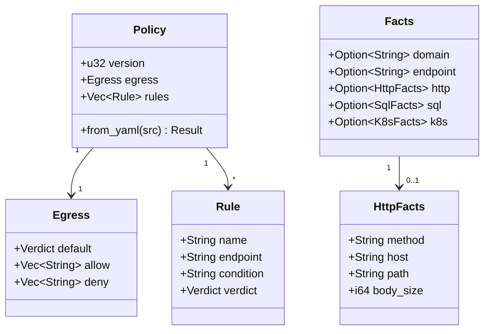
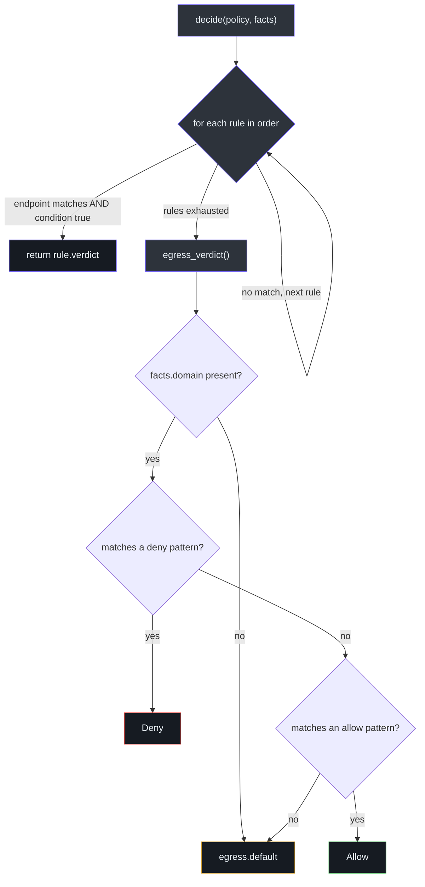
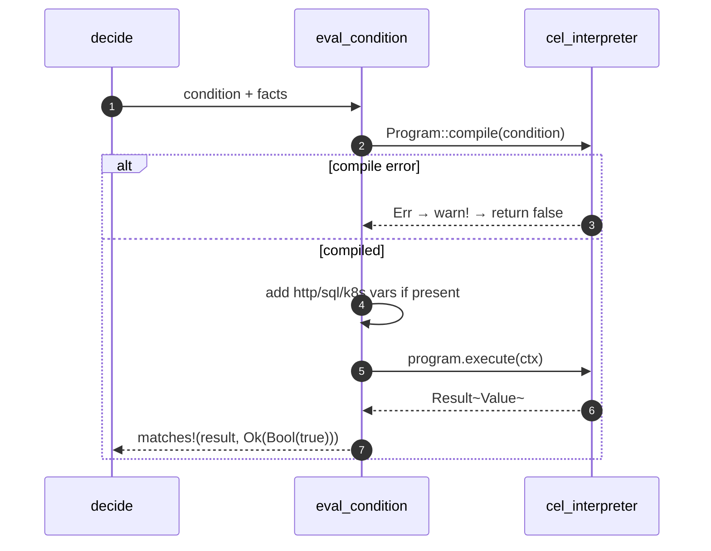

# Policy Model & Decision Engine

`honmoon-core` is the heart of Honmoon: a transport-agnostic crate that defines the policy
model, extracts protocol facts, and answers one question — given a `Policy` and a set of
`Facts`, what is the `Verdict`? This page traces `decide()` end to end. The crate has **no**
networking dependency by design ([lib.rs:1-4](https://github.com/pleaseai/honmoon/blob/master/crates/honmoon-core/src/lib.rs#L1-L4)).

## At a glance

| Element | Type | Responsibility | Source |
|---------|------|----------------|--------|
| `Verdict` | enum | `Allow` / `Deny` / `Pause` | [lib.rs:14-23](https://github.com/pleaseai/honmoon/blob/master/crates/honmoon-core/src/lib.rs#L14-L23) |
| `Policy` | struct | `version` + `egress` + `rules` | [lib.rs:25-34](https://github.com/pleaseai/honmoon/blob/master/crates/honmoon-core/src/lib.rs#L25-L34) |
| `Egress` | struct | default + allow/deny domain lists | [lib.rs:36-60](https://github.com/pleaseai/honmoon/blob/master/crates/honmoon-core/src/lib.rs#L36-L60) |
| `Rule` | struct | endpoint + CEL condition + verdict | [lib.rs:62-70](https://github.com/pleaseai/honmoon/blob/master/crates/honmoon-core/src/lib.rs#L62-L70) |
| `Facts` | struct | domain + endpoint + http/sql/k8s facts | [lib.rs:79-91](https://github.com/pleaseai/honmoon/blob/master/crates/honmoon-core/src/lib.rs#L79-L91) |
| `decide_explained()` | fn | The decision algorithm → `Outcome{verdict, rule}` | [engine.rs:38-53](https://github.com/pleaseai/honmoon/blob/master/crates/honmoon-core/src/engine.rs#L38-L53) |
| `decide()` | fn | Thin wrapper returning just the `Verdict` | [engine.rs:22-24](https://github.com/pleaseai/honmoon/blob/master/crates/honmoon-core/src/engine.rs#L22-L24) |
| `matches_domain()` | fn | Wildcard domain matcher | [engine.rs:81-89](https://github.com/pleaseai/honmoon/blob/master/crates/honmoon-core/src/engine.rs#L81-L89) |

## The model

A `Policy` deserializes from YAML via `serde` ([lib.rs:121-126](https://github.com/pleaseai/honmoon/blob/master/crates/honmoon-core/src/lib.rs#L121-L126)).
Two `serde` defaults encode the fail-closed posture directly into the type: `Egress::default`
returns `Verdict::Deny`, and the `default` field uses the `default_deny` function so an
egress block that omits `default` still denies ([lib.rs:39-60](https://github.com/pleaseai/honmoon/blob/master/crates/honmoon-core/src/lib.rs#L39-L60)).

<!-- Sources: crates/honmoon-core/src/lib.rs:25-119 -->

## The decision algorithm

The engine has a strict, two-stage precedence: **rules first, egress second**. Since Phase 4 the
core entry point is `decide_explained`, which returns an `Outcome { verdict, rule }` — the
`verdict` plus the **name of the rule that fired** (or `None` for an egress-list decision). This
is what the audit log records so a human can see *why* a request was held or blocked. `decide()`
remains as a thin wrapper for callers that only need the verdict
([engine.rs:7-53](https://github.com/pleaseai/honmoon/blob/master/crates/honmoon-core/src/engine.rs#L7-L53)).

1. Protocol-aware **rules are evaluated in order**. The first rule whose `endpoint` matches and
   whose CEL `condition` evaluates to `true` wins and returns its verdict.
2. If no rule matches, the **egress lists** decide: a `deny` match → `Deny`, else an `allow`
   match → `Allow`, else `egress.default`.

<!-- Sources: crates/honmoon-core/src/engine.rs:19-45 -->

### Endpoint matching

A rule's `endpoint` either is the literal `*` (matches anything) or must equal the connection's
endpoint exactly ([engine.rs:47-50](https://github.com/pleaseai/honmoon/blob/master/crates/honmoon-core/src/engine.rs#L47-L50)).
This is what binds `sql-no-prod-drop` to `postgres-prod` and not to every database. The test
`rule_endpoint_must_match` proves a `POST` rule on `postgres-prod` is skipped when the endpoint
is `other` ([engine.rs:154-174](https://github.com/pleaseai/honmoon/blob/master/crates/honmoon-core/src/engine.rs#L154-L174)).

### Domain matching

`matches_domain` lowercases both sides and supports a single leading `*.` wildcard, where
`*.suffix` matches both the bare `suffix` and any deeper subdomain
([engine.rs:52-64](https://github.com/pleaseai/honmoon/blob/master/crates/honmoon-core/src/engine.rs#L52-L64)):

| Pattern | Input | Result | Reason |
|---------|-------|--------|--------|
| `github.com` | `GitHub.com` | ✅ allow | case-insensitive exact |
| `*.gh.io` | `raw.gh.io` | ✅ allow | subdomain of suffix |
| `*.gh.io` | `gh.io` | ✅ allow | bare suffix included |
| `bad.gh.io` (deny) | `bad.gh.io` | ❌ deny | deny checked before allow |

The test `egress_allow_deny_and_default` locks all four cases, including "deny wins"
([engine.rs:104-127](https://github.com/pleaseai/honmoon/blob/master/crates/honmoon-core/src/engine.rs#L104-L127)).

## CEL evaluation

A rule's condition is a [CEL](https://github.com/google/cel-spec) expression compiled and
executed by `cel-interpreter`. `eval_condition` builds a `Context`, injects whichever protocol
facts are present as variables (`http`, `sql`, `k8s`), and runs the program. **Only `Ok(Bool(true))`
counts as a match** — every other outcome (compile error, runtime error, non-bool, `false`)
means "no match" ([engine.rs:66-91](https://github.com/pleaseai/honmoon/blob/master/crates/honmoon-core/src/engine.rs#L66-L91)).

<!-- Sources: crates/honmoon-core/src/engine.rs:66-91 -->

Each fact sub-struct derives `Serialize`, and `cel_interpreter::to_value` converts it into a CEL
value bound under its name — so `http.method`, `sql.verb`, and `k8s.resource` are addressable in
conditions exactly as written in the YAML ([lib.rs:92-119](https://github.com/pleaseai/honmoon/blob/master/crates/honmoon-core/src/lib.rs#L92-L119), [engine.rs:73-89](https://github.com/pleaseai/honmoon/blob/master/crates/honmoon-core/src/engine.rs#L73-L89)).

## Fail-closed by construction

The engine cannot be tricked into allowing by a broken rule. Three mechanisms compose:

| Mechanism | Effect | Source |
|-----------|--------|--------|
| `Egress::default = Deny` | Unmatched domain denies | [lib.rs:48-60](https://github.com/pleaseai/honmoon/blob/master/crates/honmoon-core/src/lib.rs#L48-L60) |
| Compile error → `false` | A malformed condition never matches | [engine.rs:67-71](https://github.com/pleaseai/honmoon/blob/master/crates/honmoon-core/src/engine.rs#L67-L71) |
| Missing fact → `false` | A condition on an unpopulated fact never matches | [engine.rs:90](https://github.com/pleaseai/honmoon/blob/master/crates/honmoon-core/src/engine.rs#L90) |

`unknown_fact_reference_does_not_match` proves that a `sql.verb == 'DROP'` rule, evaluated when
no `sql` fact is present, falls through to the egress default rather than erroring open
([engine.rs:176-184](https://github.com/pleaseai/honmoon/blob/master/crates/honmoon-core/src/engine.rs#L176-L184)).

## Worked example: end-to-end

The test `protocol_facts_drive_policy_end_to_end` exercises the whole path — raw bytes →
parser → `decide()` — against a multi-rule policy
([engine.rs:189-237](https://github.com/pleaseai/honmoon/blob/master/crates/honmoon-core/src/engine.rs#L189-L237)):

| Input | Endpoint | Parsed facts | Verdict | Why |
|-------|----------|--------------|---------|-----|
| `DROP TABLE users;` (PG `Q` packet) | `postgres-prod` | `sql.verb = DROP` | `Pause` | matches `no-prod-drop` |
| `DELETE /api/v1/namespaces/prod/secrets/db` | `k8s-prod` | `k8s.resource = secrets, verb = delete` | `Deny` | matches `no-prod-secret-delete` |
| `SELECT 1` | `postgres-prod` | `sql.verb = SELECT` | `Allow` | no rule matches → egress default |

A companion test, `shipped_example_policy_fires`, loads the **real** `policies/agent.yaml` via
`include_str!` and asserts its rules still fire for the facts the parsers emit — guarding the
shipped policy against parser/condition drift
([engine.rs:241-263](https://github.com/pleaseai/honmoon/blob/master/crates/honmoon-core/src/engine.rs#L241-L263)).

## Error handling

`Policy::from_yaml` returns `Result<Self, Error>` where `Error::Parse` wraps the `serde_yaml`
error via `thiserror` ([lib.rs:121-132](https://github.com/pleaseai/honmoon/blob/master/crates/honmoon-core/src/lib.rs#L121-L132)).
`serde_yaml` is deprecated (**TD-002**); migrating to a maintained fork is tracked but low
priority ([tech-debt-tracker.md:10](https://github.com/pleaseai/honmoon/blob/master/.please/docs/tracks/tech-debt-tracker.md#L10)).

## Related Pages

- [Protocol-Aware Parsing](/deep-dive/protocol-parsing) — where `sql` / `k8s` facts come from.
- [Policy Authoring](/getting-started/policy-authoring) — how to write the policy this engine reads.
- [Egress Gateway (Data Plane)](/deep-dive/egress-gateway) — the caller that builds `Facts`.

## References

- [crates/honmoon-core/src/lib.rs](https://github.com/pleaseai/honmoon/blob/master/crates/honmoon-core/src/lib.rs)
- [crates/honmoon-core/src/engine.rs](https://github.com/pleaseai/honmoon/blob/master/crates/honmoon-core/src/engine.rs)
- [crates/honmoon-core/src/protocols.rs](https://github.com/pleaseai/honmoon/blob/master/crates/honmoon-core/src/protocols.rs)
- [policies/agent.yaml](https://github.com/pleaseai/honmoon/blob/master/policies/agent.yaml)
