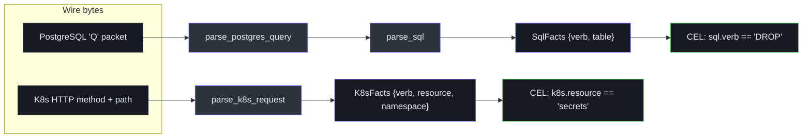
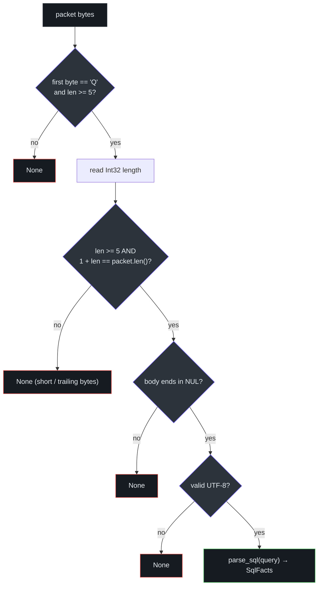
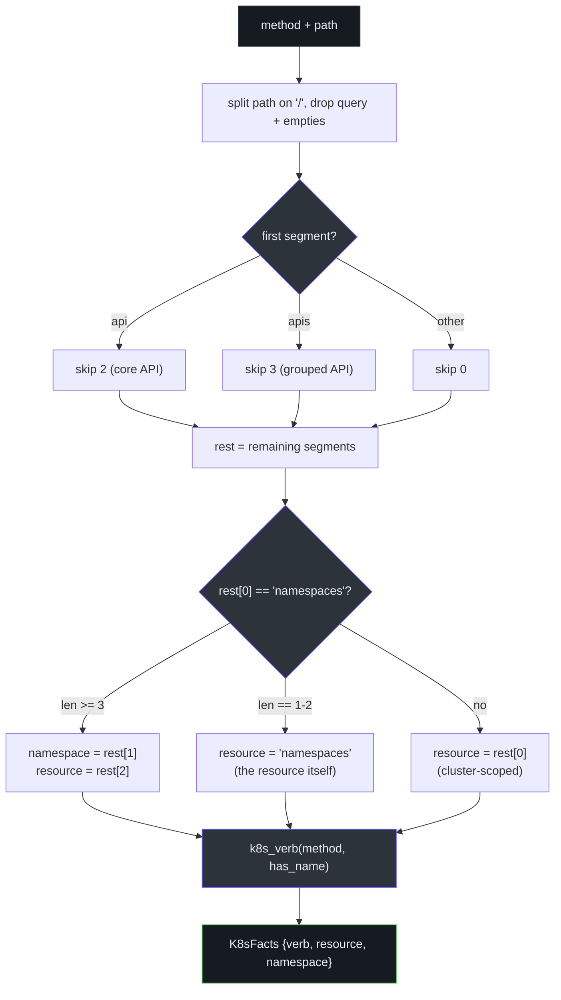

# Protocol-Aware Parsing

Protocol awareness is Honmoon's **moat**: the ability to distinguish a `SELECT` from a `DROP`,
or a secret `list` from a secret `delete`, by parsing protocols at the wire level. All of this
lives in `honmoon-core::protocols` as **pure functions over bytes/strings**, so it can be
unit-tested without a network. The proxy layer reads bytes off the wire and feeds them here
([protocols.rs:1-8](https://github.com/pleaseai/honmoon/blob/master/crates/honmoon-core/src/protocols.rs#L1-L8)).

::: warning Engine-complete, not yet traffic-driven
These parsers are fully implemented and extensively tested, but they are **not yet fed by a
live socket**. Wiring them onto a real inline TCP relay (per-endpoint listeners for PostgreSQL,
TLS termination for the K8s API) is tracked as **TD-006**. Today they are exercised by the test
suite and by `decide()`'s end-to-end tests, not by production traffic.
See [tech-debt-tracker.md:14](https://github.com/pleaseai/honmoon/blob/master/.please/docs/tracks/tech-debt-tracker.md#L14).
:::

## At a glance

| Function | Input | Output | Scope | Source |
|----------|-------|--------|-------|--------|
| `parse_postgres_query` | PostgreSQL `'Q'` packet bytes | `Option<SqlFacts>` | Frontend simple query | [protocols.rs:17-35](https://github.com/pleaseai/honmoon/blob/master/crates/honmoon-core/src/protocols.rs#L17-L35) |
| `parse_sql` | SQL statement text | `SqlFacts` | verb + best-effort table | [protocols.rs:41-93](https://github.com/pleaseai/honmoon/blob/master/crates/honmoon-core/src/protocols.rs#L41-L93) |
| `parse_k8s_request` | HTTP method + path | `K8sFacts` | verb + resource + namespace | [protocols.rs:111-156](https://github.com/pleaseai/honmoon/blob/master/crates/honmoon-core/src/protocols.rs#L111-L156) |

The design principle, stated in the module doc: *extract only the declared facts (verb / table /
resource / namespace), never decrypt or buffer full payloads beyond what a rule needs*
([protocols.rs:7-8](https://github.com/pleaseai/honmoon/blob/master/crates/honmoon-core/src/protocols.rs#L7-L8)). This is the
"no decryption surprises" invariant made concrete.

<!-- Sources: crates/honmoon-core/src/protocols.rs:17-156, crates/honmoon-core/src/engine.rs:73-89 -->

## PostgreSQL simple-query parser

The frontend `Query` message has a precise wire format: a tag byte `b'Q'`, a big-endian `Int32`
length, then a NUL-terminated SQL string. The length counts itself plus the string but **not**
the tag byte ([protocols.rs:12-16](https://github.com/pleaseai/honmoon/blob/master/crates/honmoon-core/src/protocols.rs#L12-L16)).

`parse_postgres_query` is strict — it returns `None` for anything malformed, which (combined with
fail-closed) means a garbled packet can never accidentally satisfy a rule
([protocols.rs:17-35](https://github.com/pleaseai/honmoon/blob/master/crates/honmoon-core/src/protocols.rs#L17-L35)):

<!-- Sources: crates/honmoon-core/src/protocols.rs:17-35 -->

The test `rejects_malformed_query_frames` covers trailing bytes, a missing NUL terminator, and a
length field larger than the buffer — all must return `None`
([protocols.rs:219-237](https://github.com/pleaseai/honmoon/blob/master/crates/honmoon-core/src/protocols.rs#L219-L237)).

## SQL verb/table heuristic

`parse_sql` is a deliberate **heuristic, not a full SQL grammar** — just enough to drive policy
on the dangerous verbs. It uppercases the leading token as the `verb`, then extracts a best-effort
table per the verb's syntax ([protocols.rs:37-93](https://github.com/pleaseai/honmoon/blob/master/crates/honmoon-core/src/protocols.rs#L37-L93)):

| Verb | Table extraction strategy | Example → table |
|------|---------------------------|-----------------|
| `DROP` / `TRUNCATE` | Skip object-type/option modifiers (`TABLE`, `IF`, `EXISTS`, `ONLY`, `CONCURRENTLY`, …); first remaining token | `DROP TABLE IF EXISTS users` → `users` |
| `INSERT` / `DELETE` / `SELECT` | Token after the first `FROM` / `INTO` | `SELECT * FROM public.orders` → `orders` |
| `UPDATE` | Token immediately after `UPDATE` | `update Users set x=1` → `users` |
| other | (none) | `EXPLAIN ANALYZE foo` → `` (verb `EXPLAIN`) |

Extracted identifiers are normalized by `clean_identifier`: strip quotes/backticks/semicolons,
drop the schema qualifier (`public.users;` → `users`), and lowercase
([protocols.rs:95-104](https://github.com/pleaseai/honmoon/blob/master/crates/honmoon-core/src/protocols.rs#L95-L104)).

The modifier-skipping logic matters for correctness: `DROP MATERIALIZED VIEW mv` must yield `mv`,
not `materialized` — proven by `drop_if_exists_extracts_real_table`
([protocols.rs:248-254](https://github.com/pleaseai/honmoon/blob/master/crates/honmoon-core/src/protocols.rs#L248-L254)).

## Kubernetes API parser

`parse_k8s_request` derives `K8sFacts` from an HTTP method and request path. The subtlety is the
API prefix: core APIs are `/api/{version}/…` (skip 2 segments) and grouped APIs are
`/apis/{group}/{version}/…` (skip 3) — so the version segment is never mistaken for a resource
([protocols.rs:106-156](https://github.com/pleaseai/honmoon/blob/master/crates/honmoon-core/src/protocols.rs#L106-L156)).

<!-- Sources: crates/honmoon-core/src/protocols.rs:111-156 -->

### Method → verb mapping

`k8s_verb` maps the HTTP method to a Kubernetes verb, with one nuance: a `GET` on a **collection**
is `list`, a `GET` on a **named resource** is `get`
([protocols.rs:158-176](https://github.com/pleaseai/honmoon/blob/master/crates/honmoon-core/src/protocols.rs#L158-L176)):

| HTTP method | Has resource name? | K8s verb |
|-------------|--------------------|----------|
| `GET` | no | `list` |
| `GET` | yes | `get` |
| `POST` | — | `create` |
| `PUT` | — | `update` |
| `PATCH` | — | `patch` |
| `DELETE` | — | `delete` |

### Path shapes handled

| Path | resource | namespace | verb (DELETE) | Source |
|------|----------|-----------|---------------|--------|
| `/api/v1/namespaces/prod/secrets/db` | `secrets` | `prod` | `delete` | [protocols.rs:284-289](https://github.com/pleaseai/honmoon/blob/master/crates/honmoon-core/src/protocols.rs#L284-L289) |
| `/apis/apps/v1/deployments/api` | `deployments` | `` | `delete` | [protocols.rs:239-246](https://github.com/pleaseai/honmoon/blob/master/crates/honmoon-core/src/protocols.rs#L239-L246) |
| `/api/v1/namespaces` | `namespaces` | `` | — (`list`/`get`) | [protocols.rs:256-273](https://github.com/pleaseai/honmoon/blob/master/crates/honmoon-core/src/protocols.rs#L256-L273) |
| `/api/v1/nodes` | `nodes` | `` | `list` | [protocols.rs:308-311](https://github.com/pleaseai/honmoon/blob/master/crates/honmoon-core/src/protocols.rs#L308-L311) |

Two regression tests guard the trickiest cases: `k8s_grouped_cluster_scoped_resource_not_version`
ensures `v1` is never captured as a resource, and `k8s_namespace_resource_itself` ensures
`namespaces` is correctly treated as a cluster-scoped resource when it is the target rather than a
prefix ([protocols.rs:239-273](https://github.com/pleaseai/honmoon/blob/master/crates/honmoon-core/src/protocols.rs#L239-L273)).

## Test coverage

The parsers carry the densest test suite in the repo — 9 unit tests in `protocols.rs` plus the
end-to-end tests in `engine.rs`:

| Test | Guards | Source |
|------|--------|--------|
| `parses_postgres_drop` | `'Q'` → `DROP` + table | [protocols.rs:192-197](https://github.com/pleaseai/honmoon/blob/master/crates/honmoon-core/src/protocols.rs#L192-L197) |
| `rejects_non_query_packet` | non-`Q` / too-short → `None` | [protocols.rs:213-217](https://github.com/pleaseai/honmoon/blob/master/crates/honmoon-core/src/protocols.rs#L213-L217) |
| `rejects_malformed_query_frames` | framing edge cases | [protocols.rs:219-237](https://github.com/pleaseai/honmoon/blob/master/crates/honmoon-core/src/protocols.rs#L219-L237) |
| `parse_sql_extracts_verb_and_table` | quoting, schema, case | [protocols.rs:275-281](https://github.com/pleaseai/honmoon/blob/master/crates/honmoon-core/src/protocols.rs#L275-L281) |
| `parses_k8s_list_vs_get` | collection vs named GET | [protocols.rs:291-299](https://github.com/pleaseai/honmoon/blob/master/crates/honmoon-core/src/protocols.rs#L291-L299) |

## Related Pages

- [Policy Model & Decision Engine](/deep-dive/policy-engine) — how these facts feed CEL conditions.
- [Egress Gateway (Data Plane)](/deep-dive/egress-gateway) — the relay that will feed these parsers (TD-006).
- [Roadmap & Open-Core Model](/deep-dive/roadmap-open-core) — protocol awareness as the moat.

## References

- [crates/honmoon-core/src/protocols.rs](https://github.com/pleaseai/honmoon/blob/master/crates/honmoon-core/src/protocols.rs)
- [crates/honmoon-core/src/engine.rs](https://github.com/pleaseai/honmoon/blob/master/crates/honmoon-core/src/engine.rs)
- [crates/honmoon-core/src/lib.rs](https://github.com/pleaseai/honmoon/blob/master/crates/honmoon-core/src/lib.rs)
- [.please/docs/tracks/tech-debt-tracker.md](https://github.com/pleaseai/honmoon/blob/master/.please/docs/tracks/tech-debt-tracker.md)
