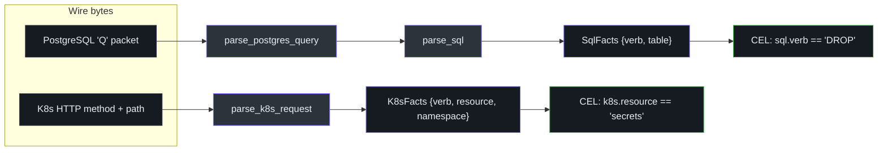
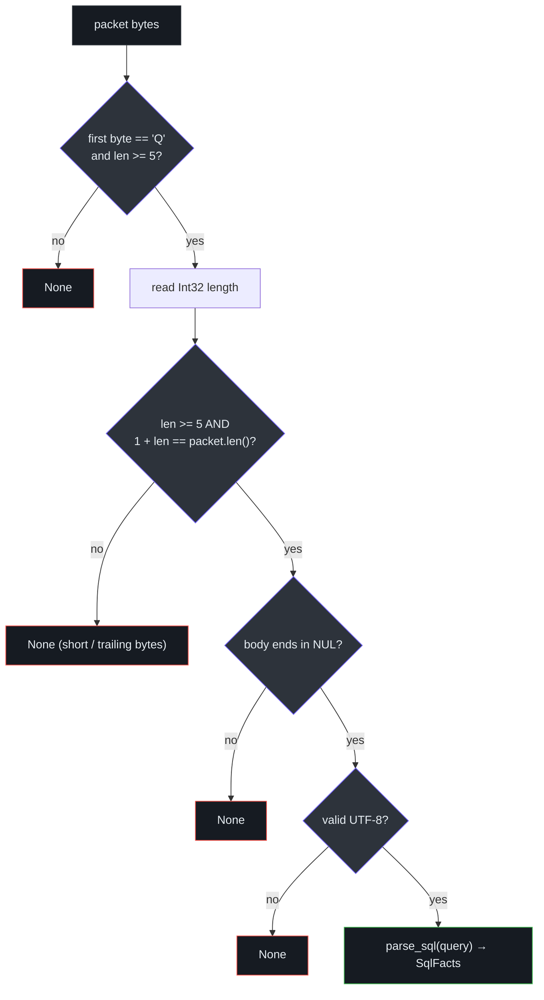
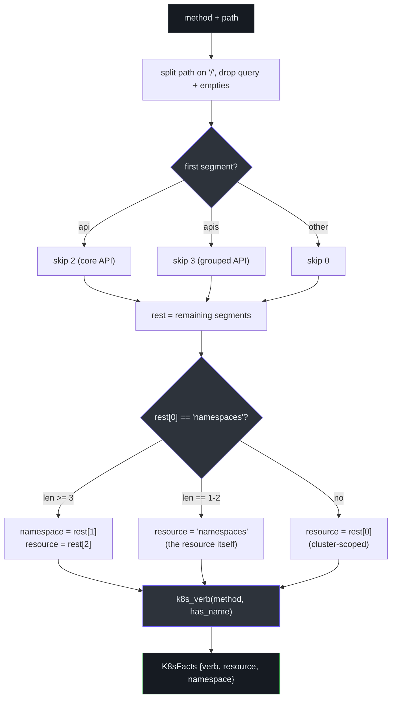

# Protocol-Aware Parsing

Protocol awareness is Honmoon's **moat**: the ability to distinguish a `SELECT` from a `DROP`,
or a secret `list` from a secret `delete`, by parsing protocols at the wire level. All of this
lives in `honmoon-core::protocols` as **pure functions over bytes/strings**, so it can be
unit-tested without a network. The proxy layer reads bytes off the wire and feeds them here
([protocols.rs:1-8](https://github.com/pleaseai/honmoon/blob/main/crates/honmoon-core/src/protocols.rs#L1-L8)).

::: warning Engine-complete, not yet traffic-driven
These parsers are fully implemented and extensively tested, but they are **not yet fed by a
live socket**. Wiring them onto a real inline TCP relay (per-endpoint listeners for PostgreSQL,
TLS termination for the K8s API) is tracked as **TD-006**. Today they are exercised by the test
suite and by `decide()`'s end-to-end tests, not by production traffic.
See [tech-debt-tracker.md:14](https://github.com/pleaseai/honmoon/blob/main/.please/docs/tracks/tech-debt-tracker.md#L14).
:::

## At a glance

| Function | Input | Output | Scope | Source |
|----------|-------|--------|-------|--------|
| `parse_postgres_query` | PostgreSQL `'Q'` packet bytes | `Option<SqlFacts>` | Frontend simple query | [protocols.rs:17-35](https://github.com/pleaseai/honmoon/blob/main/crates/honmoon-core/src/protocols.rs#L17-L35) |
| `parse_sql` | SQL statement text | `SqlFacts` | verb + best-effort table | [protocols.rs:72-99](https://github.com/pleaseai/honmoon/blob/main/crates/honmoon-core/src/protocols.rs#L72-L99) |
| `parse_k8s_request` | HTTP method + path | `K8sFacts` | verb + resource + namespace | [protocols.rs:111-156](https://github.com/pleaseai/honmoon/blob/main/crates/honmoon-core/src/protocols.rs#L111-L156) |

The design principle, stated in the module doc: *extract only the declared facts (verb / table /
resource / namespace), never decrypt or buffer full payloads beyond what a rule needs*
([protocols.rs:7-8](https://github.com/pleaseai/honmoon/blob/main/crates/honmoon-core/src/protocols.rs#L7-L8)). This is the
"no decryption surprises" invariant made concrete.

```mermaid
flowchart LR
  subgraph wire["Wire bytes"]
    pg["PostgreSQL 'Q' packet"]
    k8s["K8s HTTP method + path"]
  end
  pg --> ppq["parse_postgres_query"]
  ppq --> ps["parse_sql"]
  ps --> sf["SqlFacts {verb, table}"]
  k8s --> pk["parse_k8s_request"]
  pk --> kf["K8sFacts {verb, resource, namespace}"]
  sf --> cel["CEL: sql.verb == 'DROP'"]
  kf --> cel2["CEL: k8s.resource == 'secrets'"]
  style pg fill:#161b22,stroke:#30363d,color:#e6edf3
  style k8s fill:#161b22,stroke:#30363d,color:#e6edf3
  style ppq fill:#2d333b,stroke:#6d5dfc,color:#e6edf3
  style ps fill:#2d333b,stroke:#6d5dfc,color:#e6edf3
  style pk fill:#2d333b,stroke:#6d5dfc,color:#e6edf3
  style sf fill:#161b22,stroke:#6d5dfc,color:#e6edf3
  style kf fill:#161b22,stroke:#6d5dfc,color:#e6edf3
  style cel fill:#161b22,stroke:#3fb950,color:#e6edf3
  style cel2 fill:#161b22,stroke:#3fb950,color:#e6edf3
```
<!-- Sources: crates/honmoon-core/src/protocols.rs:17-156, crates/honmoon-core/src/engine.rs:73-89 -->

## PostgreSQL simple-query parser

The frontend `Query` message has a precise wire format: a tag byte `b'Q'`, a big-endian `Int32`
length, then a NUL-terminated SQL string. The length counts itself plus the string but **not**
the tag byte ([protocols.rs:12-16](https://github.com/pleaseai/honmoon/blob/main/crates/honmoon-core/src/protocols.rs#L12-L16)).

`parse_postgres_query` is strict — it returns `None` for anything malformed, which (combined with
fail-closed) means a garbled packet can never accidentally satisfy a rule
([protocols.rs:17-35](https://github.com/pleaseai/honmoon/blob/main/crates/honmoon-core/src/protocols.rs#L17-L35)):

```mermaid
flowchart TD
  start["packet bytes"] --> tag{"first byte == 'Q'<br>and len >= 5?"}
  tag -->|no| none1["None"]
  tag -->|yes| len["read Int32 length"]
  len --> frame{"len >= 5 AND<br>1 + len == packet.len()?"}
  frame -->|no| none2["None (short / trailing bytes)"]
  frame -->|yes| nul{"body ends in NUL?"}
  nul -->|no| none3["None"]
  nul -->|yes| utf{"valid UTF-8?"}
  utf -->|no| none4["None"]
  utf -->|yes| ps["parse_sql(query) → SqlFacts"]
  style start fill:#161b22,stroke:#30363d,color:#e6edf3
  style tag fill:#2d333b,stroke:#6d5dfc,color:#e6edf3
  style frame fill:#2d333b,stroke:#6d5dfc,color:#e6edf3
  style nul fill:#2d333b,stroke:#6d5dfc,color:#e6edf3
  style utf fill:#2d333b,stroke:#6d5dfc,color:#e6edf3
  style ps fill:#161b22,stroke:#3fb950,color:#e6edf3
  style none1 fill:#161b22,stroke:#f85149,color:#e6edf3
  style none2 fill:#161b22,stroke:#f85149,color:#e6edf3
  style none3 fill:#161b22,stroke:#f85149,color:#e6edf3
  style none4 fill:#161b22,stroke:#f85149,color:#e6edf3
```
<!-- Sources: crates/honmoon-core/src/protocols.rs:17-35 -->

The test `rejects_malformed_query_frames` covers trailing bytes, a missing NUL terminator, and a
length field larger than the buffer — all must return `None`
([protocols.rs:219-237](https://github.com/pleaseai/honmoon/blob/main/crates/honmoon-core/src/protocols.rs#L219-L237)).

## SQL verb and table

`parse_sql` parses the statement with `sqlparser`'s PostgreSQL dialect and classifies it by what
it **executes**, not by what it starts with — the decision recorded in
[ADR-0008](https://github.com/pleaseai/honmoon/blob/main/.please/docs/decisions/0008-parse-sql-with-postgresql-grammar.md) ([protocols.rs:72-99](https://github.com/pleaseai/honmoon/blob/main/crates/honmoon-core/src/protocols.rs#L72-L99)). The dialect is
`sqlparser`'s model of PostgreSQL, not the server's grammar: syntax it models differently is
classified differently, and input it rejects takes the fallback path below. Two statement shapes
make the difference:

- `EXPLAIN ANALYZE` runs the statement it wraps, so `EXPLAIN ANALYZE DELETE FROM sessions` is a
  `DELETE`; a plain `EXPLAIN` only plans it and stays an `EXPLAIN` ([protocols.rs:1163-1179](https://github.com/pleaseai/honmoon/blob/main/crates/honmoon-core/src/protocols.rs#L1163-L1179)).
- A data-modifying CTE runs inside the outer `SELECT`, so
  `WITH x AS (DELETE FROM t RETURNING *) SELECT * FROM x` is a `DELETE` ([protocols.rs:1190-1197](https://github.com/pleaseai/honmoon/blob/main/crates/honmoon-core/src/protocols.rs#L1190-L1197)).

Where several verbs execute, `sql.verb` is the most dangerous of them. The order is fixed once, in
`VERB_PRECEDENCE`: `DROP > TRUNCATE > ALTER > MERGE > DELETE > UPDATE > INSERT > SELECT`
([protocols.rs:57-70](https://github.com/pleaseai/honmoon/blob/main/crates/honmoon-core/src/protocols.rs#L57-L70)). Rules are deny-oriented, so over-reporting a verb can only refuse a statement, while
under-reporting one hands an attacker a bypass. Only the first statement is classified; the data
plane refuses a batch outright rather than forward the rest uninspected
(`carries_multiple_statements`, [protocols.rs:711-729](https://github.com/pleaseai/honmoon/blob/main/crates/honmoon-core/src/protocols.rs#L711-L729)).

`sql.table` is the field a table-scoped allow rule matches on. It holds **one relation or
nothing**: the single target the reported verb writes, or the single relation a `SELECT` reads. It
is empty when that verb has several targets (a comma list, or a `CASCADE` that reaches tables the
statement never names), when two writes of the same rank hit different relations, or when a read
reaches more than one relation — so no table-scoped rule can match such a statement and only a
table-blind rule decides it: naming the first of `DROP TABLE scratch, users` would let a rule
scoped to `scratch` authorize dropping `users` (`sole_relation`, [protocols.rs:191-204](https://github.com/pleaseai/honmoon/blob/main/crates/honmoon-core/src/protocols.rs#L191-L204); `more_dangerous`,
[protocols.rs:111-135](https://github.com/pleaseai/honmoon/blob/main/crates/honmoon-core/src/protocols.rs#L111-L135)). Writes of *different* rank are not a tie:
`WITH a AS (DELETE FROM t1 …), b AS (UPDATE t2 …) SELECT 1` reports `DELETE` on `t1`, and the
`UPDATE` of `t2` is visible to no rule — the one-verb, one-table limit tracked in
[#104](https://github.com/pleaseai/honmoon/issues/104). A `DROP` fills the table only when it drops a *table*: a
rule written as `sql.table == 'scratch'` meant the table, not a schema, index or view of that name
([protocols.rs:453-466](https://github.com/pleaseai/honmoon/blob/main/crates/honmoon-core/src/protocols.rs#L453-L466)).

| Statement | `sql.verb` | `sql.table` | Proven by |
|-----------|------------|-------------|-----------|
| `DROP TABLE IF EXISTS users` | `DROP` | `users` | `drop_if_exists_extracts_real_table` ([protocols.rs:1090-1099](https://github.com/pleaseai/honmoon/blob/main/crates/honmoon-core/src/protocols.rs#L1090-L1099)) |
| `DROP MATERIALIZED VIEW mv` | `DROP` | `` — not a table | `a_drop_of_a_non_table_object_names_no_table` ([protocols.rs:1530-1550](https://github.com/pleaseai/honmoon/blob/main/crates/honmoon-core/src/protocols.rs#L1530-L1550)) |
| `DROP TABLE a, b` / `TRUNCATE a, b` | `DROP` / `TRUNCATE` | `` — two targets | `a_multi_target_drop_or_truncate_names_no_table` ([protocols.rs:1241-1256](https://github.com/pleaseai/honmoon/blob/main/crates/honmoon-core/src/protocols.rs#L1241-L1256)) |
| `TRUNCATE scratch CASCADE` | `TRUNCATE` | `` — reaches tables it never names | `a_cascading_truncate_or_drop_names_no_table` ([protocols.rs:1360-1380](https://github.com/pleaseai/honmoon/blob/main/crates/honmoon-core/src/protocols.rs#L1360-L1380)) |
| `SELECT * FROM public.orders WHERE id = 1` | `SELECT` | `orders` | `parses_postgres_truncate_and_select` ([protocols.rs:1041-1053](https://github.com/pleaseai/honmoon/blob/main/crates/honmoon-core/src/protocols.rs#L1041-L1053)) |
| `SELECT * FROM approved JOIN secrets ON …` | `SELECT` | `` — reads two relations | `a_select_over_several_relations_names_none_of_them` ([protocols.rs:1320-1336](https://github.com/pleaseai/honmoon/blob/main/crates/honmoon-core/src/protocols.rs#L1320-L1336)) |
| `EXPLAIN ANALYZE DELETE FROM sessions` | `DELETE` | `sessions` | `explain_analyze_reports_the_statement_it_executes` ([protocols.rs:1163-1170](https://github.com/pleaseai/honmoon/blob/main/crates/honmoon-core/src/protocols.rs#L1163-L1170)) |
| `WITH x AS (DELETE FROM t RETURNING *) SELECT * FROM x` | `DELETE` | `t` | `a_data_modifying_cte_outranks_the_outer_select` ([protocols.rs:1190-1197](https://github.com/pleaseai/honmoon/blob/main/crates/honmoon-core/src/protocols.rs#L1190-L1197)) |
| `WITH a AS (DELETE FROM t1 …), b AS (DELETE FROM t2 …) SELECT 1` | `DELETE` | `` — two writes | `tied_write_verbs_on_different_relations_name_no_table` ([protocols.rs:1496-1528](https://github.com/pleaseai/honmoon/blob/main/crates/honmoon-core/src/protocols.rs#L1496-L1528)) |

A relation name is reported the same way on both paths below: schema qualifier dropped, quotes
gone, lowercased, so `public."Orders"` → `orders` (`relation_name`, [protocols.rs:151-157](https://github.com/pleaseai/honmoon/blob/main/crates/honmoon-core/src/protocols.rs#L151-L157)).

Input the dialect rejects — `DROP INDEX CONCURRENTLY idx_a` is one, an unterminated comment
another — falls back to `parse_sql_heuristic`, the leading-token scanner that shipped before it
([protocols.rs:531-628](https://github.com/pleaseai/honmoon/blob/main/crates/honmoon-core/src/protocols.rs#L531-L628)): the verb is the first keyword past any comment prologue, and the table is a
best-effort read of the words after it. A statement whose shape carries no verb in
`VERB_PRECEDENCE` (`SET`, `BEGIN`, `VACUUM`, `VALUES`, …) keeps that classification too. The
fallback shares the one guard it must not undercut: only a `DROP TABLE` names a table, so
`CONCURRENTLY` — the word that sends a `DROP INDEX` down this path — cannot become a route into
`sql.table` (`unparseable_input_falls_back_to_the_shipped_scanners`, [protocols.rs:1565-1596](https://github.com/pleaseai/honmoon/blob/main/crates/honmoon-core/src/protocols.rs#L1565-L1596)).
Extracted identifiers are normalized by `clean_identifier`: strip quotes/backticks/semicolons,
drop the schema qualifier (`public.users;` → `users`), and lowercase
([protocols.rs:700-709](https://github.com/pleaseai/honmoon/blob/main/crates/honmoon-core/src/protocols.rs#L700-L709)).

## Kubernetes API parser

`parse_k8s_request` derives `K8sFacts` from an HTTP method and request path. The subtlety is the
API prefix: core APIs are `/api/{version}/…` (skip 2 segments) and grouped APIs are
`/apis/{group}/{version}/…` (skip 3) — so the version segment is never mistaken for a resource
([protocols.rs:106-156](https://github.com/pleaseai/honmoon/blob/main/crates/honmoon-core/src/protocols.rs#L106-L156)).

```mermaid
flowchart TD
  start["method + path"] --> split["split path on '/', drop query + empties"]
  split --> prefix{"first segment?"}
  prefix -->|api| p2["skip 2 (core API)"]
  prefix -->|apis| p3["skip 3 (grouped API)"]
  prefix -->|other| p0["skip 0"]
  p2 --> rest["rest = remaining segments"]
  p3 --> rest
  p0 --> rest
  rest --> ns{"rest[0] == 'namespaces'?"}
  ns -->|"len >= 3"| nsres["namespace = rest[1]<br>resource = rest[2]"]
  ns -->|"len == 1-2"| nsself["resource = 'namespaces'<br>(the resource itself)"]
  ns -->|no| cluster["resource = rest[0]<br>(cluster-scoped)"]
  nsres --> verb["k8s_verb(method, has_name)"]
  nsself --> verb
  cluster --> verb
  verb --> out["K8sFacts {verb, resource, namespace}"]
  style start fill:#161b22,stroke:#30363d,color:#e6edf3
  style prefix fill:#2d333b,stroke:#6d5dfc,color:#e6edf3
  style ns fill:#2d333b,stroke:#6d5dfc,color:#e6edf3
  style verb fill:#2d333b,stroke:#6d5dfc,color:#e6edf3
  style out fill:#161b22,stroke:#3fb950,color:#e6edf3
```
<!-- Sources: crates/honmoon-core/src/protocols.rs:111-156 -->

### Method → verb mapping

`k8s_verb` maps the HTTP method to a Kubernetes verb, with one nuance: a `GET` on a **collection**
is `list`, a `GET` on a **named resource** is `get`
([protocols.rs:1000-1018](https://github.com/pleaseai/honmoon/blob/main/crates/honmoon-core/src/protocols.rs#L1000-L1018)):

| HTTP method | Has resource name? | K8s verb |
|-------------|--------------------|----------|
| `GET` | no | `list` |
| `GET` | yes | `get` |
| `POST` | — | `create` |
| `PUT` | — | `update` |
| `PATCH` | — | `patch` |
| `DELETE` | — | `delete` |

### Path shapes handled

| Path | resource | namespace | verb (DELETE) | Source |
|------|----------|-----------|---------------|--------|
| `/api/v1/namespaces/prod/secrets/db` | `secrets` | `prod` | `delete` | [protocols.rs:284-289](https://github.com/pleaseai/honmoon/blob/main/crates/honmoon-core/src/protocols.rs#L284-L289) |
| `/apis/apps/v1/deployments/api` | `deployments` | `` | `delete` | [protocols.rs:239-246](https://github.com/pleaseai/honmoon/blob/main/crates/honmoon-core/src/protocols.rs#L239-L246) |
| `/api/v1/namespaces` | `namespaces` | `` | — (`list`/`get`) | [protocols.rs:1101-1118](https://github.com/pleaseai/honmoon/blob/main/crates/honmoon-core/src/protocols.rs#L1101-L1118) |
| `/api/v1/nodes` | `nodes` | `` | `list` | [protocols.rs:1781-1784](https://github.com/pleaseai/honmoon/blob/main/crates/honmoon-core/src/protocols.rs#L1781-L1784) |

Two regression tests guard the trickiest cases: `k8s_grouped_cluster_scoped_resource_not_version`
ensures `v1` is never captured as a resource, and `k8s_namespace_resource_itself` ensures
`namespaces` is correctly treated as a cluster-scoped resource when it is the target rather than a
prefix ([protocols.rs:239-273](https://github.com/pleaseai/honmoon/blob/main/crates/honmoon-core/src/protocols.rs#L239-L273)).

## Test coverage

The parsers carry their own unit-test module in `protocols.rs`, plus the end-to-end tests in
`engine.rs`:

| Test | Guards | Source |
|------|--------|--------|
| `parses_postgres_drop` | `'Q'` → `DROP` + table | [protocols.rs:1034-1039](https://github.com/pleaseai/honmoon/blob/main/crates/honmoon-core/src/protocols.rs#L1034-L1039) |
| `parses_postgres_truncate_and_select` | schema-qualified `public.orders` → `orders` | [protocols.rs:1041-1053](https://github.com/pleaseai/honmoon/blob/main/crates/honmoon-core/src/protocols.rs#L1041-L1053) |
| `rejects_non_query_packet` | non-`Q` / too-short → `None` | [protocols.rs:1055-1059](https://github.com/pleaseai/honmoon/blob/main/crates/honmoon-core/src/protocols.rs#L1055-L1059) |
| `rejects_malformed_query_frames` | framing edge cases | [protocols.rs:1061-1079](https://github.com/pleaseai/honmoon/blob/main/crates/honmoon-core/src/protocols.rs#L1061-L1079) |
| `parse_sql_extracts_verb_and_table` | quoting, case | [protocols.rs:1728-1734](https://github.com/pleaseai/honmoon/blob/main/crates/honmoon-core/src/protocols.rs#L1728-L1734) |
| `parses_k8s_list_vs_get` | collection vs named GET | [protocols.rs:1764-1772](https://github.com/pleaseai/honmoon/blob/main/crates/honmoon-core/src/protocols.rs#L1764-L1772) |

## Related Pages

- [Policy Model & Decision Engine](/deep-dive/policy-engine) — how these facts feed CEL conditions.
- [Egress Gateway (Data Plane)](/deep-dive/egress-gateway) — the relay that will feed these parsers (TD-006).
- [Roadmap & Open-Core Model](/deep-dive/roadmap-open-core) — protocol awareness as the moat.

## References

- [crates/honmoon-core/src/protocols.rs](https://github.com/pleaseai/honmoon/blob/main/crates/honmoon-core/src/protocols.rs)
- [crates/honmoon-core/src/engine.rs](https://github.com/pleaseai/honmoon/blob/main/crates/honmoon-core/src/engine.rs)
- [crates/honmoon-core/src/lib.rs](https://github.com/pleaseai/honmoon/blob/main/crates/honmoon-core/src/lib.rs)
- [.please/docs/tracks/tech-debt-tracker.md](https://github.com/pleaseai/honmoon/blob/main/.please/docs/tracks/tech-debt-tracker.md)
