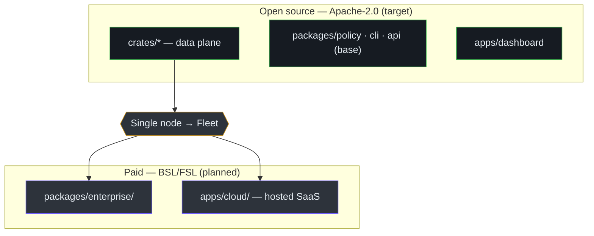

# Roadmap & Open-Core Model

Honmoon's architecture is downstream of a business decision: **open-core**. The data plane is
100% open source because, for a security tool, auditability *is* the product; monetization
happens in the control/cloud plane where teams operate fleets. This page ties the phased roadmap
to that boundary and records the key architecture decisions. Sources:
[roadmap.md](https://github.com/pleaseai/honmoon/blob/master/docs/roadmap.md),
[business-model.md](https://github.com/pleaseai/honmoon/blob/master/docs/business-model.md).

## Phase status at a glance

| Phase | Scope | Boundary | Status | Source |
|-------|-------|----------|--------|--------|
| 0 — Foundations | Monorepo, policy model, JSON Schema, ADR-0001 | OSS | done | [roadmap.md:21-29](https://github.com/pleaseai/honmoon/blob/master/docs/roadmap.md#L21-L29) |
| 1 — HTTP egress MVP | CONNECT proxy + domain allowlist | OSS | done | [roadmap.md:32-46](https://github.com/pleaseai/honmoon/blob/master/docs/roadmap.md#L32-L46) |
| 2 — CEL + HTTP facts | `decide()`, CEL engine, `http` facts | OSS | done | [roadmap.md:49-60](https://github.com/pleaseai/honmoon/blob/master/docs/roadmap.md#L49-L60) |
| 3 — SQL / K8s parsers | wire parsers → `sql` / `k8s` facts | OSS | done (parsing; live relay = TD-006) | [roadmap.md:63-77](https://github.com/pleaseai/honmoon/blob/master/docs/roadmap.md#L63-L77) |
| 4 — Verdicts, audit & dashboard | `pause` hold + audit log + embedded dashboard | OSS | done | [roadmap.md:81-101](https://github.com/pleaseai/honmoon/blob/master/docs/roadmap.md#L81-L101) |
| 5 — Isolation modes | hardened `run`, `gateway`, `join` | OSS | planned | [roadmap.md:93-100](https://github.com/pleaseai/honmoon/blob/master/docs/roadmap.md#L93-L100) |
| 6 — Team / control plane | fleet policy, RBAC/SSO, approval routing | **Paid** | planned | [roadmap.md:104-112](https://github.com/pleaseai/honmoon/blob/master/docs/roadmap.md#L104-L112) |
| 7 — Hosted SaaS & intelligence | multi-tenant cloud, threat feeds, key isolation | **Paid** | planned | [roadmap.md:116-122](https://github.com/pleaseai/honmoon/blob/master/docs/roadmap.md#L116-L122) |

<!-- Sources: docs/roadmap.md:21-122 -->

```mermaid
flowchart LR
  p0["Phase 0<br>Foundations"] --> p1["Phase 1<br>HTTP egress"]
  p1 --> p2["Phase 2<br>CEL + facts"]
  p2 --> p3["Phase 3<br>SQL/K8s parsers"]
  p3 --> p4["Phase 4<br>audit + dashboard"]
  p4 --> p5["Phase 5<br>isolation modes"]
  p5 --> p6["Phase 6<br>team plane"]
  p6 --> p7["Phase 7<br>hosted SaaS"]
  style p0 fill:#161b22,stroke:#3fb950,color:#e6edf3
  style p1 fill:#161b22,stroke:#3fb950,color:#e6edf3
  style p2 fill:#161b22,stroke:#3fb950,color:#e6edf3
  style p3 fill:#161b22,stroke:#3fb950,color:#e6edf3
  style p4 fill:#161b22,stroke:#3fb950,color:#e6edf3
  style p5 fill:#161b22,stroke:#d29922,color:#e6edf3
  style p6 fill:#2d333b,stroke:#6d5dfc,color:#e6edf3
  style p7 fill:#2d333b,stroke:#6d5dfc,color:#e6edf3
```

The green phases are shipped; amber are planned OSS; purple are the paid boundary. The dividing
line between Phase 5 and Phase 6 is the open-core boundary.

## The open-core boundary

The monetization boundary is *the moment a user moves from a single node to operating a
team/fleet*. The firewall must be powerful for free on one node; the problems of running many
agents, nodes, and people are the paid surface
([business-model.md:32-44](https://github.com/pleaseai/honmoon/blob/master/docs/business-model.md#L32-L44)).

| Area | Open source (adoption & trust) | Paid (team & enterprise) |
|------|--------------------------------|--------------------------|
| Data plane | `crates/*` — proxy, parsers, CEL engine | — (never locked) |
| Policy | YAML, single node | Fleet-wide central management, versioning, rollout |
| Audit | Local log, self-hosted dashboard | Long-term retention & search, compliance reports |
| Approval | Basic `pause` verdict | Routing, Slack, RBAC / SSO / SAML |
| Operations | Self-host | Hosted SaaS, multi-tenancy, SLA |
| Intelligence | — | Managed allowlists, threat feeds |

<!-- Sources: docs/business-model.md:37-58 -->

::: tip Why open source is non-negotiable here
*"Security teams will not trust a black-box proxy that inspects their traffic and credentials.
Auditability is itself a feature."* Locking the traffic-inspecting components behind a paywall
breaks trust and prevents adoption from happening at all
([business-model.md:12-18](https://github.com/pleaseai/honmoon/blob/master/docs/business-model.md#L12-L18)). This is encoded as
the "data plane stays open source" architectural invariant.
:::

### Licensing direction

| Target | License | Rationale | Source |
|--------|---------|-----------|--------|
| Core (`crates/*`, OSS packages) | **Apache-2.0** | Patent grant; favors contribution & trust | [business-model.md:65](https://github.com/pleaseai/honmoon/blob/master/docs/business-model.md#L65) |
| Enterprise / cloud | **BSL or FSL** | Source-available; blocks SaaS re-hosting | [business-model.md:66-67](https://github.com/pleaseai/honmoon/blob/master/docs/business-model.md#L66-L67) |

⚠️ The current scaffold still pins `MIT` in `Cargo.toml`
([Cargo.toml:12](https://github.com/pleaseai/honmoon/blob/master/Cargo.toml#L12)); moving the core to Apache-2.0 is a tracked
next action ([business-model.md:68-74](https://github.com/pleaseai/honmoon/blob/master/docs/business-model.md#L68-L74)).

## The moat

Competitors (Deno's clawpatrol, GitHub's gh-aw-firewall) have overwhelming distribution. A plain
domain allowlist cannot win against them; Honmoon's differentiation is the combination
([business-model.md:77-90](https://github.com/pleaseai/honmoon/blob/master/docs/business-model.md#L77-L90)):

1. **Protocol awareness** — parse SQL/K8s/HTTP at the wire for fine-grained policy.
2. **Multi-runtime + self-host** — not tied to a single platform.
3. **Unification** — egress filtering + protocol policy in one product.

## Architecture decisions

Two ADRs record the most consequential technical pivot — the data-plane framework choice:

| ADR | Decision | Status | Source |
|-----|----------|--------|--------|
| ADR-0001 | Adopt Pingora for the HTTP data plane | **Superseded** by 0002 | [0001](https://github.com/pleaseai/honmoon/blob/master/.please/docs/decisions/0001-adopt-pingora-http-data-plane.md) |
| ADR-0002 | Phase 1 CONNECT proxy on raw tokio; defer Pingora | **Accepted** | [0002](https://github.com/pleaseai/honmoon/blob/master/.please/docs/decisions/0002-phase1-connect-proxy-on-tokio.md) |

The lesson recorded in ADR-0002: a documented premise (Pingora's `allow_connect_method_proxying`
gives terminating forward-proxy behavior) was **disproven by a prototype**, so the team shipped
~130 LOC of tokio instead and deferred the heavy dependency until a phase actually needs it
([0002:10-44](https://github.com/pleaseai/honmoon/blob/master/.please/docs/decisions/0002-phase1-connect-proxy-on-tokio.md#L10-L44)). See
[Egress Gateway](/deep-dive/egress-gateway#why-a-hand-rolled-tokio-proxy-and-not-pingora) for the detail.

## Platform reality check

Not every layer runs everywhere — scope is kept honest
([roadmap.md:137-144](https://github.com/pleaseai/honmoon/blob/master/docs/roadmap.md#L137-L144)):

| Capability | Self-host (host/container) | Cloudflare Workers |
|------------|----------------------------|--------------------|
| HTTP egress filter + control plane | ✅ | ✅ (explicit proxy only) |
| Wire-level SQL/K8s, `run`/`join`, TLS MITM | ✅ | ❌ (needs OS networking) |

## Tech debt feeding the roadmap

| ID | Description | Priority | Blocks | Source |
|----|-------------|----------|--------|--------|
| TD-001 | Dual Rust/TS policy model → generate from JSON Schema | Medium | maintainability | [tracker:9](https://github.com/pleaseai/honmoon/blob/master/.please/docs/tracks/tech-debt-tracker.md#L9) |
| TD-002 | `serde_yaml` deprecated | Low | — | [tracker:10](https://github.com/pleaseai/honmoon/blob/master/.please/docs/tracks/tech-debt-tracker.md#L10) |
| TD-003 | `honmoon run` lacks real netns isolation | High | Phase 5 | [tracker:11](https://github.com/pleaseai/honmoon/blob/master/.please/docs/tracks/tech-debt-tracker.md#L11) |
| TD-004 | CONNECT sees host only; body rules need TLS termination | Medium | Phase 2 | [tracker:12](https://github.com/pleaseai/honmoon/blob/master/.please/docs/tracks/tech-debt-tracker.md#L12) |
| TD-006 | SQL/K8s parsers not fed by a live socket | High | Phase 3 follow-up | [tracker:14](https://github.com/pleaseai/honmoon/blob/master/.please/docs/tracks/tech-debt-tracker.md#L14) |

## Related Pages

- [Overview](/getting-started/overview) — the product thesis these phases build toward.
- [Egress Gateway (Data Plane)](/deep-dive/egress-gateway) — the ADR-0002 decision in code.
- [Control Plane & Dashboard](/deep-dive/control-plane) — the Phase 4 management plane (and its paid roadmap).

## References

- [docs/roadmap.md](https://github.com/pleaseai/honmoon/blob/master/docs/roadmap.md)
- [docs/business-model.md](https://github.com/pleaseai/honmoon/blob/master/docs/business-model.md)
- [.please/docs/decisions/0001-adopt-pingora-http-data-plane.md](https://github.com/pleaseai/honmoon/blob/master/.please/docs/decisions/0001-adopt-pingora-http-data-plane.md)
- [.please/docs/decisions/0002-phase1-connect-proxy-on-tokio.md](https://github.com/pleaseai/honmoon/blob/master/.please/docs/decisions/0002-phase1-connect-proxy-on-tokio.md)
- [.please/docs/tracks/tech-debt-tracker.md](https://github.com/pleaseai/honmoon/blob/master/.please/docs/tracks/tech-debt-tracker.md)
