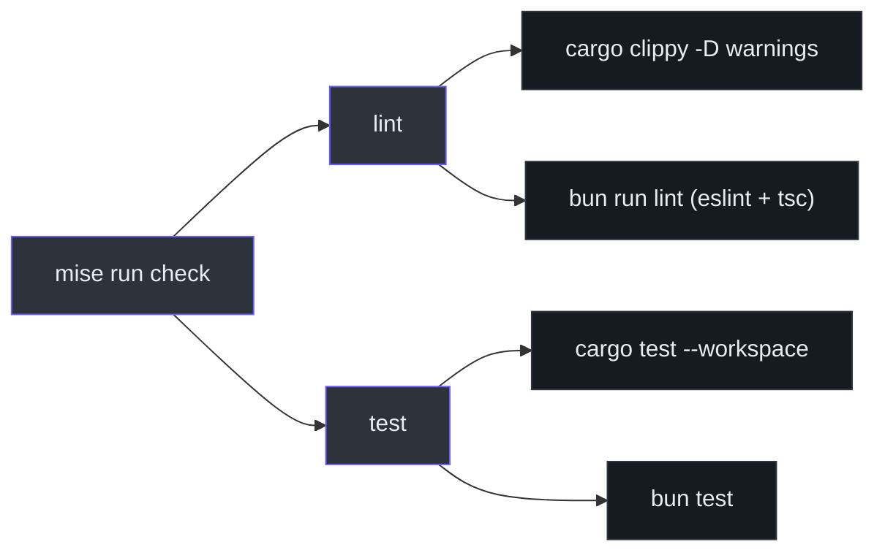
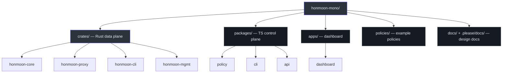

# Installation & Toolchain

Honmoon is a polyglot monorepo: a Cargo workspace (Rust data plane) and a Bun workspace
(TypeScript control plane + dashboard) living side by side. The toolchain follows the
PassionFactory standard — **mise** manages the JS runtimes and wraps both ecosystems behind a
single set of tasks; Rust is driven by the Cargo-canonical `rust-toolchain.toml`
([mise.toml:1-6](https://github.com/pleaseai/honmoon/blob/master/mise.toml#L1-L6)).

## At a glance

| Tool | Version | Managed by | Source |
|------|---------|-----------|--------|
| Rust | stable, edition 2024, `rust-version = 1.85` | `rust-toolchain.toml` (rustup) | [Cargo.toml:9-14](https://github.com/pleaseai/honmoon/blob/master/Cargo.toml#L9-L14) |
| Node | 24 | mise | [mise.toml:8-10](https://github.com/pleaseai/honmoon/blob/master/mise.toml#L8-L10) |
| Bun | latest (1.3.x) | mise | [mise.toml:8-10](https://github.com/pleaseai/honmoon/blob/master/mise.toml#L8-L10) |
| Docker (optional) | 20.10+ / Compose v2 | — (only for the Squid backend) | [README.md:166-169](https://github.com/pleaseai/honmoon/blob/master/README.md#L166-L169) |

## Prerequisites

You need [`mise`](https://mise.jdx.dev/) and a Rust toolchain (`rustup`). `mise` installs Node
and Bun; `rust-toolchain.toml` pins the Rust toolchain with `rustfmt` and `clippy`.

```bash
# 1. Clone
git clone https://github.com/pleaseai/honmoon.git
cd honmoon

# 2. Trust + install the mise-managed toolchain (node 24, bun latest)
mise trust && mise install

# 3. Install dependencies for both ecosystems
mise run install      # → cargo fetch && bun install
```

## The mise tasks

Every common operation is a `mise run <task>`. The tasks wrap both ecosystems so a single
command covers Rust and JS ([mise.toml:16-54](https://github.com/pleaseai/honmoon/blob/master/mise.toml#L16-L54)).

| Task | Runs | Purpose |
|------|------|---------|
| `mise run install` | `cargo fetch` · `bun install` | Fetch all deps |
| `mise run build` | `cargo build --workspace` · `bun run build` | Build data plane + JS |
| `mise run dev` | `bun run dashboard:dev` | Dashboard dev server (HMR) |
| `mise run lint` | `cargo clippy … -D warnings` · `bun run lint` | Lint both |
| `mise run fmt` | `cargo fmt --all` | Format Rust |
| `mise run test` | `cargo test --workspace` · `bun test` | Test both |
| `mise run check` | `lint` → `test` | Full gate (the CI equivalent) |


<!-- Sources: mise.toml:34-54, .please/docs/knowledge/workflow.md:76-81 -->

## Building without mise

If you prefer to drive each ecosystem directly:

```bash
# Rust data plane
cargo build --workspace
cargo test --workspace

# TypeScript control plane + dashboard
bun install
bun run build        # build dashboard (Vite) + control plane
bun test

# Dashboard dev server (HMR)
cd apps/dashboard && bun run dev
```

The root `package.json` defines the JS workspace scripts ([package.json:10-17](https://github.com/pleaseai/honmoon/blob/master/package.json#L10-L17)):

| Script | Command |
|--------|---------|
| `bun run build` | `bun run --filter '*' build` |
| `bun run lint` | `eslint .` |
| `bun run typecheck` | `bun run --filter '*' typecheck` |
| `bun run dashboard:dev` | `bun run --filter '@honmoon/dashboard' dev` |

## Workspace layout


<!-- Sources: README.md:88-104, Cargo.toml:3-7, package.json:5-9 -->

The Cargo workspace members and centrally pinned dependencies live in the root `Cargo.toml`
([Cargo.toml:1-28](https://github.com/pleaseai/honmoon/blob/master/Cargo.toml#L1-L28)); the JS
workspaces (`packages/*`, `apps/*`) are declared in the root `package.json`
([package.json:5-9](https://github.com/pleaseai/honmoon/blob/master/package.json#L5-L9)).

## Continuous integration

CI runs two parallel jobs on every push to `master` and every PR
([.github/workflows/ci.yml](https://github.com/pleaseai/honmoon/blob/master/.github/workflows/ci.yml)):

| Job | Steps | Source |
|-----|-------|--------|
| **Rust** | `cargo fmt --check` → `clippy -D warnings` → `cargo llvm-cov` (test + coverage) → Codecov | [ci.yml:16-47](https://github.com/pleaseai/honmoon/blob/master/.github/workflows/ci.yml#L16-L47) |
| **JS** | `bun install --frozen-lockfile` → `bun run lint` → `bun run typecheck` → `bun run build` | [ci.yml:49-70](https://github.com/pleaseai/honmoon/blob/master/.github/workflows/ci.yml#L49-L70) |

::: tip CI runs lint/typecheck/build for JS
The CI JS job runs lint/typecheck/build but **not** `bun test`
([ci.yml:70](https://github.com/pleaseai/honmoon/blob/master/.github/workflows/ci.yml#L70)). There is now a
TypeScript test suite (`@honmoon/api`'s `audit.test.ts`); run it locally with `bun test`. The Rust
suite remains the broadest coverage (policy, engine, parsers, audit, approval, egress, mgmt e2e).
:::

## Before committing

```bash
cargo fmt --all && cargo clippy --workspace --all-targets -- -D warnings
bun run lint
cargo test --workspace && bun test
```

The full quality gate and definition of done are in
[workflow.md](https://github.com/pleaseai/honmoon/blob/master/.please/docs/knowledge/workflow.md#L41-L96).

## Related Pages

- [Quick Start](/getting-started/quick-start) — your first `honmoon run`.
- [Contributor Guide](/onboarding/contributor-guide) — setup plus the full development workflow.
- [Roadmap & Open-Core Model](/deep-dive/roadmap-open-core) — phase status of each component.

## References

- [mise.toml](https://github.com/pleaseai/honmoon/blob/master/mise.toml)
- [Cargo.toml](https://github.com/pleaseai/honmoon/blob/master/Cargo.toml)
- [package.json](https://github.com/pleaseai/honmoon/blob/master/package.json)
- [.github/workflows/ci.yml](https://github.com/pleaseai/honmoon/blob/master/.github/workflows/ci.yml)
- [.please/docs/knowledge/workflow.md](https://github.com/pleaseai/honmoon/blob/master/.please/docs/knowledge/workflow.md)
