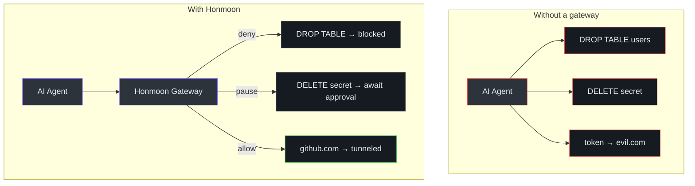
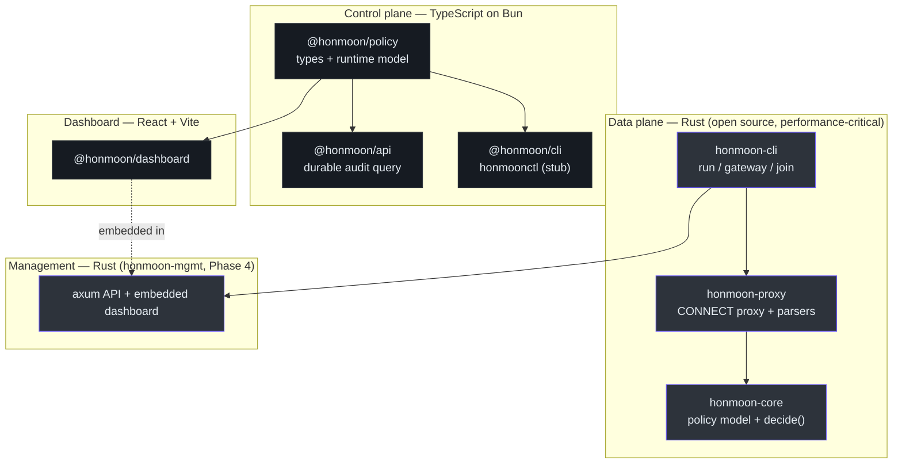

# Overview

Honmoon is a **policy-based firewall gateway** that sits between an AI agent and everything
the agent tries to reach over the network. It inspects each outbound connection, evaluates it
against a declarative policy, and returns one of three verdicts — `allow`, `deny`, or `pause`
(hold for human approval) — **before** the request reaches its destination. The name (혼문,
魂門) borrows from Korean lore: a protective barrier sealing one world off from another
([README.md:19-23](https://github.com/pleaseai/honmoon/blob/main/README.md#L19-L23)).

## At a glance

| Concern | Honmoon's answer | Source |
|---------|------------------|--------|
| What does it protect? | The boundary between AI agents and production systems (APIs, databases, K8s) | [product.md:6-11](https://github.com/pleaseai/honmoon/blob/main/.please/docs/knowledge/product.md#L6-L11) |
| How does it decide? | A YAML policy: egress allow/deny lists + CEL rules over protocol facts | [policies/agent.yaml](https://github.com/pleaseai/honmoon/blob/main/policies/agent.yaml) |
| What can it decide? | `allow` · `deny` · `pause` (held for human approval) | [lib.rs:15-25](https://github.com/pleaseai/honmoon/blob/main/crates/honmoon-core/src/lib.rs#L15-L25) |
| Default posture | **Fail closed** — default egress verdict is `deny` | [lib.rs:50-62](https://github.com/pleaseai/honmoon/blob/main/crates/honmoon-core/src/lib.rs#L50-L62) |
| What runs today? | Phase 1–4: egress proxy + CEL engine + SQL/K8s parsers + `pause` approval + audit + dashboard | [roadmap.md:32-101](https://github.com/pleaseai/honmoon/blob/main/docs/roadmap.md#L32-L101) |

## The problem

AI agents run shell commands, call APIs, and access databases. That capability is also the
risk: a single bad inference can trigger data exfiltration, a destructive query (`DROP TABLE`),
unauthorized Kubernetes resource deletion, or tokens leaked to a private endpoint. Existing
controls are either **too coarse** (block all network) or **too narrow** (HTTP domain allowlist
only) ([product.md:13-18](https://github.com/pleaseai/honmoon/blob/main/.please/docs/knowledge/product.md#L13-L18)).

Honmoon's thesis is that the right control point is the **wire**: intercept the agent's
connections, parse just enough of each protocol to make a policy decision, and enforce it.

<!-- Sources: .please/docs/knowledge/product.md:13-29, policies/agent.yaml:13-27 -->

## Two layers of protection

Honmoon deliberately combines two approaches that the industry has so far kept separate
([README.md:11-17](https://github.com/pleaseai/honmoon/blob/main/README.md#L11-L17)):

| Layer | What it does | Inspired by |
|-------|--------------|-------------|
| **Egress domain filtering** | Restrict outbound HTTP/HTTPS with a domain allow/deny list | [github/gh-aw-firewall](https://github.com/github/gh-aw-firewall) (Squid-based) |
| **Protocol-aware engine** | Parse SQL / K8s / HTTP at the wire level, apply fine-grained CEL rules | [denoland/clawpatrol](https://github.com/denoland/clawpatrol) |

The protocol-aware layer is the **moat**: a plain domain allowlist cannot distinguish a
`SELECT` from a `DROP`, but Honmoon parses the PostgreSQL wire message and binds the verdict to
`sql.verb == 'DROP'` ([product.md:57-60](https://github.com/pleaseai/honmoon/blob/main/.please/docs/knowledge/product.md#L57-L60)).

## Dual-plane design

The monorepo separates languages by responsibility — a hard architectural boundary, not a
preference ([ARCHITECTURE.md:26-49](https://github.com/pleaseai/honmoon/blob/main/ARCHITECTURE.md#L26-L49)):

<!-- Sources: ARCHITECTURE.md:30-49, crates/honmoon-mgmt/src/lib.rs:1-16, packages/policy/src/index.ts:33-92 -->

**Invariant:** `honmoon-core` is transport-agnostic — it has no `tokio` or networking
dependency. The proxy feeds it `Facts` and consumes a `Verdict`. This keeps the policy logic
pure and unit-testable without a runtime ([ARCHITECTURE.md:47-48](https://github.com/pleaseai/honmoon/blob/main/ARCHITECTURE.md#L47-L48)).

## Operating modes

Honmoon is designed for three deployment shapes. Only the first two are wired today; `join` is
a stub ([main.rs:58-60](https://github.com/pleaseai/honmoon/blob/main/crates/honmoon-cli/src/main.rs#L58-L60)).

| Mode | Command | Status | What it does |
|------|---------|--------|--------------|
| Process Wrapper | `honmoon run -- <cmd>` | Phase 1 (env-var isolation only — see caveat) | Start an ephemeral proxy, exec the child with `https_proxy` pointed at it |
| Gateway | `honmoon gateway` | Phase 1 | Standalone central proxy loading a policy |
| Join | `honmoon join` | planned | Route all host traffic to a gateway via tunnel |

::: warning Isolation is advisory today, not enforcing
`honmoon run` currently only sets proxy environment variables for the child. A child process
that ignores those variables escapes the policy. Real network-namespace isolation (Linux netns
/ macOS NetworkExtension) is tracked as **TD-003** and is a Phase 5 goal.
See [tech-debt-tracker.md:11](https://github.com/pleaseai/honmoon/blob/main/.please/docs/tracks/tech-debt-tracker.md#L11).
:::

## Where to go next

- **Run it:** [Installation & Toolchain](/getting-started/installation) → [Quick Start](/getting-started/quick-start)
- **Write policy:** [Policy Authoring](/getting-started/policy-authoring)
- **Understand it:** [Architecture](/deep-dive/architecture) → [Policy Engine](/deep-dive/policy-engine)

## Related Pages

- [Architecture](/deep-dive/architecture) — dependency layers and the request lifecycle.
- [Policy Model & Decision Engine](/deep-dive/policy-engine) — how `decide()` reaches a verdict.
- [Roadmap & Open-Core Model](/deep-dive/roadmap-open-core) — what is built vs planned, and why.

## References

- [README.md](https://github.com/pleaseai/honmoon/blob/main/README.md)
- [.please/docs/knowledge/product.md](https://github.com/pleaseai/honmoon/blob/main/.please/docs/knowledge/product.md)
- [ARCHITECTURE.md](https://github.com/pleaseai/honmoon/blob/main/ARCHITECTURE.md)
- [docs/roadmap.md](https://github.com/pleaseai/honmoon/blob/main/docs/roadmap.md)
