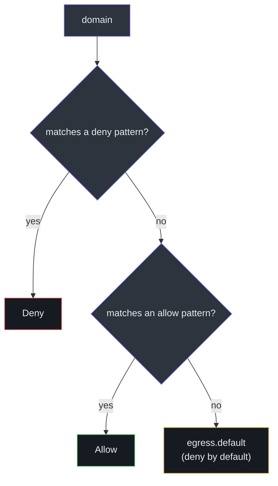
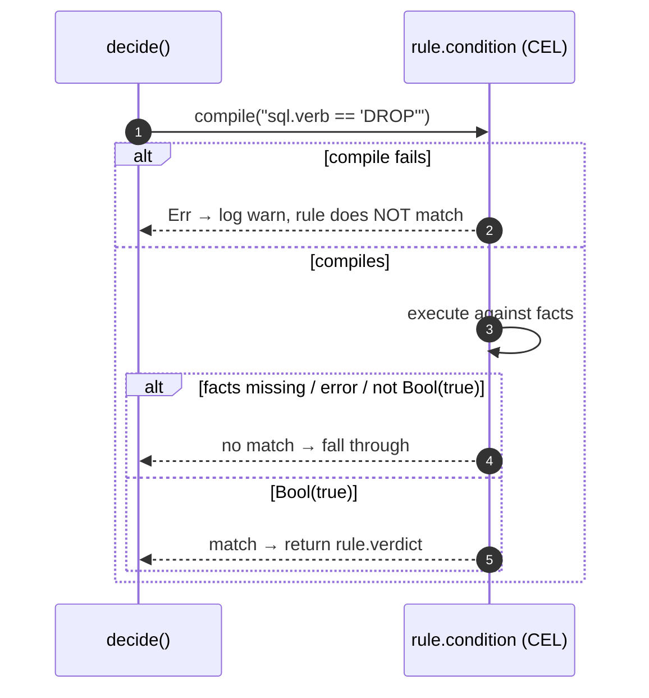

# Policy Authoring

A Honmoon policy is a single YAML document with two sections: an `egress` block (domain
allow/deny lists — the common case) and a list of `rules` (protocol-aware CEL conditions — the
fine-grained case). The shape is defined identically by the Rust model
([lib.rs:25-70](https://github.com/pleaseai/honmoon/blob/master/crates/honmoon-core/src/lib.rs#L25-L70)),
the TypeScript types ([index.ts:7-31](https://github.com/pleaseai/honmoon/blob/master/packages/policy/src/index.ts#L7-L31)),
and the JSON Schema ([policy.schema.json](https://github.com/pleaseai/honmoon/blob/master/packages/policy/schema/policy.schema.json)).

## At a glance

| Field | Type | Default | Meaning | Source |
|-------|------|---------|---------|--------|
| `version` | integer ≥ 1 | `0` | Policy schema version | [policy.schema.json:8](https://github.com/pleaseai/honmoon/blob/master/packages/policy/schema/policy.schema.json#L8) |
| `egress.default` | verdict | `deny` | Verdict when no allow/deny entry matches | [lib.rs:39-41](https://github.com/pleaseai/honmoon/blob/master/crates/honmoon-core/src/lib.rs#L39-L41) |
| `egress.allow` | string[] | `[]` | Domain patterns to allow | [lib.rs:42-43](https://github.com/pleaseai/honmoon/blob/master/crates/honmoon-core/src/lib.rs#L42-L43) |
| `egress.deny` | string[] | `[]` | Domain patterns to deny (wins over allow) | [lib.rs:44-45](https://github.com/pleaseai/honmoon/blob/master/crates/honmoon-core/src/lib.rs#L44-L45) |
| `rules[]` | rule[] | `[]` | Ordered protocol-aware rules | [lib.rs:62-70](https://github.com/pleaseai/honmoon/blob/master/crates/honmoon-core/src/lib.rs#L62-L70) |

A **verdict** is one of `allow`, `deny`, `pause` ([policy.schema.json:24-27](https://github.com/pleaseai/honmoon/blob/master/packages/policy/schema/policy.schema.json#L24-L27)).

## The shipped example

```yaml
# policies/agent.yaml
# yaml-language-server: $schema=../packages/policy/schema/policy.schema.json
version: 1

egress:
  default: deny
  allow:
    - github.com
    - '*.githubusercontent.com'
    - api.anthropic.com
  deny:
    - '*.internal.corp'

rules:
  - name: k8s-no-secret-delete
    endpoint: k8s-prod
    condition: "k8s.resource == 'secrets' && k8s.verb == 'delete'"
    verdict: deny

  - name: sql-no-prod-drop
    endpoint: postgres-prod
    condition: "sql.verb == 'DROP' || sql.verb == 'TRUNCATE'"
    verdict: pause

  - name: http-block-large-upload
    endpoint: '*'
    condition: "http.method == 'POST' && http.body_size > 10485760"
    verdict: deny
```

The first line is a `yaml-language-server` modeline so editors validate against the JSON Schema
as you type ([agent.yaml:1](https://github.com/pleaseai/honmoon/blob/master/policies/agent.yaml#L1)).

## Egress domain matching

Domain patterns support an exact match or a single leading `*.` wildcard. Matching is
case-insensitive on both sides ([engine.rs:56-64](https://github.com/pleaseai/honmoon/blob/master/crates/honmoon-core/src/engine.rs#L56-L64)):

| Pattern | Matches | Does **not** match |
|---------|---------|--------------------|
| `github.com` | `github.com`, `GitHub.com` | `api.github.com` |
| `*.githubusercontent.com` | `raw.githubusercontent.com`, `githubusercontent.com` | `evilgithubusercontent.com` |

The `*.suffix` form matches the bare `suffix` **and** any `*.suffix` subdomain
([engine.rs:59-60](https://github.com/pleaseai/honmoon/blob/master/crates/honmoon-core/src/engine.rs#L59-L60)).
Within the egress block, **deny wins over allow**, and an unmatched domain falls through to
`egress.default` ([engine.rs:30-45](https://github.com/pleaseai/honmoon/blob/master/crates/honmoon-core/src/engine.rs#L30-L45)):


<!-- Sources: crates/honmoon-core/src/engine.rs:30-64 -->

## Protocol rules with CEL

Each rule binds a [CEL](https://github.com/google/cel-spec) condition to a named `endpoint`.
Rules are evaluated **in order**; the first rule whose endpoint matches and whose condition
evaluates to `true` wins ([engine.rs:19-28](https://github.com/pleaseai/honmoon/blob/master/crates/honmoon-core/src/engine.rs#L19-L28)).
If no rule matches, the egress block decides.

| Rule field | Meaning | Example | Source |
|-----------|---------|---------|--------|
| `name` | Human label | `sql-no-prod-drop` | [lib.rs:65](https://github.com/pleaseai/honmoon/blob/master/crates/honmoon-core/src/lib.rs#L65) |
| `endpoint` | Named target; `*` matches any | `postgres-prod` | [lib.rs:66](https://github.com/pleaseai/honmoon/blob/master/crates/honmoon-core/src/lib.rs#L66), [engine.rs:48-50](https://github.com/pleaseai/honmoon/blob/master/crates/honmoon-core/src/engine.rs#L48-L50) |
| `condition` | CEL over protocol facts | `sql.verb == 'DROP'` | [lib.rs:67-68](https://github.com/pleaseai/honmoon/blob/master/crates/honmoon-core/src/lib.rs#L67-L68) |
| `verdict` | `allow` / `deny` / `pause` | `pause` | [lib.rs:69](https://github.com/pleaseai/honmoon/blob/master/crates/honmoon-core/src/lib.rs#L69) |

### Facts available to conditions

Conditions reference protocol facts as CEL variables of the same name. Each is only populated
when the corresponding parser has run ([lib.rs:77-119](https://github.com/pleaseai/honmoon/blob/master/crates/honmoon-core/src/lib.rs#L77-L119)):

| Variable | Fields | Populated by | Status |
|----------|--------|--------------|--------|
| `http` | `method`, `host`, `path`, `body_size` | CONNECT proxy sets `host` only today | `host` <span class="status-done">live</span> · rest <span class="status-planned">needs TLS termination</span> |
| `sql` | `verb`, `table` | `parse_postgres_query` / `parse_sql` | <span class="status-done">parsed & tested</span> · <span class="status-planned">not yet on a live socket (TD-006)</span> |
| `k8s` | `verb`, `resource`, `namespace` | `parse_k8s_request` | <span class="status-done">parsed & tested</span> · <span class="status-planned">not yet on a live socket (TD-006)</span> |

### Example conditions

```cel
# Block dangerous DDL against the production database
sql.verb == 'DROP' || sql.verb == 'TRUNCATE'

# Deny deletion of Kubernetes secrets in prod
k8s.resource == 'secrets' && k8s.verb == 'delete'

# Block large uploads (needs HTTP body facts → TLS termination)
http.method == 'POST' && http.body_size > 10485760
```

## Fail-closed semantics

Honmoon is designed to **fail closed**: a rule whose condition fails to compile, or references a
fact that has not been populated, simply **does not match** — it can never turn a `deny` into an
`allow`. Combined with the `deny`-by-default egress verdict, an absent or broken rule is always
the safe outcome ([engine.rs:16-18](https://github.com/pleaseai/honmoon/blob/master/crates/honmoon-core/src/engine.rs#L16-L18), [engine.rs:66-71](https://github.com/pleaseai/honmoon/blob/master/crates/honmoon-core/src/engine.rs#L66-L71)).


<!-- Sources: crates/honmoon-core/src/engine.rs:66-91 -->

This behavior is locked by tests: `unknown_fact_reference_does_not_match` proves a condition
referencing an unpopulated `sql` fact falls through to the egress default
([engine.rs:176-184](https://github.com/pleaseai/honmoon/blob/master/crates/honmoon-core/src/engine.rs#L176-L184)).

## Validating a policy

| Method | Status | Notes |
|--------|--------|-------|
| Editor (`yaml-language-server` + JSON Schema) | <span class="status-done">works</span> | Live validation via the modeline |
| `Policy::from_yaml` (Rust) | <span class="status-done">works</span> | Used by `honmoon run` / `gateway` to load policy | 
| `honmoonctl validate <file>` | <span class="status-planned">stub</span> | Reads the file but YAML parse + schema check are a `TODO` ([cli/src/index.ts:14-23](https://github.com/pleaseai/honmoon/blob/master/packages/cli/src/index.ts#L14-L23)) |

::: warning Dual model, kept in sync by hand
The Rust model (`honmoon-core`) and the TS model (`@honmoon/policy`) describe the same policy
but are maintained separately — a change to one must update the other (**TD-001**). The JSON
Schema is the intended future single source of truth.
See [lib.rs:1-4](https://github.com/pleaseai/honmoon/blob/master/crates/honmoon-core/src/lib.rs#L1-L4) and [index.ts:1-5](https://github.com/pleaseai/honmoon/blob/master/packages/policy/src/index.ts#L1-L5).
:::

## Related Pages

- [Policy Model & Decision Engine](/deep-dive/policy-engine) — the full precedence algorithm.
- [Protocol-Aware Parsing](/deep-dive/protocol-parsing) — how `sql` / `k8s` facts are produced.
- [Quick Start](/getting-started/quick-start) — run a policy.

## References

- [policies/agent.yaml](https://github.com/pleaseai/honmoon/blob/master/policies/agent.yaml)
- [packages/policy/schema/policy.schema.json](https://github.com/pleaseai/honmoon/blob/master/packages/policy/schema/policy.schema.json)
- [packages/policy/src/index.ts](https://github.com/pleaseai/honmoon/blob/master/packages/policy/src/index.ts)
- [crates/honmoon-core/src/lib.rs](https://github.com/pleaseai/honmoon/blob/master/crates/honmoon-core/src/lib.rs)
- [crates/honmoon-core/src/engine.rs](https://github.com/pleaseai/honmoon/blob/master/crates/honmoon-core/src/engine.rs)
