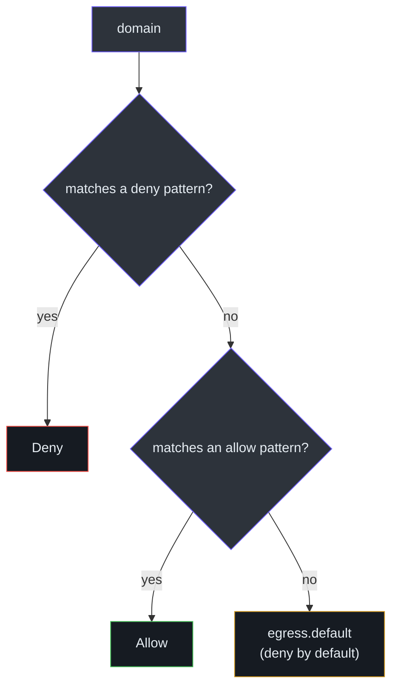
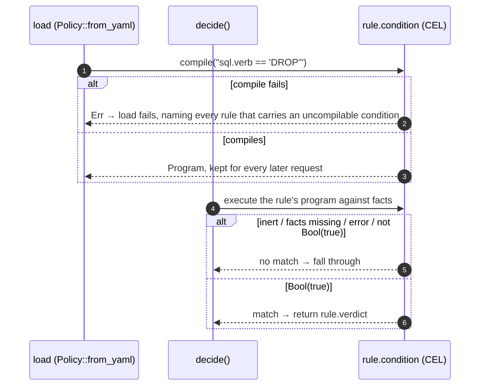

# Policy Authoring

A Honmoon policy is a single YAML document with three sections: an `egress` block (domain
allow/deny lists — the common case), an optional `endpoints` map (named network targets), and a
list of `rules` (protocol-aware CEL conditions — the fine-grained case). The same field structure
is described by the Rust model
([lib.rs:57-152](https://github.com/pleaseai/honmoon/blob/main/crates/honmoon-core/src/lib.rs#L57-L152)),
the TypeScript types ([index.ts:7-61](https://github.com/pleaseai/honmoon/blob/main/packages/policy/src/index.ts#L7-L61)),
and the JSON Schema ([policy.schema.json](https://github.com/pleaseai/honmoon/blob/main/packages/policy/schema/policy.schema.json)) —
though their *validation* differs: the JSON Schema is the strict one (`additionalProperties: false`,
`version ≥ 1`), while the Rust loader tolerates and defaults missing fields and the TS types are
compile-time only. Keeping the three aligned is tracked as TD-001.

## At a glance

| Field | Type | Default | Meaning | Source |
|-------|------|---------|---------|--------|
| `version` | integer ≥ 1 | `0` | Policy schema version | [policy.schema.json:8](https://github.com/pleaseai/honmoon/blob/main/packages/policy/schema/policy.schema.json#L8) |
| `egress.default` | verdict | `deny` | Verdict when no allow/deny entry matches | [lib.rs:121-123](https://github.com/pleaseai/honmoon/blob/main/crates/honmoon-core/src/lib.rs#L121-L123) |
| `egress.allow` | string[] | `[]` | Domain patterns to allow | [lib.rs:124-125](https://github.com/pleaseai/honmoon/blob/main/crates/honmoon-core/src/lib.rs#L124-L125) |
| `egress.deny` | string[] | `[]` | Domain patterns to deny (wins over allow) | [lib.rs:126-127](https://github.com/pleaseai/honmoon/blob/main/crates/honmoon-core/src/lib.rs#L126-L127) |
| `endpoints` | map&lt;name, endpoint&gt; | `{}` | Named network targets a rule can bind to | [lib.rs:64-68](https://github.com/pleaseai/honmoon/blob/main/crates/honmoon-core/src/lib.rs#L64-L68) |
| `rules[]` | rule[] | `[]` | Ordered protocol-aware rules | [lib.rs:144-152](https://github.com/pleaseai/honmoon/blob/main/crates/honmoon-core/src/lib.rs#L144-L152) |

A **verdict** is one of `allow`, `deny`, `pause` ([policy.schema.json:28-31](https://github.com/pleaseai/honmoon/blob/main/packages/policy/schema/policy.schema.json#L28-L31)).

## The shipped example

```yaml
# policies/agent.yaml
# yaml-language-server: $schema=../packages/policy/schema/policy.schema.json
version: 1

egress:
  default: deny
  allow:
    - github.com
    - '*.githubusercontent.com'
    - api.anthropic.com
    - k8s.internal # endpoint hosts need an allow entry of their own
    - db.internal
  deny:
    - '*.internal.corp'

endpoints:
  k8s-prod: {host: k8s.internal, port: 6443, protocol: kubernetes}
  postgres-prod: {host: db.internal, port: 5432, protocol: postgres}

rules:
  - name: k8s-no-secret-delete
    endpoint: k8s-prod
    condition: "k8s.resource == 'secrets' && k8s.verb == 'delete'"
    verdict: deny

  - name: sql-no-prod-drop
    endpoint: postgres-prod
    condition: "sql.verb == 'DROP' || sql.verb == 'TRUNCATE'"
    verdict: pause

  - name: http-block-large-upload
    endpoint: '*'
    condition: "http.method == 'POST' && http.body_size > 10485760"
    verdict: deny
```

The first line is a `yaml-language-server` modeline so editors validate against the JSON Schema
as you type ([agent.yaml:1](https://github.com/pleaseai/honmoon/blob/main/policies/agent.yaml#L1)).

## Egress domain matching

Domain patterns support an exact match or a single leading `*.` wildcard. Matching is
case-insensitive on both sides ([engine.rs:56-64](https://github.com/pleaseai/honmoon/blob/main/crates/honmoon-core/src/engine.rs#L56-L64)):

| Pattern | Matches | Does **not** match |
|---------|---------|--------------------|
| `github.com` | `github.com`, `GitHub.com` | `api.github.com` |
| `*.githubusercontent.com` | `raw.githubusercontent.com`, `githubusercontent.com` | `evilgithubusercontent.com` |

The `*.suffix` form matches the bare `suffix` **and** any `*.suffix` subdomain
([engine.rs:59-60](https://github.com/pleaseai/honmoon/blob/main/crates/honmoon-core/src/engine.rs#L59-L60)).
Within the egress block, **deny wins over allow**, and an unmatched domain falls through to
`egress.default` ([engine.rs:149-164](https://github.com/pleaseai/honmoon/blob/main/crates/honmoon-core/src/engine.rs#L149-L164)):


```mermaid
flowchart TD
  start["domain"] --> deny{"matches a deny pattern?"}
  deny -->|yes| D["Deny"]
  deny -->|no| allow{"matches an allow pattern?"}
  allow -->|yes| A["Allow"]
  allow -->|no| def["egress.default<br>(deny by default)"]
  style start fill:#2d333b,stroke:#6d5dfc,color:#e6edf3
  style deny fill:#2d333b,stroke:#6d5dfc,color:#e6edf3
  style allow fill:#2d333b,stroke:#6d5dfc,color:#e6edf3
  style D fill:#161b22,stroke:#f85149,color:#e6edf3
  style A fill:#161b22,stroke:#3fb950,color:#e6edf3
  style def fill:#161b22,stroke:#d29922,color:#e6edf3
```
<!-- Sources: crates/honmoon-core/src/engine.rs:30-64 -->

## Named endpoints

`endpoints` maps a name to the network target a client dials. A rule's `endpoint` field refers to
one of these names, so a rule like `k8s.resource == 'secrets'` applies to *that cluster* rather
than to every host that happens to serve a similar path.

```yaml
endpoints:
  k8s-prod: {host: k8s.internal, port: 6443, protocol: kubernetes}
  postgres-prod: {host: db.internal, port: 5432, protocol: postgres}
  cache: {host: redis.internal, port: 6379} # protocol defaults to tcp
```

| Field | Type | Default | Meaning |
|-------|------|---------|---------|
| `host` | string | required | Hostname the client dials |
| `port` | integer 1–65535 | required | Port the client dials |
| `protocol` | `postgres` / `kubernetes` / `tcp` | `tcp` | Which protocol facts to parse |

**Matching is exact**: the host must be equal (case-insensitive, with a trailing FQDN dot
trimmed) *and* the port must be equal. There is no IP resolution and no wildcard host in v0.1.0
([lib.rs:346-363](https://github.com/pleaseai/honmoon/blob/main/crates/honmoon-core/src/lib.rs#L346-L363)).
The port comes from what the client dialed — the CONNECT authority for an HTTPS tunnel, defaulting
to 443 (or 80 for a cleartext forward-proxy request) when the authority carries no explicit port,
or the SOCKS5 handshake's own `host:port` for a non-HTTP protocol.

What each `protocol` does today:

| Value | Effect |
|-------|--------|
| `kubernetes` | Intercepted HTTPS requests to this endpoint get `k8s` facts (`verb`, `resource`, `namespace`) parsed from the method and path |
| `postgres` | Connections that reach this endpoint **through the SOCKS5 listener** are inspected inline: every `Q` (simple query) and `P` (Parse) frame gets `sql` facts and its own verdict ([ADR-0007](https://github.com/pleaseai/honmoon/blob/main/.please/docs/decisions/0007-inline-postgresql-runtime-semantics.md)) |
| `tcp` | Name only — the endpoint can be referenced by a rule, but no protocol facts are parsed |

### Reaching a `postgres` endpoint

SQL rules only fire on a connection that arrives through the **SOCKS5 listener** — the CONNECT
proxy carries HTTP and TLS, and a PostgreSQL client speaks neither. Run the gateway with the
listener bound (it is on by default) and point the client at it:

```bash
honmoon gateway --config policies/agent.yaml --socks-addr 127.0.0.1:1080
```

```bash
# A client that speaks SOCKS5 dials the endpoint through the listener
ALL_PROXY=socks5h://127.0.0.1:1080 <your-tool>
```

`psql` does not speak SOCKS5 itself, so wrap it in a SOCKS-aware launcher (`proxychains4`,
`tsocks`) or point it at a local forwarder. Use `sslmode=prefer` or `sslmode=disable`: inline
inspection needs plaintext between the client and honmoon, so `SSLRequest` is declined and
`sslmode=require` cannot connect. A refused statement comes back as SQLSTATE `42501`
(insufficient privilege) naming the rule, and the session stays open.

A connection to a host with **no** declared endpoint (or one declared `protocol: tcp`) is a raw
tunnel through the same listener, gated once on `domain` by the `egress` block — no SQL is parsed.

A rule referencing an endpoint that `endpoints` does not declare is a **load-time warning, not an
error**: `Facts.endpoint` may be set by other means, and refusing the whole policy over one
dangling name would fail open for every other rule
([lib.rs:365-381](https://github.com/pleaseai/honmoon/blob/main/crates/honmoon-core/src/lib.rs#L365-L381)).

That tolerance covers *undefined references only*. An unusable `endpoints` entry is a **load-time
error** — the policy is rejected outright
([lib.rs:206-231](https://github.com/pleaseai/honmoon/blob/main/crates/honmoon-core/src/lib.rs#L206-L231)):

| Mistake | Why it fails the load |
|---------|-----------------------|
| `port: 0` | Not a dialable port; the JSON Schema requires 1–65535 |
| Two names on the same `(host, port)` | Lookup would silently pick one and shadow the other, so only one of the author's rules would ever fire (hosts compared case-insensitively with a trailing dot trimmed) |

## Protocol rules with CEL

Each rule binds a [CEL](https://github.com/google/cel-spec) condition to a named `endpoint`.
Rules are evaluated **in order**; the first rule whose endpoint matches and whose condition
evaluates to `true` wins ([engine.rs:102-138](https://github.com/pleaseai/honmoon/blob/main/crates/honmoon-core/src/engine.rs#L102-L138)).
If no rule matches, the egress block decides.

| Rule field | Meaning | Example | Source |
|-----------|---------|---------|--------|
| `name` | Human label | `sql-no-prod-drop` | [lib.rs:147](https://github.com/pleaseai/honmoon/blob/main/crates/honmoon-core/src/lib.rs#L147) |
| `endpoint` | Named target; `*` matches any | `postgres-prod` | [lib.rs:148](https://github.com/pleaseai/honmoon/blob/main/crates/honmoon-core/src/lib.rs#L148), [engine.rs:48-50](https://github.com/pleaseai/honmoon/blob/main/crates/honmoon-core/src/engine.rs#L48-L50) |
| `condition` | CEL over protocol facts | `sql.verb == 'DROP'` | [lib.rs:149-150](https://github.com/pleaseai/honmoon/blob/main/crates/honmoon-core/src/lib.rs#L149-L150) |
| `verdict` | `allow` / `deny` / `pause` | `pause` | [lib.rs:151](https://github.com/pleaseai/honmoon/blob/main/crates/honmoon-core/src/lib.rs#L151) |

### Rule order and unreachable rules

Because the first match wins, an **unconditional** rule — `condition: "true"` — answers every
request its `endpoint` covers, and nothing below it on that endpoint is ever reached.

That matters most for the shape an `egress.default: deny` policy needs around a `postgres`
endpoint. The connection itself is gated before any statement exists, so the endpoint needs a
connection-level `allow`; but a `sql.*` condition cannot match a connection that carries no
statement yet, so that `allow` has to come **after** the statement rules
([ADR-0007](https://github.com/pleaseai/honmoon/blob/main/.please/docs/decisions/0007-inline-postgresql-runtime-semantics.md)):

```yaml
rules:
  # Statement rules first — they only match once a statement exists.
  - name: sql-no-prod-drop
    endpoint: postgres-prod
    condition: "sql.verb == 'DROP' || sql.verb == 'TRUNCATE'"
    verdict: pause

  # The connection-level allow last, so it gates the connect and nothing else.
  - name: postgres-connect
    endpoint: postgres-prod
    condition: "true"
    verdict: allow
```

Write those two the other way round and `postgres-connect` answers every *statement* too — a
`DROP` is allowed, and the rule meant to stop it never runs. `Policy::from_yaml` warns at load
when it finds that ordering, naming both rules
([lib.rs:383-474](https://github.com/pleaseai/honmoon/blob/main/crates/honmoon-core/src/lib.rs#L383-L474)):

```
WARN policy rule is unreachable: an earlier unconditional rule always matches first
  rule="sql-no-prod-drop" shadowed_by="postgres-connect" endpoint="postgres-prod"
```

Two details worth knowing when you read (or don't read) that warning:

- **`endpoint: '*'` covers everything.** An unconditional `*` rule makes *every* rule below it
  unreachable, whatever endpoint those rules name. The reverse does not hold — an unconditional
  rule on one endpoint leaves a later `*` rule reachable through all the others.
- **Only the literal `true` is recognised.** An expression that merely happens to be always true
  (`1 == 1`) is not flagged: Honmoon does not try to prove a CEL expression total, and a warning
  that guessed would be one you learned to ignore.

::: danger Never leave `condition` blank
`condition: ""` is not a way to say "always", and it is not a safe no-op either. A blank string
carries no expression, so the rule can never match — it would sit in your policy looking active
while doing nothing, and an inert rule is indistinguishable from a rule that simply did not match.
So Honmoon refuses to load a policy containing one, where you see it, rather than letting it go
unnoticed in production ([#151](https://github.com/pleaseai/honmoon/issues/151)):

```
Error: rule `blank` (rules[0]) has a blank `condition`; write `"true"` for a rule that always matches
```

Whitespace does not help — `" "`, `"\n"` and a non-breaking or ideographic space are rejected the
same way. A condition made only of **zero-width** characters is not blank, though: it looks empty
in an editor but is not whitespace. It fails the load one step later instead, at the compile check,
with the message for a condition that is not valid CEL (see
[Fail-closed semantics](#fail-closed-semantics)). Either way you find out at startup. Give every
rule a real condition; write `"true"` when you mean always.
:::

### Facts available to conditions

Conditions reference protocol facts as CEL variables of the same name. Each is only populated
when the corresponding parser has run ([lib.rs:154-173](https://github.com/pleaseai/honmoon/blob/main/crates/honmoon-core/src/lib.rs#L154-L173)):

| Variable | Fields | Populated by | Status |
|----------|--------|--------------|--------|
| `http` | `method`, `host`, `path`, `body_size` | CONNECT proxy sets `host` only today | `host` <span class="status-done">live</span> · rest <span class="status-planned">needs TLS termination</span> |
| `sql` | `verb`, `table` | `parse_postgres_query` / `parse_sql` | <span class="status-done">live on SOCKS5 connections to a `postgres` endpoint</span> |
| `k8s` | `verb`, `resource`, `namespace` | `parse_k8s_request` | <span class="status-done">live on intercepted HTTPS to a `kubernetes` endpoint</span> |

### Example conditions

```cel
# Block dangerous DDL against the production database
sql.verb == 'DROP' || sql.verb == 'TRUNCATE'

# Deny deletion of Kubernetes secrets in prod
k8s.resource == 'secrets' && k8s.verb == 'delete'

# Block large uploads (needs HTTP body facts → TLS termination)
http.method == 'POST' && http.body_size > 10485760
```

## Fail-closed semantics

Honmoon is designed to **fail closed**, in two layers.

At **evaluation**, a rule whose condition fails to compile, or which references a fact that has not
been populated, simply **does not match** — it can never turn a `deny` into an `allow`. Combined
with the `deny`-by-default egress verdict, an absent or broken rule is always the safe outcome
([engine.rs:53-58](https://github.com/pleaseai/honmoon/blob/main/crates/honmoon-core/src/engine.rs#L53-L58), [engine.rs:321-353](https://github.com/pleaseai/honmoon/blob/main/crates/honmoon-core/src/engine.rs#L321-L353)).
Read "fails to compile" there literally: the CEL compiler **returns an error**, and every outcome
other than `true` means "no match".

At **load**, a condition that fails to compile does not get that far. Conditions are compiled when
the policy is loaded rather than on each request, and since
[#191](https://github.com/pleaseai/honmoon/issues/191) a condition the compiler rejects is a
**load failure**, not a warning: `Policy::from_yaml` refuses the policy and names every rule
responsible
([lib.rs:299-344](https://github.com/pleaseai/honmoon/blob/main/crates/honmoon-core/src/lib.rs#L299-L344)).
So the evaluation layer above is not what you meet when you start a gateway — it is what answers
for a `Policy` built in code, which the library API accepts without going through the loader, and
for a `condition` reassigned on a policy after it loaded.

This used to carry an exception worth knowing about. On the previous CEL crate a whole class of
malformed condition **panicked** rather than returning an error — crashing the decision path
instead of failing closed — and the class was wide: any single character the lexer could not begin
a token with, including invisible ones such as `U+200B` or a stray byte-order mark that render as
nothing in an editor. That was tracked as
[#154](https://github.com/pleaseai/honmoon/issues/154) and is **fixed**: every one of those inputs
now returns an error and declines like any other unparseable condition.

Two things are worth keeping in mind when authoring:

- A **blank** condition is rejected at load, with its own message. `Policy::from_yaml` refuses a
  policy containing one, because a rule with no expression can never match and would sit in your
  policy looking active. See
  [Rule order and unreachable rules](#rule-order-and-unreachable-rules) above.
- **Invalid CEL is rejected at load too — but the JSON Schema still does not catch it.** A
  non-blank condition that is not a valid expression — `"&&"`, a stray `"@"`, a condition made only
  of zero-width characters — fails the load with a message naming the rule and quoting the
  condition. Your editor will not flag it first: the schema checks shape, not CEL, so the loader is
  where you find out. Every offending rule is named in one go, so a policy with three of them takes
  one run to diagnose, not three. `honmoon policy validate <file>` runs that loader on its own, so
  finding out does not mean starting a gateway.

::: warning Breaking change in #191: a gateway that starts today may stop starting
Before [#191](https://github.com/pleaseai/honmoon/issues/191) a policy carrying an uncompilable
condition **loaded**, and you found out the rule was inert from a `warn` line — if anyone read the
log. Now the gateway refuses to start. That is the point: an inert rule looks active in the file
and answers nothing, so an operator who never read that warning was running a policy weaker than
the one they wrote. But it does mean a deployment whose policy has a rule nobody noticed was inert
will fail to boot on upgrade.

The error names every rule and quotes what it carries. Both author-written values are printed the
way Rust prints a string, not in backticks, so a condition made only of invisible characters is
still visible in the message:

```
Error: rule "secrets" (rules[1]) has a `condition` that is not a valid CEL expression: "&&"
```

Check the policy before you upgrade, with `honmoon policy validate` — it loads the file through
this same loader and exits without starting anything (see
[Validating a policy](#validating-a-policy) below):

```bash
honmoon policy validate policies/agent.yaml
```

Nothing else answers this question. The JSON Schema does not parse CEL, `honmoonctl validate` is
still a stub, and starting the gateway is not a dry run: `honmoon gateway --config <file>` refuses
a bad policy before it binds anything, but on a good one it goes on to serve until you stop it —
and it resolves the management token first, so it creates `~/.honmoon/mgmt-token` even on the run
where the policy is what fails.
:::


```mermaid
sequenceDiagram
  autonumber
  participant L as load (Policy::from_yaml)
  participant E as decide()
  participant R as rule.condition (CEL)
  L->>R: compile("sql.verb == 'DROP'")
  alt compile fails
    R-->>L: Err → load fails, naming every rule that carries an uncompilable condition
  else compiles
    R-->>L: Program, kept for every later request
  end
  E->>R: execute the rule's program against facts
  alt inert / facts missing / error / not Bool(true)
    R-->>E: no match → fall through
  else Bool(true)
    R-->>E: match → return rule.verdict
  end
```
<!-- Sources: crates/honmoon-core/src/lib.rs:199-224, crates/honmoon-core/src/lib.rs:292-337, crates/honmoon-core/src/engine.rs:287-353, crates/honmoon-core/src/engine.rs:398-444 -->

This behavior is locked by tests: `unknown_fact_reference_does_not_match` proves a condition
referencing an unpopulated `sql` fact falls through to the egress default, and
`a_condition_that_does_not_compile_fails_the_load_for_the_whole_policy` proves a policy carrying
`"&&"` is refused — sound rules and all — while the same policy with the condition repaired loads
and decides. On the loader side,
`names_every_rule_whose_condition_does_not_compile` pins that all three of a three-fault policy are
reported at once, and `a_blank_condition_is_still_reported_as_blank` pins that a blank condition
keeps its own message rather than being folded into the compile error.

## Validating a policy

| Method | Status | Notes |
|--------|--------|-------|
| `honmoon policy validate <file>` | <span class="status-done">works</span> | The CLI check. Runs the same loader the gateway does, binds nothing, writes nothing |
| Editor (`yaml-language-server` + JSON Schema) | <span class="status-done">works</span> | Live validation via the modeline — shape only, never CEL |
| `Policy::from_yaml` (Rust) | <span class="status-done">works</span> | The loader itself: what `honmoon run` / `gateway` and the command above all call |
| `honmoonctl validate <file>` | <span class="status-planned">stub</span> | Reads the file but YAML parse + schema check are a `TODO` ([cli/src/index.ts:14-23](https://github.com/pleaseai/honmoon/blob/main/packages/cli/src/index.ts#L14-L23)). Prefer `honmoon policy validate` — see below |

### `honmoon policy validate`

```bash
honmoon policy validate policies/agent.yaml
# honmoon: policies/agent.yaml: policy is valid (3 rules, 2 endpoints)
```

It is a load-and-exit check, so what it accepts is what a gateway accepts:

| | |
|---|---|
| **Exit 0** | The policy loads. The gateway would start on it |
| **Exit non-zero** | The policy does not load, and the loader's diagnosis is on stderr |
| **stdout** | Empty. Everything it says goes to stderr, so a CI step can pipe stdout without catching diagnostics |

How much of that diagnosis you get depends on the fault, because that is how the loader reports.
Every rule whose `condition` does not compile is named in one go
([lib.rs:328-344](https://github.com/pleaseai/honmoon/blob/main/crates/honmoon-core/src/lib.rs#L328-L344)), so three of them take one run to
find. The loader's other checks — an unusable `endpoints` entry
([lib.rs:247-264](https://github.com/pleaseai/honmoon/blob/main/crates/honmoon-core/src/lib.rs#L247-L264)), a blank `condition`
([lib.rs:287-297](https://github.com/pleaseai/honmoon/blob/main/crates/honmoon-core/src/lib.rs#L287-L297)) — return on the first offender, so
those take one run each.

Two properties are worth stating outright, because they are what make it usable.

**It is the gateway's own loader, not a second opinion.** The command calls `load_policy`
([main.rs:1051-1083](https://github.com/pleaseai/honmoon/blob/main/crates/honmoon-cli/src/main.rs#L1051-L1083)) — the same one call
`honmoon gateway --config` and `honmoon run --policy` make ([main.rs:620](https://github.com/pleaseai/honmoon/blob/main/crates/honmoon-cli/src/main.rs#L620),
[main.rs:797](https://github.com/pleaseai/honmoon/blob/main/crates/honmoon-cli/src/main.rs#L797)), and the only place in the binary that reads a
policy from a path,
compiled conditions and all ([lib.rs:222-231](https://github.com/pleaseai/honmoon/blob/main/crates/honmoon-core/src/lib.rs#L222-L231)). A check
that could accept a policy the gateway then refused would be worse than no check, so there is no
separate implementation here to drift from that one. Two integration tests run both paths over one
file and require the same verdict — `validate_and_the_gateway_report_the_same_refusal` on a policy
both refuse, and `validate_and_the_gateway_accept_the_same_policy` on one both accept
([tests/policy_validate.rs](https://github.com/pleaseai/honmoon/blob/main/crates/honmoon-cli/tests/policy_validate.rs)).

The read says three things in its own words, and they are different kinds of check. **The first
refuses nothing extra**: a file whose top level is not a mapping — plain text, a list, a single
value — is named as *not a policy document* rather than handed to the parser
([main.rs:1138-1140](https://github.com/pleaseai/honmoon/blob/main/crates/honmoon-cli/src/main.rs#L1138-L1140)). The loader refuses those
too; what changes is that the parser would have quoted the file to say so, and for a document that
is one plain scalar the quote is the whole file. Pointed at a token file, an SSH key or a `.env` by
a mistyped path, that lands in the log.

This was `policy validate`'s alone when it was added, because this command is the one documented for
CI, where the path comes from the repository under test. It is not any more: the check lives in the
shared read, so `honmoon run --policy` and `honmoon gateway --config` name a mistyped path in exactly
the same words. An operator's stderr is not always read by the operator — a supervisor ships it to a
journal or a log aggregator, which is the same disclosure with a different audience.

What is classified is the file's **first document**, not the stream, because that is the document the
loader deserializes first and therefore the one it can quote. A `---` line under a PEM key would
otherwise slip past: `serde_yaml` refuses a multi-document stream instead of returning its first
document, so a stream-level check defers, and the loader then reaches the scalar and quotes it. A
stream whose first document *is* a mapping still passes through *that* guard, and is refused
content-free either way past it — by the recognised-key rule below when the mapping declares no
policy field, and by the parser, for being a stream, when it declares one. A policy file that opens
with an explicit `---` is one document and loads normally.

**The second does refuse something extra, on purpose.** A mapping in which none of `version`,
`egress`, `endpoints` or `rules` appears is refused, and the parser would have taken it
([main.rs:1265-1294](https://github.com/pleaseai/honmoon/blob/main/crates/honmoon-cli/src/main.rs#L1265-L1294)). Every `Policy` field
carries `#[serde(default)]` and the struct has no `deny_unknown_fields`, so *any* mapping used to
deserialize into a policy with every field at its default — which means a Kubernetes `Secret`
manifest, a `DB_PASSWORD: …` file and a service-account JSON key (JSON is valid YAML) each loaded,
and `honmoon policy validate` answered `policy is valid (0 rules, 0 endpoints)` on a credential file.
Under `gateway --config` the file's whole text then reached `GET /api/policy`. Nothing was quoted
because nothing went wrong, which is the opposite failure to the one above and the harder one to
notice.

The rule is **"a mapping with no recognised key"**, not "a document with no recognised key", and the
two boundaries either side of that are the rule rather than exceptions to it. An empty file is
`null`, not a mapping, so it is untouched and still loads. A mapping carrying **at least one**
recognised key is accepted whatever else it carries, so a policy written for a newer honmoon that
names a field this build has never heard of loads exactly as it did before — that
forward-compatibility is why `#[serde(deny_unknown_fields)]` was rejected for this, and
`an_unknown_sibling_of_a_recognised_key_still_loads` pins it. An explicitly empty mapping (`{}`) is
refused, which is the literal rule and not an oversight: an empty file already spells "no policy".

**The third qualifies the second on one key.** `version` is the one recognised key that is not
honmoon-specific — a `docker-compose.yml` opens with an unquoted `version: 3` — so by name alone a
compose file was admitted and loaded as a 0-rule policy whose source `gateway --config` served
([issue #240](https://github.com/pleaseai/honmoon/issues/240)). It is not closed by dropping
`version` from the admission set, because that refuses a file containing only `version: 1`, a
policy the gateway starts on. It is closed on the *value*: when `version` is the only recognised key
a mapping declares, it admits the document only as `version: 1`, the policy version this build reads
([main.rs:1359-1392](https://github.com/pleaseai/honmoon/blob/main/crates/honmoon-cli/src/main.rs#L1359-L1392)).
Any other value — compose's `2` and `3`, the `0` an absent `version` defaults to, or a spelling the
parser would refuse anyway — is refused for the path, with nothing from the file in the message.
Beside `egress`, `endpoints` or `rules` the value is not consulted, so a policy declaring a version
this build does not know still loads on the fields it does know;
`a_policy_carrying_an_unknown_field_still_loads` runs that through the binary. Two files are pinned
either side: `no_command_accepts_a_compose_file_admitted_only_by_its_version` and
`a_policy_declaring_only_its_version_still_loads`.

The bound is worth stating so it is not mistaken for a gap. A file that **is** a mapping but carries
a mistyped field value beside a field the parser can run (`version: "1.0"` above `rules:`) still
reaches the parser's quoting, and the value quoted is the author's own field, with a line and
column. That is the diagnosis they asked for; suppressing it would turn a useful error into a
useless one. Only a file whose sole recognised key is a mistyped `version` gets the content-free
refusal instead. And the value rule stops where the value can no longer tell: a foreign file that
opens with an unquoted `version: 1` and declares nothing else honmoon reads is admitted, because
nothing about that line distinguishes it from the minimal policy.

An empty file is **not** in this class — it is a valid policy. YAML reads it as `null`, and every
`Policy` field carries `#[serde(default)]`
([lib.rs:57-88](https://github.com/pleaseai/honmoon/blob/main/crates/honmoon-core/src/lib.rs#L57-L88)),
so a document with no fields in it loads as deny-by-default with no rules. `honmoon gateway
--config` starts on one, and `a_file_that_is_not_a_policy_is_named_rather_than_quoted` pins that
`validate` accepts it — both guards have to let `null` through, because refusing it would refuse a
policy the gateway runs. `an_explicitly_empty_mapping_is_refused_and_an_empty_file_is_not` holds the
two apart.

**It has no side effects.** No listener is bound, no audit log is opened, no CA is read or
generated, and — the one that is easy to miss — the management token is never resolved. All four
live inside the `gateway` function, which this path never enters. Starting a gateway resolves that
token at [main.rs:614](https://github.com/pleaseai/honmoon/blob/main/crates/honmoon-cli/src/main.rs#L614), *before* it reads the policy at
[main.rs:620](https://github.com/pleaseai/honmoon/blob/main/crates/honmoon-cli/src/main.rs#L620), so `honmoon gateway --config <bad file>`
creates `~/.honmoon/mgmt-token` on its way to telling you the policy is broken. Checking a policy should
not mint a credential, least of all on the run where the policy is what failed, so this path never
reaches that code (`validating_a_bad_policy_creates_nothing_under_home` pins it, against a control
that shows the gateway doing exactly that).

It reports the loader's **warnings** too — an unreachable rule
([lib.rs:395-404](https://github.com/pleaseai/honmoon/blob/main/crates/honmoon-core/src/lib.rs#L395-L404)), a rule naming an endpoint
`endpoints` does not declare ([lib.rs:371-381](https://github.com/pleaseai/honmoon/blob/main/crates/honmoon-core/src/lib.rs#L371-L381)) —
which `tracing` filters out of an ordinary gateway run, because this command asks for a `warn`
default and its own stderr writer ([main.rs:413-436](https://github.com/pleaseai/honmoon/blob/main/crates/honmoon-cli/src/main.rs#L413-L436)). They do not
change the exit code: the gateway starts on a policy carrying one, so this accepts it too.

They arrive through `tracing`, and the `warn` level this command asks for is only a *default*. A
`RUST_LOG` you export for other reasons replaces it, and one that is stricter (`RUST_LOG=error`,
`off`) silences these warnings with nothing on screen to say so. If a policy you expected a warning
about comes back clean, check `RUST_LOG` first — `RUST_LOG=warn` puts them back.

```yaml
# .github/workflows/policy.yml
- run: honmoon policy validate policies/agent.yaml
```

A policy that loads is summarised by a count of what loaded, never by its contents. An endpoint map
names the hosts an operator cares most about, and a CI log is not somewhere they chose to put them.
What a *problem* prints is the problem: a rejected rule is quoted, and a warning names the rule and
the endpoint it is about, because that is the diagnosis and the thing to go and fix. So a clean run
says nothing about your policy, and a run with a warning names the rules the warning is about —
worth knowing before you make that log public.

`honmoonctl validate` remains the stub it was. Making it real is its own job
([#198](https://github.com/pleaseai/honmoon/issues/198) deliberately left it alone), and it could
not share this implementation anyway: it is TypeScript, so filling it in would mean a second
validator against the second policy model that **TD-001** already tracks. Until then, the command
above is the one that answers the question.

::: warning Dual model, kept in sync by hand
The Rust model (`honmoon-core`) and the TS model (`@honmoon/policy`) describe the same policy
but are maintained separately — a change to one must update the other (**TD-001**). The JSON
Schema is the intended future single source of truth.
See [lib.rs:1-4](https://github.com/pleaseai/honmoon/blob/main/crates/honmoon-core/src/lib.rs#L1-L4) and [index.ts:1-5](https://github.com/pleaseai/honmoon/blob/main/packages/policy/src/index.ts#L1-L5).
:::

## Related Pages

- [Policy Model & Decision Engine](/deep-dive/policy-engine) — the full precedence algorithm.
- [Protocol-Aware Parsing](/deep-dive/protocol-parsing) — how `sql` / `k8s` facts are produced.
- [Quick Start](/getting-started/quick-start) — run a policy.

## References

- [policies/agent.yaml](https://github.com/pleaseai/honmoon/blob/main/policies/agent.yaml)
- [packages/policy/schema/policy.schema.json](https://github.com/pleaseai/honmoon/blob/main/packages/policy/schema/policy.schema.json)
- [packages/policy/src/index.ts](https://github.com/pleaseai/honmoon/blob/main/packages/policy/src/index.ts)
- [crates/honmoon-core/src/lib.rs](https://github.com/pleaseai/honmoon/blob/main/crates/honmoon-core/src/lib.rs)
- [crates/honmoon-core/src/engine.rs](https://github.com/pleaseai/honmoon/blob/main/crates/honmoon-core/src/engine.rs)
