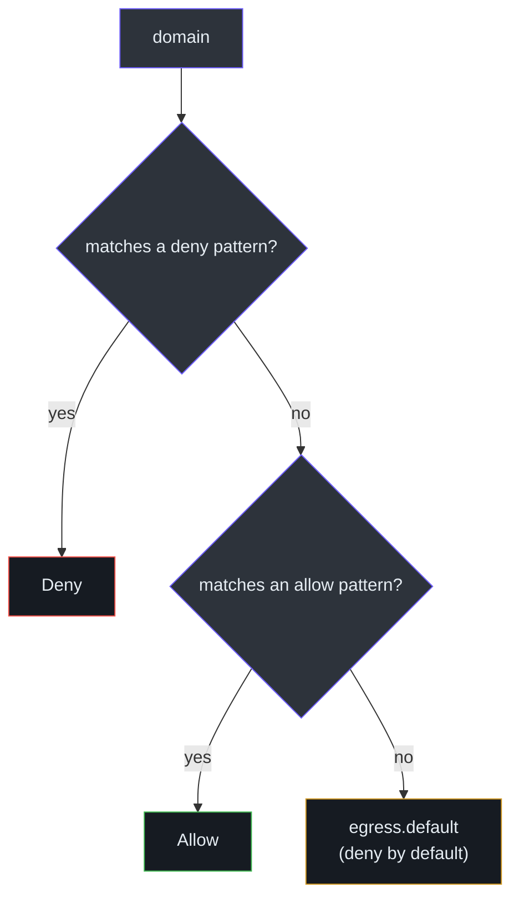
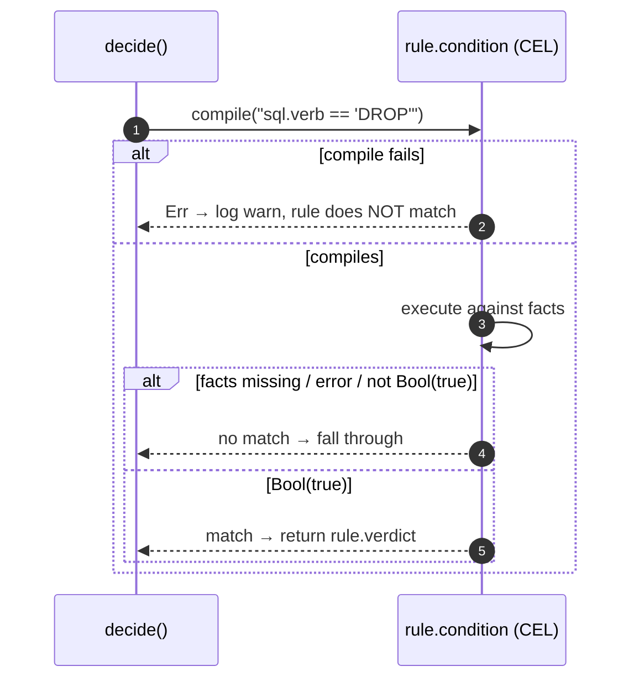

# Policy Authoring

A Honmoon policy is a single YAML document with three sections: an `egress` block (domain
allow/deny lists — the common case), an optional `endpoints` map (named network targets), and a
list of `rules` (protocol-aware CEL conditions — the fine-grained case). The same field structure
is described by the Rust model
([lib.rs:44-117](https://github.com/pleaseai/honmoon/blob/main/crates/honmoon-core/src/lib.rs#L44-L117)),
the TypeScript types ([index.ts:7-45](https://github.com/pleaseai/honmoon/blob/main/packages/policy/src/index.ts#L7-L45)),
and the JSON Schema ([policy.schema.json](https://github.com/pleaseai/honmoon/blob/main/packages/policy/schema/policy.schema.json)) —
though their *validation* differs: the JSON Schema is the strict one (`additionalProperties: false`,
`version ≥ 1`), while the Rust loader tolerates and defaults missing fields and the TS types are
compile-time only. Keeping the three aligned is tracked as TD-001.

## At a glance

| Field | Type | Default | Meaning | Source |
|-------|------|---------|---------|--------|
| `version` | integer ≥ 1 | `0` | Policy schema version | [policy.schema.json:8](https://github.com/pleaseai/honmoon/blob/main/packages/policy/schema/policy.schema.json#L8) |
| `egress.default` | verdict | `deny` | Verdict when no allow/deny entry matches | [lib.rs:86-88](https://github.com/pleaseai/honmoon/blob/main/crates/honmoon-core/src/lib.rs#L86-L88) |
| `egress.allow` | string[] | `[]` | Domain patterns to allow | [lib.rs:89-90](https://github.com/pleaseai/honmoon/blob/main/crates/honmoon-core/src/lib.rs#L89-L90) |
| `egress.deny` | string[] | `[]` | Domain patterns to deny (wins over allow) | [lib.rs:91-92](https://github.com/pleaseai/honmoon/blob/main/crates/honmoon-core/src/lib.rs#L91-L92) |
| `endpoints` | map&lt;name, endpoint&gt; | `{}` | Named network targets a rule can bind to | [lib.rs:51-55](https://github.com/pleaseai/honmoon/blob/main/crates/honmoon-core/src/lib.rs#L51-L55) |
| `rules[]` | rule[] | `[]` | Ordered protocol-aware rules | [lib.rs:109-117](https://github.com/pleaseai/honmoon/blob/main/crates/honmoon-core/src/lib.rs#L109-L117) |

A **verdict** is one of `allow`, `deny`, `pause` ([policy.schema.json:24-27](https://github.com/pleaseai/honmoon/blob/main/packages/policy/schema/policy.schema.json#L24-L27)).

## The shipped example

```yaml
# policies/agent.yaml
# yaml-language-server: $schema=../packages/policy/schema/policy.schema.json
version: 1

egress:
  default: deny
  allow:
    - github.com
    - '*.githubusercontent.com'
    - api.anthropic.com
    - k8s.internal # endpoint hosts need an allow entry of their own
    - db.internal
  deny:
    - '*.internal.corp'

endpoints:
  k8s-prod: {host: k8s.internal, port: 6443, protocol: kubernetes}
  postgres-prod: {host: db.internal, port: 5432, protocol: postgres}

rules:
  - name: k8s-no-secret-delete
    endpoint: k8s-prod
    condition: "k8s.resource == 'secrets' && k8s.verb == 'delete'"
    verdict: deny

  - name: sql-no-prod-drop
    endpoint: postgres-prod
    condition: "sql.verb == 'DROP' || sql.verb == 'TRUNCATE'"
    verdict: pause

  - name: http-block-large-upload
    endpoint: '*'
    condition: "http.method == 'POST' && http.body_size > 10485760"
    verdict: deny
```

The first line is a `yaml-language-server` modeline so editors validate against the JSON Schema
as you type ([agent.yaml:1](https://github.com/pleaseai/honmoon/blob/main/policies/agent.yaml#L1)).

## Egress domain matching

Domain patterns support an exact match or a single leading `*.` wildcard. Matching is
case-insensitive on both sides ([engine.rs:56-64](https://github.com/pleaseai/honmoon/blob/main/crates/honmoon-core/src/engine.rs#L56-L64)):

| Pattern | Matches | Does **not** match |
|---------|---------|--------------------|
| `github.com` | `github.com`, `GitHub.com` | `api.github.com` |
| `*.githubusercontent.com` | `raw.githubusercontent.com`, `githubusercontent.com` | `evilgithubusercontent.com` |

The `*.suffix` form matches the bare `suffix` **and** any `*.suffix` subdomain
([engine.rs:59-60](https://github.com/pleaseai/honmoon/blob/main/crates/honmoon-core/src/engine.rs#L59-L60)).
Within the egress block, **deny wins over allow**, and an unmatched domain falls through to
`egress.default` ([engine.rs:30-45](https://github.com/pleaseai/honmoon/blob/main/crates/honmoon-core/src/engine.rs#L30-L45)):


```mermaid
flowchart TD
  start["domain"] --> deny{"matches a deny pattern?"}
  deny -->|yes| D["Deny"]
  deny -->|no| allow{"matches an allow pattern?"}
  allow -->|yes| A["Allow"]
  allow -->|no| def["egress.default<br>(deny by default)"]
  style start fill:#2d333b,stroke:#6d5dfc,color:#e6edf3
  style deny fill:#2d333b,stroke:#6d5dfc,color:#e6edf3
  style allow fill:#2d333b,stroke:#6d5dfc,color:#e6edf3
  style D fill:#161b22,stroke:#f85149,color:#e6edf3
  style A fill:#161b22,stroke:#3fb950,color:#e6edf3
  style def fill:#161b22,stroke:#d29922,color:#e6edf3
```
<!-- Sources: crates/honmoon-core/src/engine.rs:30-64 -->

## Named endpoints

`endpoints` maps a name to the network target a client dials. A rule's `endpoint` field refers to
one of these names, so a rule like `k8s.resource == 'secrets'` applies to *that cluster* rather
than to every host that happens to serve a similar path.

```yaml
endpoints:
  k8s-prod: {host: k8s.internal, port: 6443, protocol: kubernetes}
  postgres-prod: {host: db.internal, port: 5432, protocol: postgres}
  cache: {host: redis.internal, port: 6379} # protocol defaults to tcp
```

| Field | Type | Default | Meaning |
|-------|------|---------|---------|
| `host` | string | required | Hostname the client dials |
| `port` | integer 1–65535 | required | Port the client dials |
| `protocol` | `postgres` / `kubernetes` / `tcp` | `tcp` | Which protocol facts to parse |

**Matching is exact**: the host must be equal (case-insensitive, with a trailing FQDN dot
trimmed) *and* the port must be equal. There is no IP resolution and no wildcard host in v0.1.0
([lib.rs:210-227](https://github.com/pleaseai/honmoon/blob/main/crates/honmoon-core/src/lib.rs#L210-L227)).
The port comes from what the client dialed — the CONNECT authority for an HTTPS tunnel, defaulting
to 443 (or 80 for a cleartext forward-proxy request) when the authority carries no explicit port,
or the SOCKS5 handshake's own `host:port` for a non-HTTP protocol.

What each `protocol` does today:

| Value | Effect |
|-------|--------|
| `kubernetes` | Intercepted HTTPS requests to this endpoint get `k8s` facts (`verb`, `resource`, `namespace`) parsed from the method and path |
| `postgres` | Connections that reach this endpoint **through the SOCKS5 listener** are inspected inline: every `Q` (simple query) and `P` (Parse) frame gets `sql` facts and its own verdict ([ADR-0007](https://github.com/pleaseai/honmoon/blob/main/.please/docs/decisions/0007-inline-postgresql-runtime-semantics.md)) |
| `tcp` | Name only — the endpoint can be referenced by a rule, but no protocol facts are parsed |

### Reaching a `postgres` endpoint

SQL rules only fire on a connection that arrives through the **SOCKS5 listener** — the CONNECT
proxy carries HTTP and TLS, and a PostgreSQL client speaks neither. Run the gateway with the
listener bound (it is on by default) and point the client at it:

```bash
honmoon gateway --config policies/agent.yaml --socks-addr 127.0.0.1:1080
```

```bash
# A client that speaks SOCKS5 dials the endpoint through the listener
ALL_PROXY=socks5h://127.0.0.1:1080 <your-tool>
```

`psql` does not speak SOCKS5 itself, so wrap it in a SOCKS-aware launcher (`proxychains4`,
`tsocks`) or point it at a local forwarder. Use `sslmode=prefer` or `sslmode=disable`: inline
inspection needs plaintext between the client and honmoon, so `SSLRequest` is declined and
`sslmode=require` cannot connect. A refused statement comes back as SQLSTATE `42501`
(insufficient privilege) naming the rule, and the session stays open.

A connection to a host with **no** declared endpoint (or one declared `protocol: tcp`) is a raw
tunnel through the same listener, gated once on `domain` by the `egress` block — no SQL is parsed.

A rule referencing an endpoint that `endpoints` does not declare is a **load-time warning, not an
error**: `Facts.endpoint` may be set by other means, and refusing the whole policy over one
dangling name would fail open for every other rule
([lib.rs:235-245](https://github.com/pleaseai/honmoon/blob/main/crates/honmoon-core/src/lib.rs#L235-L245)).

That tolerance covers *undefined references only*. An unusable `endpoints` entry is a **load-time
error** — the policy is rejected outright
([lib.rs:183-208](https://github.com/pleaseai/honmoon/blob/main/crates/honmoon-core/src/lib.rs#L183-L208)):

| Mistake | Why it fails the load |
|---------|-----------------------|
| `port: 0` | Not a dialable port; the JSON Schema requires 1–65535 |
| Two names on the same `(host, port)` | Lookup would silently pick one and shadow the other, so only one of the author's rules would ever fire (hosts compared case-insensitively with a trailing dot trimmed) |

## Protocol rules with CEL

Each rule binds a [CEL](https://github.com/google/cel-spec) condition to a named `endpoint`.
Rules are evaluated **in order**; the first rule whose endpoint matches and whose condition
evaluates to `true` wins ([engine.rs:19-28](https://github.com/pleaseai/honmoon/blob/main/crates/honmoon-core/src/engine.rs#L19-L28)).
If no rule matches, the egress block decides.

| Rule field | Meaning | Example | Source |
|-----------|---------|---------|--------|
| `name` | Human label | `sql-no-prod-drop` | [lib.rs:112](https://github.com/pleaseai/honmoon/blob/main/crates/honmoon-core/src/lib.rs#L112) |
| `endpoint` | Named target; `*` matches any | `postgres-prod` | [lib.rs:113](https://github.com/pleaseai/honmoon/blob/main/crates/honmoon-core/src/lib.rs#L113), [engine.rs:48-50](https://github.com/pleaseai/honmoon/blob/main/crates/honmoon-core/src/engine.rs#L48-L50) |
| `condition` | CEL over protocol facts | `sql.verb == 'DROP'` | [lib.rs:114-115](https://github.com/pleaseai/honmoon/blob/main/crates/honmoon-core/src/lib.rs#L114-L115) |
| `verdict` | `allow` / `deny` / `pause` | `pause` | [lib.rs:116](https://github.com/pleaseai/honmoon/blob/main/crates/honmoon-core/src/lib.rs#L116) |

### Rule order and unreachable rules

Because the first match wins, an **unconditional** rule — `condition: "true"` — answers every
request its `endpoint` covers, and nothing below it on that endpoint is ever reached.

That matters most for the shape an `egress.default: deny` policy needs around a `postgres`
endpoint. The connection itself is gated before any statement exists, so the endpoint needs a
connection-level `allow`; but a `sql.*` condition cannot match a connection that carries no
statement yet, so that `allow` has to come **after** the statement rules
([ADR-0007](https://github.com/pleaseai/honmoon/blob/main/.please/docs/decisions/0007-inline-postgresql-runtime-semantics.md)):

```yaml
rules:
  # Statement rules first — they only match once a statement exists.
  - name: sql-no-prod-drop
    endpoint: postgres-prod
    condition: "sql.verb == 'DROP' || sql.verb == 'TRUNCATE'"
    verdict: pause

  # The connection-level allow last, so it gates the connect and nothing else.
  - name: postgres-connect
    endpoint: postgres-prod
    condition: "true"
    verdict: allow
```

Write those two the other way round and `postgres-connect` answers every *statement* too — a
`DROP` is allowed, and the rule meant to stop it never runs. `Policy::from_yaml` warns at load
when it finds that ordering, naming both rules
([lib.rs:286-371](https://github.com/pleaseai/honmoon/blob/main/crates/honmoon-core/src/lib.rs#L286-L371)):

```
WARN policy rule is unreachable: an earlier unconditional rule always matches first
  rule="sql-no-prod-drop" shadowed_by="postgres-connect" endpoint="postgres-prod"
```

Two details worth knowing when you read (or don't read) that warning:

- **`endpoint: '*'` covers everything.** An unconditional `*` rule makes *every* rule below it
  unreachable, whatever endpoint those rules name. The reverse does not hold — an unconditional
  rule on one endpoint leaves a later `*` rule reachable through all the others.
- **Only the literal `true` is recognised.** An expression that merely happens to be always true
  (`1 == 1`) is not flagged: Honmoon does not try to prove a CEL expression total, and a warning
  that guessed would be one you learned to ignore.

::: danger Never leave `condition` blank
`condition: ""` is not a way to say "always", and it is not a safe no-op either. A blank string
is not valid CEL, so the rule could never match — and it does not even decline the way
[Fail-closed semantics](#fail-closed-semantics) below describes, because `Program::compile("")`
panics instead of returning an error. So Honmoon refuses to load a policy containing one, rather
than crashing on the first request that reaches the rule
([#151](https://github.com/pleaseai/honmoon/issues/151)):

```
Error: rule `blank` has a blank `condition`; write `"true"` for a rule that always matches
```

Whitespace does not help — `" "` and `"\n"` are rejected the same way. Give every rule a real
condition; write `"true"` when you mean always.
:::

### Facts available to conditions

Conditions reference protocol facts as CEL variables of the same name. Each is only populated
when the corresponding parser has run ([lib.rs:129-148](https://github.com/pleaseai/honmoon/blob/main/crates/honmoon-core/src/lib.rs#L129-L148)):

| Variable | Fields | Populated by | Status |
|----------|--------|--------------|--------|
| `http` | `method`, `host`, `path`, `body_size` | CONNECT proxy sets `host` only today | `host` <span class="status-done">live</span> · rest <span class="status-planned">needs TLS termination</span> |
| `sql` | `verb`, `table` | `parse_postgres_query` / `parse_sql` | <span class="status-done">live on SOCKS5 connections to a `postgres` endpoint</span> |
| `k8s` | `verb`, `resource`, `namespace` | `parse_k8s_request` | <span class="status-done">live on intercepted HTTPS to a `kubernetes` endpoint</span> |

### Example conditions

```cel
# Block dangerous DDL against the production database
sql.verb == 'DROP' || sql.verb == 'TRUNCATE'

# Deny deletion of Kubernetes secrets in prod
k8s.resource == 'secrets' && k8s.verb == 'delete'

# Block large uploads (needs HTTP body facts → TLS termination)
http.method == 'POST' && http.body_size > 10485760
```

## Fail-closed semantics

Honmoon is designed to **fail closed**: a rule whose condition fails to compile, or references a
fact that has not been populated, simply **does not match** — it can never turn a `deny` into an
`allow`. Combined with the `deny`-by-default egress verdict, an absent or broken rule is always
the safe outcome ([engine.rs:35-37](https://github.com/pleaseai/honmoon/blob/main/crates/honmoon-core/src/engine.rs#L35-L37), [engine.rs:167-201](https://github.com/pleaseai/honmoon/blob/main/crates/honmoon-core/src/engine.rs#L167-L201)).

Read "fails to compile" there literally: it means the CEL compiler **returned an error**. Not
every malformed condition does. Some panic instead, and a panic is not a rule that fails closed —
it is a crash on the decision path. Two limits follow, and both are in the compiler rather than
in Honmoon:

- A **blank** condition panics, and Honmoon catches that case at the only point where it can:
  `Policy::from_yaml` refuses to load a policy containing one, so it never reaches evaluation.
  See [Rule order and unreachable rules](#rule-order-and-unreachable-rules) above.
- **Other** malformed conditions panic the same way — `"&&"`, `")"`, an unterminated string
  literal, a condition that is only a comment — and those are *not* detected at load. A rule
  carrying one loads cleanly and crashes the decision path when a request reaches it. Tracked in
  [#154](https://github.com/pleaseai/honmoon/issues/154); telling those apart from valid CEL
  without compiling them means parsing CEL, so the fix is not a check Honmoon can add at the call
  site. Most syntax errors do return an error and do fail closed — `"(true"` and `"a[]"`, for
  instance — but do not rely on it: give every rule a condition you have seen evaluate.


```mermaid
sequenceDiagram
  autonumber
  participant E as decide()
  participant R as rule.condition (CEL)
  E->>R: compile("sql.verb == 'DROP'")
  alt compile fails
    R-->>E: Err → log warn, rule does NOT match
  else compiles
    R->>R: execute against facts
    alt facts missing / error / not Bool(true)
      R-->>E: no match → fall through
    else Bool(true)
      R-->>E: match → return rule.verdict
    end
  end
```
<!-- Sources: crates/honmoon-core/src/engine.rs:66-91 -->

This behavior is locked by tests: `unknown_fact_reference_does_not_match` proves a condition
referencing an unpopulated `sql` fact falls through to the egress default
([engine.rs:176-184](https://github.com/pleaseai/honmoon/blob/main/crates/honmoon-core/src/engine.rs#L176-L184)).

## Validating a policy

| Method | Status | Notes |
|--------|--------|-------|
| Editor (`yaml-language-server` + JSON Schema) | <span class="status-done">works</span> | Live validation via the modeline |
| `Policy::from_yaml` (Rust) | <span class="status-done">works</span> | Used by `honmoon run` / `gateway` to load policy | 
| `honmoonctl validate <file>` | <span class="status-planned">stub</span> | Reads the file but YAML parse + schema check are a `TODO` ([cli/src/index.ts:14-23](https://github.com/pleaseai/honmoon/blob/main/packages/cli/src/index.ts#L14-L23)) |

::: warning Dual model, kept in sync by hand
The Rust model (`honmoon-core`) and the TS model (`@honmoon/policy`) describe the same policy
but are maintained separately — a change to one must update the other (**TD-001**). The JSON
Schema is the intended future single source of truth.
See [lib.rs:1-4](https://github.com/pleaseai/honmoon/blob/main/crates/honmoon-core/src/lib.rs#L1-L4) and [index.ts:1-5](https://github.com/pleaseai/honmoon/blob/main/packages/policy/src/index.ts#L1-L5).
:::

## Related Pages

- [Policy Model & Decision Engine](/deep-dive/policy-engine) — the full precedence algorithm.
- [Protocol-Aware Parsing](/deep-dive/protocol-parsing) — how `sql` / `k8s` facts are produced.
- [Quick Start](/getting-started/quick-start) — run a policy.

## References

- [policies/agent.yaml](https://github.com/pleaseai/honmoon/blob/main/policies/agent.yaml)
- [packages/policy/schema/policy.schema.json](https://github.com/pleaseai/honmoon/blob/main/packages/policy/schema/policy.schema.json)
- [packages/policy/src/index.ts](https://github.com/pleaseai/honmoon/blob/main/packages/policy/src/index.ts)
- [crates/honmoon-core/src/lib.rs](https://github.com/pleaseai/honmoon/blob/main/crates/honmoon-core/src/lib.rs)
- [crates/honmoon-core/src/engine.rs](https://github.com/pleaseai/honmoon/blob/main/crates/honmoon-core/src/engine.rs)
