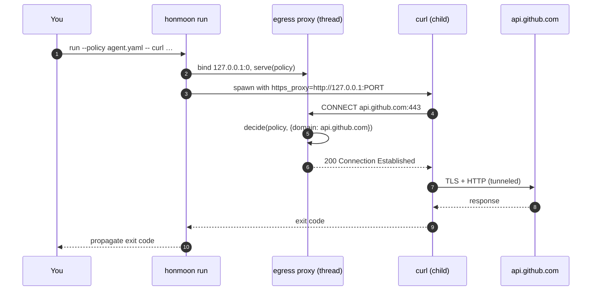
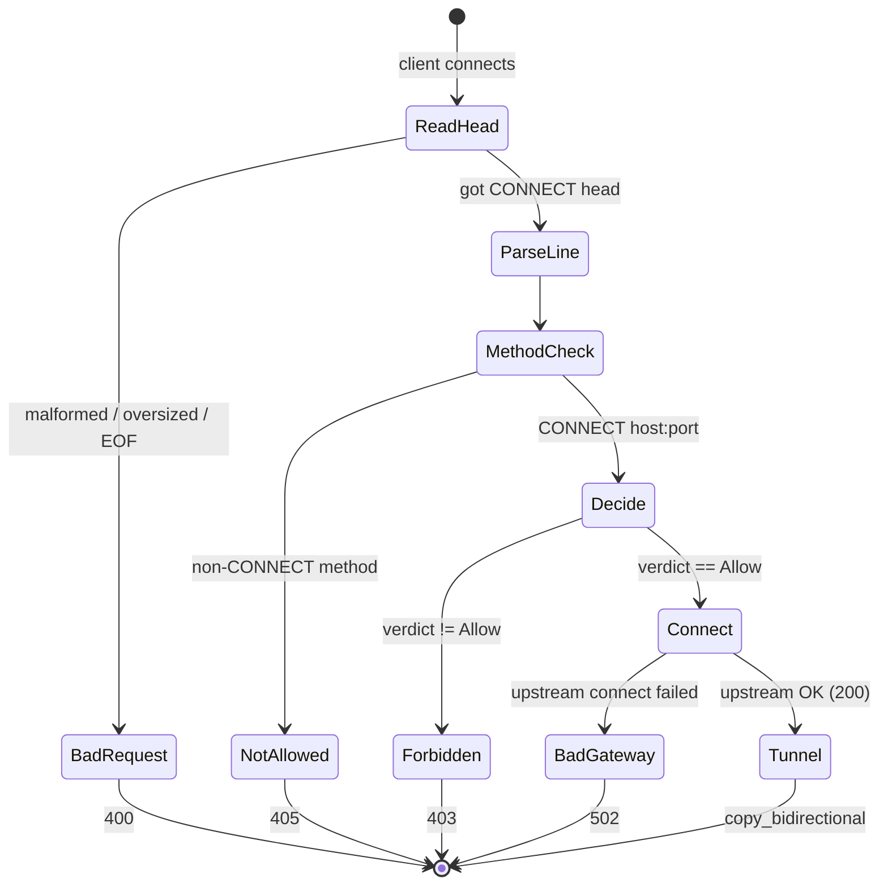

# Quick Start

This page walks through the two operating modes that work today — `honmoon run` (process
wrapper) and `honmoon gateway` (standalone proxy) — using the shipped example policy. Both are
Phase 1 features proven by the hermetic integration test
([egress.rs](https://github.com/pleaseai/honmoon/blob/master/crates/honmoon-proxy/tests/egress.rs)).

## At a glance

| Command | What happens | Status | Source |
|---------|--------------|--------|--------|
| `honmoon run --policy P -- <cmd>` | Ephemeral proxy started, child exec'd with `https_proxy` set | <span class="status-done">works</span> (env-var isolation) | [main.rs:66-98](https://github.com/pleaseai/honmoon/blob/master/crates/honmoon-cli/src/main.rs#L66-L98) |
| `honmoon gateway --config P --addr A` | Standalone CONNECT proxy bound to `A` | <span class="status-done">works</span> | [main.rs:53-57](https://github.com/pleaseai/honmoon/blob/master/crates/honmoon-cli/src/main.rs#L53-L57) |
| `honmoon join --gateway G` | — | <span class="status-planned">stub: `bail!`</span> | [main.rs:58-60](https://github.com/pleaseai/honmoon/blob/master/crates/honmoon-cli/src/main.rs#L58-L60) |

## 1. Run a command behind a policy

`honmoon run` binds an ephemeral egress proxy on `127.0.0.1:0`, spawns the proxy on a
background thread, then execs your command with all proxy env vars pointed at it. Only
hosts your policy allows can be reached; everything else gets a `403`
([main.rs:66-98](https://github.com/pleaseai/honmoon/blob/master/crates/honmoon-cli/src/main.rs#L66-L98)).

```bash
# Build the binary once
cargo build -p honmoon-cli

# Allowed host → tunnels through
cargo run -p honmoon-cli -- run --policy policies/agent.yaml -- curl -sS https://api.github.com

# Denied host → curl fails (proxy returns 403 to the CONNECT)
cargo run -p honmoon-cli -- run --policy policies/agent.yaml -- curl -sS https://example.com
```

The example policy allows `github.com`, `*.githubusercontent.com`, and `api.anthropic.com`,
and defaults to `deny` ([agent.yaml:4-11](https://github.com/pleaseai/honmoon/blob/master/policies/agent.yaml#L4-L11)).


<!-- Sources: crates/honmoon-cli/src/main.rs:66-98, crates/honmoon-proxy/src/gateway.rs:62-112 -->

::: warning The child must honor proxy env vars
Isolation is **advisory** in Phase 1: `honmoon run` only sets `http_proxy` / `https_proxy` /
`all_proxy` (and uppercase variants) for the child
([main.rs:86-94](https://github.com/pleaseai/honmoon/blob/master/crates/honmoon-cli/src/main.rs#L86-L94)).
A process that ignores those variables bypasses Honmoon entirely. Enforcing network isolation
(netns / NetworkExtension) is tracked as **TD-003**.
:::

## 2. Run the standalone gateway

`honmoon gateway` loads a policy and runs the CONNECT proxy on a fixed address (default
`127.0.0.1:8443`). Point any client's `https_proxy` at it
([main.rs:31-37](https://github.com/pleaseai/honmoon/blob/master/crates/honmoon-cli/src/main.rs#L31-L37), [main.rs:53-57](https://github.com/pleaseai/honmoon/blob/master/crates/honmoon-cli/src/main.rs#L53-L57)):

```bash
# Terminal A — start the gateway
cargo run -p honmoon-cli -- gateway --config policies/agent.yaml --addr 127.0.0.1:8443

# Terminal B — route a client through it
https_proxy=http://127.0.0.1:8443 curl -sS https://github.com
https_proxy=http://127.0.0.1:8443 curl -sS https://example.com   # blocked (403)
```

Enable structured logs with `RUST_LOG` (the binary wires `tracing-subscriber` to the env
filter, [main.rs:46-48](https://github.com/pleaseai/honmoon/blob/master/crates/honmoon-cli/src/main.rs#L46-L48)):

```bash
RUST_LOG=honmoon_proxy=debug cargo run -p honmoon-cli -- gateway --config policies/agent.yaml
```

## 3. What you'll see — the verdict flow

Every CONNECT request resolves to exactly one of three responses today:


<!-- Sources: crates/honmoon-proxy/src/gateway.rs:63-112 -->

| Outcome | HTTP status | When | Source |
|---------|------------|------|--------|
| Tunnel established | `200 Connection Established` | Verdict `Allow`, upstream reachable | [gateway.rs:107-110](https://github.com/pleaseai/honmoon/blob/master/crates/honmoon-proxy/src/gateway.rs#L107-L110) |
| Forbidden | `403` | Verdict not `Allow` | [gateway.rs:93-96](https://github.com/pleaseai/honmoon/blob/master/crates/honmoon-proxy/src/gateway.rs#L93-L96) |
| Method not allowed | `405` | Non-CONNECT method | [gateway.rs:76-79](https://github.com/pleaseai/honmoon/blob/master/crates/honmoon-proxy/src/gateway.rs#L76-L79) |
| Bad request | `400` | Malformed / oversized / truncated head | [gateway.rs:68-74](https://github.com/pleaseai/honmoon/blob/master/crates/honmoon-proxy/src/gateway.rs#L68-L74) |
| Request timeout | `408` | Head not received within 10s | [gateway.rs:64-67](https://github.com/pleaseai/honmoon/blob/master/crates/honmoon-proxy/src/gateway.rs#L64-L67) |
| Bad gateway | `502` | Upstream connect failed | [gateway.rs:98-104](https://github.com/pleaseai/honmoon/blob/master/crates/honmoon-proxy/src/gateway.rs#L98-L104) |

::: tip `pause` does not yet hold a request
The policy model defines three verdicts, but over the Phase 1 CONNECT proxy anything other
than `Allow` results in a `403` — there is no approval queue yet. The `pause` → hold-for-approval
workflow is Phase 4 ([roadmap.md:81-89](https://github.com/pleaseai/honmoon/blob/master/docs/roadmap.md#L81-L89)).
For SQL/K8s rules (which can return `pause`), the parsers exist and are tested but are not yet
fed by a live socket (**TD-006**) — see [Protocol-Aware Parsing](/deep-dive/protocol-parsing).
:::

## 4. Run the tests

```bash
# The whole Rust suite (policy model, engine, parsers, hermetic egress test)
cargo test --workspace

# Just the Phase 1 egress integration test
cargo test -p honmoon-proxy --test egress
```

The integration test stands up an in-process upstream and a hand-rolled CONNECT client over
loopback, proving an allowed host tunnels (`200`) and a denied host is blocked (`403`) — with no
external processes ([egress.rs:74-127](https://github.com/pleaseai/honmoon/blob/master/crates/honmoon-proxy/tests/egress.rs#L74-L127)).

## Related Pages

- [Policy Authoring](/getting-started/policy-authoring) — write your own allow/deny + CEL rules.
- [Egress Gateway (Data Plane)](/deep-dive/egress-gateway) — how the CONNECT proxy works internally.
- [Policy Model & Decision Engine](/deep-dive/policy-engine) — how a verdict is reached.

## References

- [crates/honmoon-cli/src/main.rs](https://github.com/pleaseai/honmoon/blob/master/crates/honmoon-cli/src/main.rs)
- [crates/honmoon-proxy/src/gateway.rs](https://github.com/pleaseai/honmoon/blob/master/crates/honmoon-proxy/src/gateway.rs)
- [crates/honmoon-proxy/tests/egress.rs](https://github.com/pleaseai/honmoon/blob/master/crates/honmoon-proxy/tests/egress.rs)
- [policies/agent.yaml](https://github.com/pleaseai/honmoon/blob/master/policies/agent.yaml)
