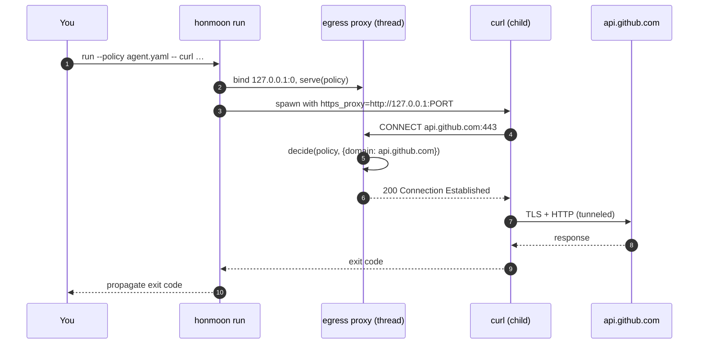
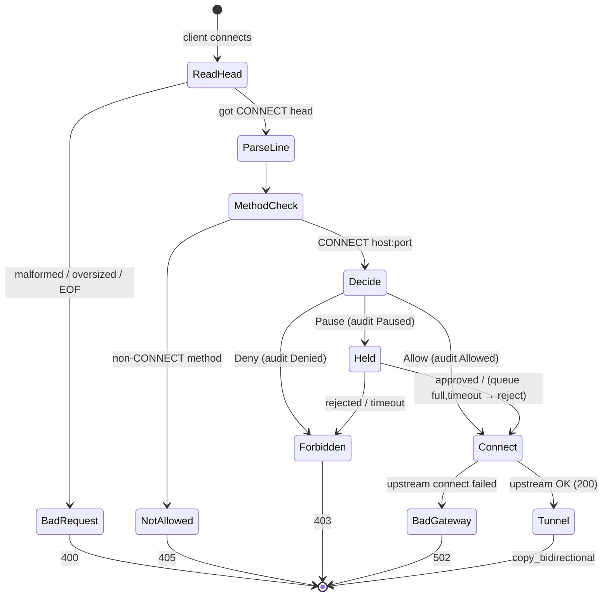

# Quick Start

This page walks through the two operating modes that work today — `honmoon run` (process
wrapper) and `honmoon gateway` (standalone proxy) — using the shipped example policy. Both build on
the same terminating CONNECT proxy, whose allow/deny/tunnel behavior is proven by the hermetic
integration test ([egress.rs](https://github.com/pleaseai/honmoon/blob/main/crates/honmoon-proxy/tests/egress.rs)). (That test exercises
the proxy directly; `run`'s env-var exec wiring is covered by the CLI itself, not that test.)

## At a glance

| Command | What happens | Status | Source |
|---------|--------------|--------|--------|
| `honmoon run --policy P -- <cmd>` | Ephemeral proxy started, child exec'd with `https_proxy` set | <span class="status-done">works</span> (env-var isolation) | [main.rs:66-98](https://github.com/pleaseai/honmoon/blob/main/crates/honmoon-cli/src/main.rs#L66-L98) |
| `honmoon gateway --config P --addr A` | Standalone CONNECT proxy bound to `A` | <span class="status-done">works</span> | [main.rs:53-57](https://github.com/pleaseai/honmoon/blob/main/crates/honmoon-cli/src/main.rs#L53-L57) |
| `honmoon join --gateway G` | — | <span class="status-planned">stub: `bail!`</span> | [main.rs:58-60](https://github.com/pleaseai/honmoon/blob/main/crates/honmoon-cli/src/main.rs#L58-L60) |

## 1. Run a command behind a policy

`honmoon run` binds an ephemeral egress proxy on `127.0.0.1:0`, spawns the proxy on a
background thread, then execs your command with all proxy env vars pointed at it. Only
hosts your policy allows can be reached; everything else gets a `403`
([main.rs:66-98](https://github.com/pleaseai/honmoon/blob/main/crates/honmoon-cli/src/main.rs#L66-L98)).

```bash
# Build the binary once
cargo build -p honmoon-cli

# Allowed host → tunnels through
cargo run -p honmoon-cli -- run --policy policies/agent.yaml -- curl -sS https://api.github.com

# Denied host → curl fails (proxy returns 403 to the CONNECT)
cargo run -p honmoon-cli -- run --policy policies/agent.yaml -- curl -sS https://example.com
```

The example policy allows `github.com`, `*.githubusercontent.com`, and `api.anthropic.com`,
and defaults to `deny` ([agent.yaml:4-11](https://github.com/pleaseai/honmoon/blob/main/policies/agent.yaml#L4-L11)).


<!-- Sources: crates/honmoon-cli/src/main.rs:66-98, crates/honmoon-proxy/src/gateway.rs:62-112 -->

::: warning The child must honor proxy env vars
Isolation is **advisory**: `honmoon run` only sets `http_proxy` / `https_proxy` / `all_proxy`
(and uppercase variants) for the child
([main.rs:153-161](https://github.com/pleaseai/honmoon/blob/main/crates/honmoon-cli/src/main.rs#L153-L161)).
A process that ignores those variables bypasses Honmoon entirely. Enforcing network isolation
(netns / NetworkExtension) is tracked as **TD-003** (Phase 5).
:::

## 2. Run the standalone gateway + dashboard

`honmoon gateway` runs the CONNECT proxy **and** the management API + dashboard on one runtime.
The proxy defaults to `127.0.0.1:8443`; the management API + dashboard to `127.0.0.1:8444`
([main.rs:34-47](https://github.com/pleaseai/honmoon/blob/main/crates/honmoon-cli/src/main.rs#L34-L47), [main.rs:78-128](https://github.com/pleaseai/honmoon/blob/main/crates/honmoon-cli/src/main.rs#L78-L128)):

```bash
# Terminal A — start the gateway (proxy :8443, dashboard :8444, durable audit log)
cargo run -p honmoon-cli -- gateway --config policies/agent.yaml \
  --addr 127.0.0.1:8443 --mgmt-addr 127.0.0.1:8444 --audit-log honmoon-audit.jsonl

# Terminal B — route a client through it
https_proxy=http://127.0.0.1:8443 curl -sS https://github.com
https_proxy=http://127.0.0.1:8443 curl -sS https://example.com   # blocked (403)

# Open the dashboard (audit log, policy view, approval queue)
open http://127.0.0.1:8444
```

The dashboard is embedded in the binary, so it is served directly by the gateway — no separate
process. For the durable, queryable audit history over the JSONL file, run `@honmoon/api` (see
[Control Plane & Dashboard](/deep-dive/control-plane)).

Enable structured logs with `RUST_LOG` (the binary wires `tracing-subscriber` to the env
filter, [main.rs:46-48](https://github.com/pleaseai/honmoon/blob/main/crates/honmoon-cli/src/main.rs#L46-L48)):

```bash
RUST_LOG=honmoon_proxy=debug cargo run -p honmoon-cli -- gateway --config policies/agent.yaml
```

## 3. What you'll see — the verdict flow

Every CONNECT request is decided, **recorded to the audit log**, and resolved:


<!-- Sources: crates/honmoon-proxy/src/gateway.rs:112-201 -->

| Outcome | HTTP status | When | Source |
|---------|------------|------|--------|
| Tunnel established | `200 Connection Established` | Verdict `Allow` (or approved `pause`), upstream reachable | [gateway.rs:156-161](https://github.com/pleaseai/honmoon/blob/main/crates/honmoon-proxy/src/gateway.rs#L156-L161) |
| Forbidden | `403` | Verdict `Deny`, or a `pause` rejected/timed out | [gateway.rs:196](https://github.com/pleaseai/honmoon/blob/main/crates/honmoon-proxy/src/gateway.rs#L196) |
| Held, then resolved | — → `200`/`403` | Verdict `Pause` — held in the approval queue | [gateway.rs:206-271](https://github.com/pleaseai/honmoon/blob/main/crates/honmoon-proxy/src/gateway.rs#L206-L271) |
| Service unavailable | `503` | `pause` but the approval queue is full (fail closed) | [gateway.rs:218-230](https://github.com/pleaseai/honmoon/blob/main/crates/honmoon-proxy/src/gateway.rs#L218-L230) |
| Method not allowed | `405` | Non-CONNECT method | [gateway.rs:125-128](https://github.com/pleaseai/honmoon/blob/main/crates/honmoon-proxy/src/gateway.rs#L125-L128) |
| Bad request / timeout / bad gateway | `400` / `408` / `502` | Malformed head / slowloris / upstream failed | [gateway.rs:113-153](https://github.com/pleaseai/honmoon/blob/main/crates/honmoon-proxy/src/gateway.rs#L113-L153) |

::: tip `pause` now holds for approval (Phase 4)
A `pause` verdict **holds the connection** in the approval queue until a human approves it (via the
dashboard at `:8444`) or it times out (300s → auto-reject). Today only `http.host`-based `pause`
rules fire over CONNECT; SQL/K8s `pause` rules need the live inline relay + TLS termination
(**TD-006**) — see [Protocol-Aware Parsing](/deep-dive/protocol-parsing).
:::

## 4. Run the tests

```bash
# The whole Rust suite (policy, engine, parsers, audit, approval, egress + mgmt e2e)
cargo test --workspace

# Just the egress integration test, or the Phase 4 pause→approve e2e test
cargo test -p honmoon-proxy --test egress
cargo test -p honmoon-mgmt --test e2e

# TypeScript audit-query tests
bun test
```

The egress test proves an allowed host tunnels (`200`) and a denied host is blocked (`403`)
hermetically ([egress.rs:74-127](https://github.com/pleaseai/honmoon/blob/main/crates/honmoon-proxy/tests/egress.rs#L74-L127)); the `honmoon-mgmt`
e2e test drives a full `pause` → approve-over-HTTP → tunnel (and reject → `403`) cycle
([e2e.rs](https://github.com/pleaseai/honmoon/blob/main/crates/honmoon-mgmt/tests/e2e.rs)).

## Related Pages

- [Policy Authoring](/getting-started/policy-authoring) — write your own allow/deny + CEL rules.
- [Egress Gateway (Data Plane)](/deep-dive/egress-gateway) — how the CONNECT proxy works internally.
- [Policy Model & Decision Engine](/deep-dive/policy-engine) — how a verdict is reached.

## References

- [crates/honmoon-cli/src/main.rs](https://github.com/pleaseai/honmoon/blob/main/crates/honmoon-cli/src/main.rs)
- [crates/honmoon-proxy/src/gateway.rs](https://github.com/pleaseai/honmoon/blob/main/crates/honmoon-proxy/src/gateway.rs)
- [crates/honmoon-proxy/tests/egress.rs](https://github.com/pleaseai/honmoon/blob/main/crates/honmoon-proxy/tests/egress.rs)
- [policies/agent.yaml](https://github.com/pleaseai/honmoon/blob/main/policies/agent.yaml)
