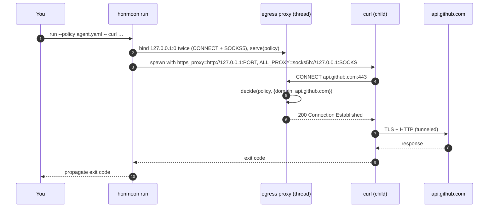
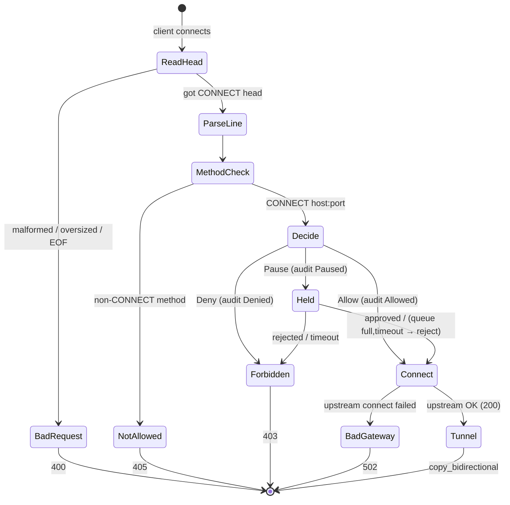

# Quick Start

This page walks through the two operating modes that work today — `honmoon run` (process
wrapper) and `honmoon gateway` (standalone proxy) — using the shipped example policy. Both build on
the same terminating CONNECT proxy, whose allow/deny/tunnel behavior is proven by the hermetic
integration test ([egress.rs](https://github.com/pleaseai/honmoon/blob/main/crates/honmoon-proxy/tests/egress.rs)). (That test exercises
the proxy directly; `run`'s env-var exec wiring is covered by the CLI itself, not that test.)

## At a glance

| Command | What happens | Status | Source |
|---------|--------------|--------|--------|
| `honmoon run --policy P -- <cmd>` | Two ephemeral listeners started (CONNECT + SOCKS5), child exec'd with the `http_proxy` family and `ALL_PROXY` set | <span class="status-done">works</span> (Linux: empty-namespace isolation; macOS: Seatbelt profile; advisory elsewhere) | [main.rs:387-470](https://github.com/pleaseai/honmoon/blob/main/crates/honmoon-cli/src/main.rs#L387-L470) |
| `honmoon gateway --config P --addr A` | Standalone CONNECT proxy bound to `A` | <span class="status-done">works</span> | [main.rs:53-57](https://github.com/pleaseai/honmoon/blob/main/crates/honmoon-cli/src/main.rs#L53-L57) |
| `honmoon join --gateway G` | — | <span class="status-planned">stub: `bail!`</span> | [main.rs:58-60](https://github.com/pleaseai/honmoon/blob/main/crates/honmoon-cli/src/main.rs#L58-L60) |

## 1. Run a command behind a policy

`honmoon run` binds *two* ephemeral listeners on `127.0.0.1:0` — the terminating CONNECT proxy
and the SOCKS5 one — serves both from a single background thread, then execs your command with the
`http_proxy`/`https_proxy` family pointed at the first and `all_proxy`/`ALL_PROXY` at the second
([mod.rs:128-138](https://github.com/pleaseai/honmoon/blob/main/crates/honmoon-cli/src/isolate/mod.rs#L128-L138)).
One thread, not one per listener, is deliberate: a panicking accept loop parked in its own task
would drop its listener and hand the port back while `run` still reported `Enforced`, so all four
loops share one `tokio::select!` and any of them failing takes the whole proxy down
([main.rs:420-443](https://github.com/pleaseai/honmoon/blob/main/crates/honmoon-cli/src/main.rs#L420-L443)).
Only hosts your policy allows can be reached; everything else is refused — a `403` on the CONNECT
path ([mitm.rs:303-312](https://github.com/pleaseai/honmoon/blob/main/crates/honmoon-proxy/src/mitm.rs#L303-L312)),
a `0x02` reply on the SOCKS5 one
([socks.rs:182-183](https://github.com/pleaseai/honmoon/blob/main/crates/honmoon-proxy/src/socks.rs#L182-L183)).

```bash
# Build the binary once
cargo build -p honmoon-cli

# Allowed host → tunnels through
cargo run -p honmoon-cli -- run --policy policies/agent.yaml -- curl -sS https://api.github.com

# Denied host → curl fails (proxy returns 403 to the CONNECT)
cargo run -p honmoon-cli -- run --policy policies/agent.yaml -- curl -sS https://example.com
```

The example policy allows `github.com`, `*.githubusercontent.com`, and `api.anthropic.com`,
and defaults to `deny` ([agent.yaml:4-11](https://github.com/pleaseai/honmoon/blob/main/policies/agent.yaml#L4-L11)).


```mermaid
sequenceDiagram
  autonumber
  participant U as You
  participant CLI as honmoon run
  participant PX as egress proxy (thread)
  participant CH as curl (child)
  participant GH as api.github.com
  U->>CLI: run --policy agent.yaml -- curl …
  CLI->>PX: bind 127.0.0.1:0 twice (CONNECT + SOCKS5), serve(policy)
  CLI->>CH: spawn with https_proxy=http://127.0.0.1:PORT, ALL_PROXY=socks5h://127.0.0.1:SOCKS
  CH->>PX: CONNECT api.github.com:443
  PX->>PX: decide(policy, {domain: api.github.com})
  PX-->>CH: 200 Connection Established
  CH->>GH: TLS + HTTP (tunneled)
  GH-->>CH: response
  CH-->>CLI: exit code
  CLI-->>U: propagate exit code
```
<!-- Sources: crates/honmoon-cli/src/main.rs:387-470, crates/honmoon-proxy/src/gateway.rs:62-112 -->

::: warning Enforcing on Linux and macOS, advisory everywhere else
On **Linux** the child is spawned into an empty user + network namespace holding nothing but
loopback, with **both** of honmoon's proxies bridged in over one Unix socket each
([ADR-0005](https://github.com/pleaseai/honmoon/blob/main/.please/docs/decisions/0005-empty-namespace-and-bridged-proxy-sockets.md)). The proxy
variables are set by the in-namespace supervisor and point the child at loopback ports *inside* its
own namespace rather than at the host's proxies: `http_proxy` / `https_proxy` (and uppercase) at
the CONNECT proxy, `all_proxy` / `ALL_PROXY` at the SOCKS5 listener as `socks5h://127.0.0.1:PORT`
([linux.rs:738-748](https://github.com/pleaseai/honmoon/blob/main/crates/honmoon-cli/src/isolate/linux.rs#L738-L748)).
The `h` keeps DNS on honmoon's side, which is what puts the hostname into the SOCKS5 handshake
where it selects an `endpoints:` entry — so a `protocol: postgres` endpoint is inspected statement
by statement under `run` just as it is under `gateway`
([socks.rs:119-137](https://github.com/pleaseai/honmoon/blob/main/crates/honmoon-proxy/src/socks.rs#L119-L137)).
On **macOS** there is no namespace and nothing to bridge: the child keeps the host's loopback, where
both proxies are already listening, and a Seatbelt profile under `sandbox-exec` denies every socket
but those two ports — one `remote ip` rule each, never a wildcard
([macos.rs:355-364](https://github.com/pleaseai/honmoon/blob/main/crates/honmoon-cli/src/isolate/macos.rs#L355-L364)).
On both, an **unprivileged** child that ignores the variables reaches nothing over the network
rather than bypassing policy. Nor is there DNS inside the sandbox on
either platform; a proxied client does not need it, but a tool that resolves before it proxies will
fail.
:::

::: warning A client honouring neither variable reaches nothing, by design
A tool that reads neither `HTTP_PROXY` nor `ALL_PROXY` cannot connect at all under `run`. That is
ADR-0005's deliberate fail-closed default, not a bug to work around: the child is not asked to
cooperate, it is left with no other route.

`psql` is the example worth naming, because it looks like a counterexample and is not — it speaks
no SOCKS5 natively and no HTTP at all, so it honours neither variable. Reaching a `postgres`
endpoint means putting something SOCKS-aware between `psql` and the tunnel: a wrapper that
intercepts the connect (`proxychains-ng` and similar), or a local forwarder that terminates a plain
TCP port and dials out over SOCKS5. honmoon does not ship, bundle or support either; which one fits
is yours to decide. Pass `sslmode=prefer`/`disable` as well, since inline inspection needs
plaintext between the client and honmoon.

The boundary is narrower than "sandbox". A child that can become root, already holds
`CAP_SYS_ADMIN`, or has passwordless `sudo` can leave it, and neither platform touches the
filesystem, so Unix sockets that live there (`/var/run/docker.sock` and friends) stay reachable.
`run` falls back to advisory and says so on stderr where the kernel or a container policy refuses
the namespace — notably the default Docker seccomp profile blocks `unshare(CLONE_NEWUSER)`, so
`honmoon run` inside an ordinary container is advisory — or where the Seatbelt profile no longer
compiles. `sandbox-exec` is formally deprecated by Apple; Claude Code ships on it today, so it is
serviceable, but the deprecation is real. Every other platform is advisory, so **TD-003** stays open
([tech-debt-tracker.md:11](https://github.com/pleaseai/honmoon/blob/main/.please/docs/tracks/tech-debt-tracker.md#L11)).
:::

## 2. Run the standalone gateway + dashboard

`honmoon gateway` runs the CONNECT proxy **and** the management API + dashboard on one runtime.
The proxy defaults to `127.0.0.1:8443`; the management API + dashboard to `127.0.0.1:8444`
([main.rs:34-47](https://github.com/pleaseai/honmoon/blob/main/crates/honmoon-cli/src/main.rs#L34-L47), [main.rs:78-128](https://github.com/pleaseai/honmoon/blob/main/crates/honmoon-cli/src/main.rs#L78-L128)):

```bash
# Terminal A — start the gateway (proxy :8443, dashboard :8444, durable audit log)
cargo run -p honmoon-cli -- gateway --config policies/agent.yaml \
  --addr 127.0.0.1:8443 --mgmt-addr 127.0.0.1:8444 --audit-log honmoon-audit.jsonl

# Terminal B — route a client through it
https_proxy=http://127.0.0.1:8443 curl -sS https://github.com
https_proxy=http://127.0.0.1:8443 curl -sS https://example.com   # blocked (403)

# Open the dashboard (audit log, policy view, approval queue).
# Every /api route needs the management token, so open the login URL honmoon
# printed on startup rather than the bare address — it hands the dashboard the
# session secret its reads travel on, then redirects to /:
#   honmoon: dashboard: http://127.0.0.1:8444/login?token=<token>
open "http://127.0.0.1:8444/login?token=$(cat ~/.honmoon/mgmt-token)"
```

With no `--mgmt-token`, honmoon mints one on first use and persists it at
`~/.honmoon/mgmt-token`, in a directory it creates `0700`, with the file itself `0600` — that mode
is enforced on a file honmoon creates or replaces, while a pre-existing wider-mode file is reported
on stderr rather than tightened. **Automatic generation is Unix-only** — there is no
`/dev/urandom` off Unix and a POSIX mode establishes no Windows ACL, so both loaders refuse to mint
there and a Windows operator must set `--mgmt-token` / `HONMOON_MGMT_TOKEN` themselves. Set
`--mgmt-token` / `HONMOON_MGMT_TOKEN` to pin your own anywhere
([mgmt_token.rs](https://github.com/pleaseai/honmoon/blob/main/crates/honmoon-cli/src/mgmt_token.rs)).
`@honmoon/api` resolves that same token from the same places, so one credential covers both servers
([auth.ts](https://github.com/pleaseai/honmoon/blob/main/packages/api/src/auth.ts)). Scripted
callers send `Authorization: Bearer <token>` instead of logging in.

The dashboard is embedded in the binary, so it is served directly by the gateway — no separate
process. For the durable, queryable audit history over the JSONL file, run `@honmoon/api` (see
[Control Plane & Dashboard](/deep-dive/control-plane)).

Enable structured logs with `RUST_LOG` (the binary wires `tracing-subscriber` to the env
filter, [main.rs:46-48](https://github.com/pleaseai/honmoon/blob/main/crates/honmoon-cli/src/main.rs#L46-L48)):

```bash
RUST_LOG=honmoon_proxy=debug cargo run -p honmoon-cli -- gateway --config policies/agent.yaml
```

## 3. What you'll see — the verdict flow

Every CONNECT request is decided, **recorded to the audit log**, and resolved:


```mermaid
stateDiagram-v2
  [*] --> ReadHead: client connects
  ReadHead --> BadRequest: malformed / oversized / EOF
  ReadHead --> ParseLine: got CONNECT head
  ParseLine --> MethodCheck
  MethodCheck --> NotAllowed: non-CONNECT method
  MethodCheck --> Decide: CONNECT host:port
  Decide --> Connect: Allow (audit Allowed)
  Decide --> Forbidden: Deny (audit Denied)
  Decide --> Held: Pause (audit Paused)
  Held --> Connect: approved / (queue full,timeout → reject)
  Held --> Forbidden: rejected / timeout
  Connect --> Tunnel: upstream OK (200)
  Connect --> BadGateway: upstream connect failed
  BadRequest --> [*]: 400
  NotAllowed --> [*]: 405
  Forbidden --> [*]: 403
  BadGateway --> [*]: 502
  Tunnel --> [*]: copy_bidirectional
```
<!-- Sources: crates/honmoon-proxy/src/gateway.rs:112-201 -->

| Outcome | HTTP status | When | Source |
|---------|------------|------|--------|
| Tunnel established | `200 Connection Established` | Verdict `Allow` (or approved `pause`), upstream reachable | [gateway.rs:156-161](https://github.com/pleaseai/honmoon/blob/main/crates/honmoon-proxy/src/gateway.rs#L156-L161) |
| Forbidden | `403` | Verdict `Deny`, or a `pause` rejected/timed out | [gateway.rs:196](https://github.com/pleaseai/honmoon/blob/main/crates/honmoon-proxy/src/gateway.rs#L196) |
| Held, then resolved | — → `200`/`403` | Verdict `Pause` — held in the approval queue | [gateway.rs:206-271](https://github.com/pleaseai/honmoon/blob/main/crates/honmoon-proxy/src/gateway.rs#L206-L271) |
| Service unavailable | `503` | `pause` but the approval queue is full (fail closed) | [gateway.rs:218-230](https://github.com/pleaseai/honmoon/blob/main/crates/honmoon-proxy/src/gateway.rs#L218-L230) |
| Method not allowed | `405` | Non-CONNECT method | [gateway.rs:125-128](https://github.com/pleaseai/honmoon/blob/main/crates/honmoon-proxy/src/gateway.rs#L125-L128) |
| Bad request / timeout / bad gateway | `400` / `408` / `502` | Malformed head / slowloris / upstream failed | [gateway.rs:113-153](https://github.com/pleaseai/honmoon/blob/main/crates/honmoon-proxy/src/gateway.rs#L113-L153) |

::: tip `pause` now holds for approval (Phase 4)
A `pause` verdict **holds the connection** in the approval queue until a human approves it (via the
dashboard at `:8444`) or it times out (300s → auto-reject). Today only `http.host`-based `pause`
rules fire over CONNECT; SQL/K8s `pause` rules need the live inline relay + TLS termination
(**TD-006**) — see [Protocol-Aware Parsing](/deep-dive/protocol-parsing).
:::

## 4. Run the tests

```bash
# The whole Rust suite (policy, engine, parsers, audit, approval, egress + mgmt e2e)
cargo test --workspace

# Just the egress integration test, or the Phase 4 pause→approve e2e test
cargo test -p honmoon-proxy --test egress
cargo test -p honmoon-mgmt --test e2e

# TypeScript audit-query tests
bun test
```

The egress test proves an allowed host tunnels (`200`) and a denied host is blocked (`403`)
hermetically ([egress.rs:74-127](https://github.com/pleaseai/honmoon/blob/main/crates/honmoon-proxy/tests/egress.rs#L74-L127)); the `honmoon-mgmt`
e2e test drives a full `pause` → approve-over-HTTP → tunnel (and reject → `403`) cycle
([e2e.rs](https://github.com/pleaseai/honmoon/blob/main/crates/honmoon-mgmt/tests/e2e.rs)).

## Related Pages

- [Policy Authoring](/getting-started/policy-authoring) — write your own allow/deny + CEL rules.
- [Egress Gateway (Data Plane)](/deep-dive/egress-gateway) — how the CONNECT proxy works internally.
- [Policy Model & Decision Engine](/deep-dive/policy-engine) — how a verdict is reached.

## References

- [crates/honmoon-cli/src/main.rs](https://github.com/pleaseai/honmoon/blob/main/crates/honmoon-cli/src/main.rs)
- [crates/honmoon-proxy/src/gateway.rs](https://github.com/pleaseai/honmoon/blob/main/crates/honmoon-proxy/src/gateway.rs)
- [crates/honmoon-proxy/tests/egress.rs](https://github.com/pleaseai/honmoon/blob/main/crates/honmoon-proxy/tests/egress.rs)
- [policies/agent.yaml](https://github.com/pleaseai/honmoon/blob/main/policies/agent.yaml)
