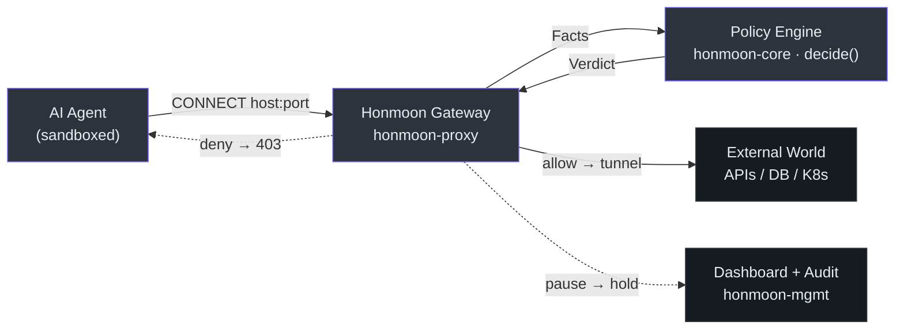

# Honmoon

> A **policy-based firewall gateway** guarding the boundary between AI agents and production
> systems. It intercepts an agent's outbound traffic and applies policy — `allow` / `deny` /
> `pause` — **before** requests reach their destination.

Honmoon unifies two layers of protection in one product: **egress domain filtering** (a YAML
allow/deny list) and a **protocol-aware policy engine** (CEL conditions over wire-level SQL,
Kubernetes, and HTTP facts). The data plane is Rust; the control plane and dashboard are
TypeScript on Bun.

::: tip Maturity
This is an early-stage project. Phases 0–4 are implemented and tested (egress proxy, CEL engine,
SQL/K8s parsers, the `pause` approval workflow, audit log, and embedded dashboard); Phases 5–7 are
roadmap. Pages below mark <span class="status-done">implemented</span> vs
<span class="status-planned">planned / scaffold</span> explicitly. See the
[Roadmap](/deep-dive/roadmap-open-core) for the full picture.
:::

## Quick Start

```bash
# Clone + install both toolchains
git clone https://github.com/pleaseai/honmoon.git && cd honmoon
mise install            # node + bun (Rust via rust-toolchain.toml)
mise run install        # cargo fetch && bun install

# Build & test everything
mise run build          # cargo build --workspace + bun run build
mise run test           # cargo test --workspace + bun test

# Run a command behind a policy-enforcing egress proxy (Phase 1)
cargo run -p honmoon-cli -- run --policy policies/agent.yaml -- curl https://api.github.com

# Or run the standalone gateway proxy
cargo run -p honmoon-cli -- gateway --config policies/agent.yaml --addr 127.0.0.1:8443
```

See [Installation & Toolchain](/getting-started/installation) and [Quick Start](/getting-started/quick-start).

## Architecture at a glance


<!-- Sources: README.md:36-45, crates/honmoon-proxy/src/gateway.rs:62-112, crates/honmoon-core/src/engine.rs:19-28 -->

## Documentation map

| Section | What you'll find | Start here |
|---------|------------------|-----------|
| **Onboarding** | Role-tailored guides (contributor, staff eng, exec, PM) | [Contributor Guide](/onboarding/contributor-guide) |
| **Getting Started** | Overview, install, first run, policy authoring | [Overview](/getting-started/overview) |
| **Architecture** | Dependency layers, request lifecycle, invariants | [Architecture](/deep-dive/architecture) |
| **Policy Engine** | `decide()`, egress matching, CEL evaluation | [Policy Model & Decision Engine](/deep-dive/policy-engine) |
| **Protocol Parsing** | PostgreSQL / SQL / Kubernetes wire parsers | [Protocol-Aware Parsing](/deep-dive/protocol-parsing) |
| **Data Plane** | CONNECT proxy, `run` / `gateway` wiring | [Egress Gateway](/deep-dive/egress-gateway) |
| **Control Plane** | Management API, audit query, embedded dashboard (Phase 4) | [Control Plane & Dashboard](/deep-dive/control-plane) |
| **Roadmap** | Phased plan + open-core business model | [Roadmap & Open-Core](/deep-dive/roadmap-open-core) |

## Key files

| File | Role | Source |
|------|------|--------|
| `crates/honmoon-core/src/lib.rs` | Policy model: `Policy`, `Egress`, `Rule`, `Verdict`, `Facts` | [lib.rs](https://github.com/pleaseai/honmoon/blob/master/crates/honmoon-core/src/lib.rs) |
| `crates/honmoon-core/src/engine.rs` | `decide_explained()` — CEL rules + egress matching | [engine.rs](https://github.com/pleaseai/honmoon/blob/master/crates/honmoon-core/src/engine.rs) |
| `crates/honmoon-core/src/audit.rs` | Audit log (in-memory ring + JSONL sink) | [audit.rs](https://github.com/pleaseai/honmoon/blob/master/crates/honmoon-core/src/audit.rs) |
| `crates/honmoon-core/src/protocols.rs` | Wire parsers → SQL / K8s facts | [protocols.rs](https://github.com/pleaseai/honmoon/blob/master/crates/honmoon-core/src/protocols.rs) |
| `crates/honmoon-proxy/src/gateway.rs` | CONNECT egress proxy + audit + pause hold | [gateway.rs](https://github.com/pleaseai/honmoon/blob/master/crates/honmoon-proxy/src/gateway.rs) |
| `crates/honmoon-proxy/src/approval.rs` | Pending-approval registry (pause hold) | [approval.rs](https://github.com/pleaseai/honmoon/blob/master/crates/honmoon-proxy/src/approval.rs) |
| `crates/honmoon-mgmt/src/lib.rs` | Management API + embedded dashboard | [lib.rs](https://github.com/pleaseai/honmoon/blob/master/crates/honmoon-mgmt/src/lib.rs) |
| `crates/honmoon-cli/src/main.rs` | `honmoon` binary: `run` / `gateway` / `join` | [main.rs](https://github.com/pleaseai/honmoon/blob/master/crates/honmoon-cli/src/main.rs) |
| `packages/policy/schema/policy.schema.json` | JSON Schema for policy validation | [policy.schema.json](https://github.com/pleaseai/honmoon/blob/master/packages/policy/schema/policy.schema.json) |
| `policies/agent.yaml` | Example policy | [agent.yaml](https://github.com/pleaseai/honmoon/blob/master/policies/agent.yaml) |
| `ARCHITECTURE.md` | Module boundaries & invariants | [ARCHITECTURE.md](https://github.com/pleaseai/honmoon/blob/master/ARCHITECTURE.md) |

## Tech stack

| Layer | Technology | Why |
|-------|-----------|-----|
| Data plane | **Rust** (edition 2024), `tokio`, `cel-interpreter` | Wire-level proxy + parsers; performance & memory safety critical |
| Control plane | **TypeScript on Bun** | CLI, policy validation, management/audit API |
| Dashboard | **React 19 + Vite + Tailwind** | SPA embedded into the Rust binary via `rust-embed`, served by `honmoon-mgmt` |
| Policy | **YAML + JSON Schema + CEL** | Declarative egress; portable CEL conditions for protocol rules |

<!-- Sources: ARCHITECTURE.md:70-80, .please/docs/knowledge/tech-stack.md:9-14, Cargo.toml:9-28, package.json:1-26 -->
