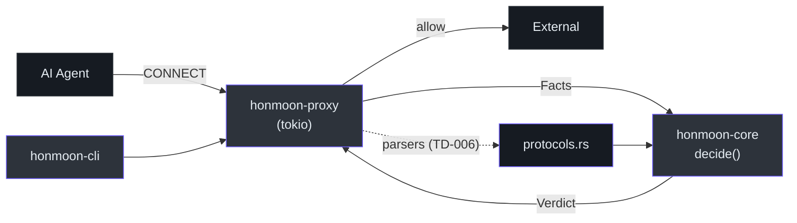
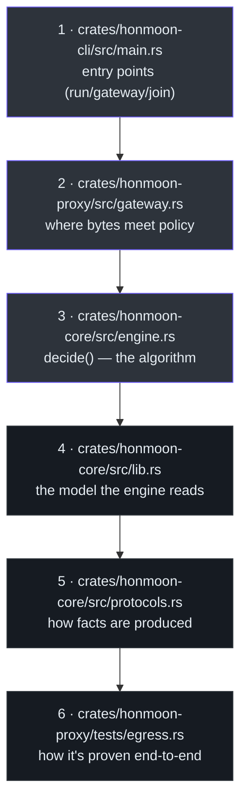
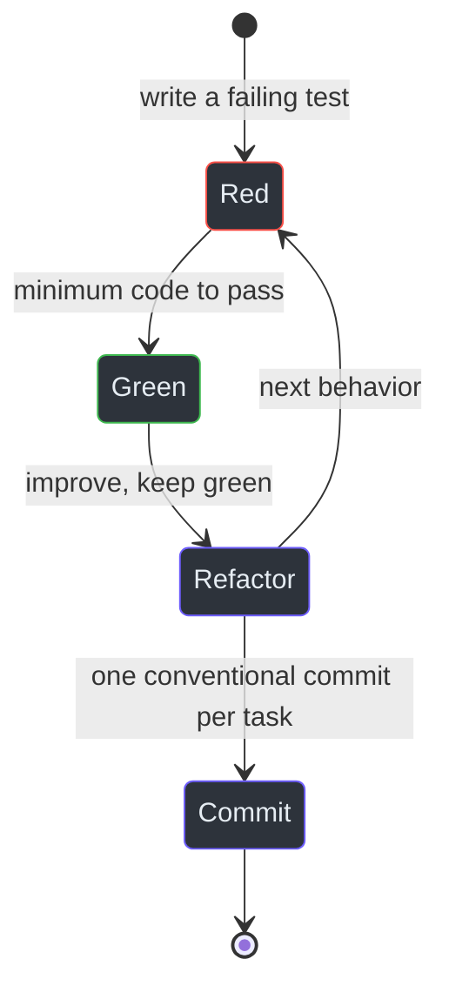

# Contributor Guide

Welcome. This guide takes you from "I know Python or JavaScript" to "I can make a sound change to
Honmoon and get it merged." It is deliberately progressive:

- **Part I** — the language and framework foundations you need (Rust, tokio, CEL, Bun), with
  cross-language comparisons to Python/JS.
- **Part II** — this codebase's architecture and domain model.
- **Part III** — getting productive: setup, the test-driven workflow, and how to contribute.

Honmoon is a **policy-based firewall gateway for AI agents**. The data plane is Rust; the control
plane and dashboard are TypeScript on Bun. It is early-stage — Phases 0–4 are implemented and
tested, Phases 5–7 are roadmap — so a lot of your value as a contributor is in *extending tested
foundations*, not rewriting churn.

---

## Part I — Foundations

You do not need to be a Rust expert to contribute, but you do need a working model of four things.

### 1.1 Rust, for someone who knows Python/JS

Honmoon's data plane is ~1,000 lines of Rust across three crates. The Rust here is
*deliberately plain* — `honmoon-core` avoids async entirely. Here is the mental-model translation:

| Concept | Python / JS | Rust (as used here) |
|---------|-------------|---------------------|
| Nullable value | `None` / `undefined` | `Option<T>` — `Some(x)` or `None` |
| Error result | `raise` / `throw` | `Result<T, E>` — `Ok(x)` or `Err(e)`, returned not thrown |
| Tagged union | class hierarchy / string literal union | `enum` with variants (`Verdict::Allow`) |
| Struct / object | `dataclass` / interface | `struct` with `#[derive(...)]` |
| Interface / protocol | ABC / TS interface | `trait` |
| Immutable by default | `const` (shallow) | everything `let` is immutable unless `mut` |

The single most important pattern in this codebase is **`Option` + pattern matching**. Look at
how the policy engine reads the domain ([engine.rs:30-45](https://github.com/pleaseai/honmoon/blob/master/crates/honmoon-core/src/engine.rs#L30-L45)):

```rust
fn egress_verdict(policy: &Policy, facts: &Facts) -> Verdict {
    if let Some(domain) = &facts.domain {        // unwrap the Option, bind `domain`
        if policy.egress.deny.iter().any(|p| matches_domain(p, domain)) {
            return Verdict::Deny;                 // early return — like Python's `return`
        }
        // …
    }
    policy.egress.default                          // last expression IS the return value
}
```

Three things to notice that differ from Python/JS:

1. **`if let Some(domain) = …`** safely unwraps an optional. There is no `None`-dereference
   crash; you must handle the `None` arm (here, by falling through to `policy.egress.default`).
2. **The last expression is the return value** — no `return` keyword needed on the final line.
3. **`&` means borrow.** `&Policy` is a read-only reference; the function does not take ownership.
   This is how Rust avoids a garbage collector — covered next.

#### Ownership in 90 seconds

Rust's headline feature is that memory safety is checked at compile time, with no GC. The rule:
each value has one owner; you either **move** ownership or **borrow** a reference (`&` read-only,
`&mut` exclusive-mutable). You will mostly *borrow* in this codebase. When the gateway shares one
policy across many connections, it wraps it in an `Arc` (atomic reference count) and clones the
*handle*, not the data ([gateway.rs:46-55](https://github.com/pleaseai/honmoon/blob/master/crates/honmoon-proxy/src/gateway.rs#L46-L55)):

```rust
let policy = std::sync::Arc::new(policy);     // shared ownership
loop {
    let policy = policy.clone();              // cheap: bumps the refcount
    tokio::spawn(async move { handle(stream, &policy).await });
}
```

If you have written Python with `multiprocessing` shared state or JS with structured clone, `Arc`
is the "share this immutably across tasks" primitive.

### 1.2 Async Rust and tokio

The proxy is asynchronous; the policy engine is not. That split is intentional —
[`honmoon-core` is transport-agnostic](/deep-dive/architecture#dependency-layers) and never touches
a socket, so it stays a set of plain synchronous functions you can test without a runtime.

In `honmoon-proxy`, async works much like JS `async`/`await`, with `tokio` as the event loop
(think Node's libuv) ([gateway.rs:42-60](https://github.com/pleaseai/honmoon/blob/master/crates/honmoon-proxy/src/gateway.rs#L42-L60)):

| JS / Node | Rust / tokio |
|-----------|--------------|
| `async function f()` | `async fn f()` |
| `await p` | `p.await` |
| `Promise.all` | `tokio::join!` / `futures` |
| event loop (libuv) | `tokio::runtime::Runtime` |
| `setTimeout`-guarded fetch | `tokio::time::timeout(dur, fut)` |
| worker per request | `tokio::spawn(async move { … })` |

The accept loop spawns one task per connection — the Rust equivalent of handling each request on
its own green thread. The slowloris guard is a `tokio::time::timeout` around reading the request
head ([gateway.rs:64-67](https://github.com/pleaseai/honmoon/blob/master/crates/honmoon-proxy/src/gateway.rs#L64-L67)).

### 1.3 CEL — the policy condition language

[CEL](https://github.com/google/cel-spec) (Common Expression Language) is a small, safe,
non-Turing-complete expression language from Google — used in Kubernetes admission policies and
Envoy. Honmoon uses it for rule conditions because it has Rust, TypeScript, and Go
implementations, so the *same* expression is portable across the data and control planes
([tech-stack.md:39-41](https://github.com/pleaseai/honmoon/blob/master/.please/docs/knowledge/tech-stack.md#L39-L41)).

A CEL condition is just a boolean expression over variables:

```cel
sql.verb == 'DROP' || sql.verb == 'TRUNCATE'
k8s.resource == 'secrets' && k8s.verb == 'delete'
http.method == 'POST' && http.body_size > 10485760
```

The engine injects protocol facts as CEL variables (`http`, `sql`, `k8s`) and treats *only*
`Ok(Bool(true))` as a match — every error or non-bool is "no match"
([engine.rs:66-91](https://github.com/pleaseai/honmoon/blob/master/crates/honmoon-core/src/engine.rs#L66-L91)). See
[Policy Engine](/deep-dive/policy-engine#cel-evaluation) for the full mechanism.

### 1.4 Bun + TypeScript (control plane)

The TS side runs on [Bun](https://bun.sh) — a fast JS runtime + package manager + bundler, used
here instead of Node + npm. If you know Node, the differences you will touch:

| Node | Bun (here) |
|------|-----------|
| `fs.readFile` | `Bun.file(path).text()` ([cli/index.ts:19](https://github.com/pleaseai/honmoon/blob/master/packages/cli/src/index.ts#L19)) |
| `http.createServer` / Express | `Bun.serve({ fetch })` ([api/index.ts:10-20](https://github.com/pleaseai/honmoon/blob/master/packages/api/src/index.ts#L10-L20)) |
| `npm install` | `bun install` |
| `ts-node` | Bun runs `.ts` directly |

As of Phase 4 the control plane is real (see [Control Plane & Dashboard](/deep-dive/control-plane)):
`@honmoon/api` is a tested audit-query service and the React dashboard has live views. The main
remaining TS stub is `honmoonctl validate`. Note the management API the dashboard talks to is the
Rust `honmoon-mgmt` (axum), not a TS server.

---

## Part II — The codebase

### 2.1 The big picture


<!-- Sources: ARCHITECTURE.md:50-80, crates/honmoon-proxy/src/gateway.rs:62-112 -->

Three Rust crates form a clean dependency chain — `cli` → `proxy` → `core` — and `core` depends on
nothing networked. Read [Architecture](/deep-dive/architecture) for the full layer model.

### 2.2 The domain model

Five types carry the whole domain. Learn these and you understand Honmoon
([lib.rs:14-119](https://github.com/pleaseai/honmoon/blob/master/crates/honmoon-core/src/lib.rs#L14-L119)):

| Type | Is | Why it matters |
|------|----|-----------------|
| `Verdict` | `Allow` / `Deny` / `Pause` | The output of every decision |
| `Policy` | `version` + `egress` + `rules` | The whole policy document |
| `Egress` | `default` + allow/deny lists | The common-case domain filter; **defaults to deny** |
| `Rule` | `endpoint` + CEL `condition` + `verdict` | A protocol-aware fine-grained rule |
| `Facts` | domain + endpoint + http/sql/k8s | What we know about a request |

The cardinal invariant: **fail closed.** A broken or unmatched rule never *directly* yields
`Allow` — it proceeds to egress evaluation (the `deny` list, then the `allow` list, then
`egress.default`), and `Egress::default()` is `Verdict::Deny` out of the box
([lib.rs:48-60](https://github.com/pleaseai/honmoon/blob/master/crates/honmoon-core/src/lib.rs#L48-L60)). So with the
default (or any `egress.default: deny`) policy, failure paths resolve to deny; a policy that sets
`egress.default: allow` opts out of that safety. If you change the decision path, the property
your tests must protect is "no failure path *upgrades* a verdict past what the egress block (and its
default) would return."

### 2.3 Reading order for the source

Follow the request, not the file tree:


<!-- Sources: ARCHITECTURE.md:50-69 -->

### 2.4 What is real vs scaffold

Knowing this saves you from "fixing" something that was never built. Marked honestly throughout
the wiki and grounded in the [tech-debt tracker](https://github.com/pleaseai/honmoon/blob/master/.please/docs/tracks/tech-debt-tracker.md#L9-L14):

| Area | Status |
|------|--------|
| Policy model, `decide_explained()`, CEL, egress matching | <span class="status-done">real & tested</span> |
| PostgreSQL / SQL / K8s parsers | <span class="status-done">real & tested</span> · <span class="status-planned">not on a live socket (TD-006)</span> |
| CONNECT proxy + `run` / `gateway` | <span class="status-done">real & tested</span> |
| `pause` approval hold + audit log + dashboard (Phase 4) | <span class="status-done">real & tested</span> (`honmoon-mgmt`, `honmoon-proxy::approval`, `honmoon-core::audit`) |
| `@honmoon/api` durable audit query | <span class="status-done">real & tested</span> (`audit.test.ts`) |
| `honmoon run` network isolation | <span class="status-planned">advisory only — env vars (TD-003)</span> |
| `honmoon join` | <span class="status-planned">stub `bail!`</span> |
| `honmoonctl validate` | <span class="status-planned">TODO stub</span> |
| SQL/K8s `pause` over a live socket | <span class="status-planned">parsers tested; live relay TD-006</span> |

---

## Part III — Getting productive

### 3.1 Setup

```bash
git clone https://github.com/pleaseai/honmoon.git && cd honmoon
mise trust && mise install     # node 24 + bun (Rust via rust-toolchain.toml)
mise run install               # cargo fetch && bun install
mise run test                  # confirm green: cargo test --workspace + bun test
```

Full detail (tasks, CI parity) is in [Installation & Toolchain](/getting-started/installation).

### 3.2 The test-driven workflow

Honmoon mandates TDD with a strict task lifecycle and a >80% coverage target for new code
([workflow.md:3-39](https://github.com/pleaseai/honmoon/blob/master/.please/docs/knowledge/workflow.md#L3-L39)). The cycle:


<!-- Sources: .please/docs/knowledge/workflow.md:3-39 -->

This is not ceremony — it is how the parsers reached their density of edge-case coverage. When you
add a SQL verb or a K8s path shape, **write the `assert_eq!` first**, watch it fail, then make it
pass. The existing tests are your templates:
[`protocols.rs` tests](https://github.com/pleaseai/honmoon/blob/master/crates/honmoon-core/src/protocols.rs#L178-L313),
[`engine.rs` tests](https://github.com/pleaseai/honmoon/blob/master/crates/honmoon-core/src/engine.rs#L93-L264).

### 3.3 The quality gate

Before you commit, run what CI runs ([workflow.md:76-81](https://github.com/pleaseai/honmoon/blob/master/.please/docs/knowledge/workflow.md#L76-L81)):

```bash
cargo fmt --all && cargo clippy --workspace --all-targets -- -D warnings
bun run lint
cargo test --workspace && bun test
# …or just:
mise run check
```

`clippy` runs with `-D warnings` — warnings are errors. Format with `cargo fmt` before pushing or
the `fmt --check` CI step fails ([ci.yml:30-34](https://github.com/pleaseai/honmoon/blob/master/.github/workflows/ci.yml#L30-L34)).

### 3.4 Commit convention

Conventional Commits, one commit per task ([workflow.md:83-87](https://github.com/pleaseai/honmoon/blob/master/.please/docs/knowledge/workflow.md#L83-L87)):

```text
feat(core): add MERGE to the SQL verb heuristic
fix(proxy): reject CONNECT targets without a port
test(core): cover grouped-API K8s subresource paths
docs(wiki): clarify pause is not yet enforced over CONNECT
```

Types: `feat`, `fix`, `docs`, `style`, `refactor`, `perf`, `test`, `build`, `ci`, `chore`, `revert`.

### 3.5 A worked first contribution

Say you want the SQL parser to recognize `MERGE`. The honest, test-first path:

1. **Red** — add to `parse_sql_extracts_verb_and_table` in
   [protocols.rs](https://github.com/pleaseai/honmoon/blob/master/crates/honmoon-core/src/protocols.rs#L275-L281):
   `assert_eq!(parse_sql("MERGE INTO accounts …").table, "accounts");`. Run `cargo test` — it fails.
2. **Green** — extend the `match verb` arms in `parse_sql`
   ([protocols.rs:46-87](https://github.com/pleaseai/honmoon/blob/master/crates/honmoon-core/src/protocols.rs#L46-L87)) so `MERGE`
   extracts the table after `INTO`. Run `cargo test` — green.
3. **Sync the model if needed** — adding a verb doesn't change the *types*, so `@honmoon/policy`
   stays as-is. (If you ever change the policy *shape*, update Rust **and** TS — TD-001.)
4. **Gate** — `mise run check`.
5. **Commit** — `feat(core): recognize MERGE in the SQL verb heuristic`.

### 3.6 Boundaries — what to be careful with

| Action | Guidance |
|--------|----------|
| Add I/O to `honmoon-core` | 🚫 Never — it must stay transport-agnostic ([ARCHITECTURE.md:91-93](https://github.com/pleaseai/honmoon/blob/master/ARCHITECTURE.md#L91-L93)) |
| Change the decision path | ⚠️ Preserve fail-closed; add tests proving deny-by-default still holds |
| Change policy shape | ⚠️ Update Rust + TS + JSON Schema together (TD-001) |
| Decrypt / buffer payloads | 🚫 Extract only declared facts; no DPI surprises ([ARCHITECTURE.md:99-100](https://github.com/pleaseai/honmoon/blob/master/ARCHITECTURE.md#L99-L100)) |
| Overstate a feature in docs | 🚫 Mark planned vs implemented; this is a security tool ([product-guidelines.md:14-17](https://github.com/pleaseai/honmoon/blob/master/.please/docs/knowledge/product-guidelines.md#L14-L17)) |

---

## Glossary

| Term | Meaning |
|------|---------|
| **Data plane** | The Rust components that touch the wire (`crates/*`) |
| **Control plane** | The TS components that manage/observe (`packages/*`, `apps/*`) |
| **Verdict** | `allow` / `deny` / `pause` |
| **Facts** | Wire-extracted attributes of a request (domain, sql.verb, k8s.resource…) |
| **Endpoint** | A named target a rule binds to (`postgres-prod`); `*` matches any |
| **CEL** | Common Expression Language — the rule condition language |
| **Fail closed** | Default-deny; a broken rule can never allow |
| **Egress** | Outbound traffic; the domain allow/deny filter |
| **CONNECT** | The HTTP method clients use to request a tunnel through a proxy |
| **TD-00x** | A tracked tech-debt item ([tracker](https://github.com/pleaseai/honmoon/blob/master/.please/docs/tracks/tech-debt-tracker.md)) |

## Key file reference

| File | What | Source |
|------|------|--------|
| `crates/honmoon-core/src/lib.rs` | Domain model | [lib.rs](https://github.com/pleaseai/honmoon/blob/master/crates/honmoon-core/src/lib.rs) |
| `crates/honmoon-core/src/engine.rs` | `decide()` | [engine.rs](https://github.com/pleaseai/honmoon/blob/master/crates/honmoon-core/src/engine.rs) |
| `crates/honmoon-core/src/protocols.rs` | Parsers | [protocols.rs](https://github.com/pleaseai/honmoon/blob/master/crates/honmoon-core/src/protocols.rs) |
| `crates/honmoon-proxy/src/gateway.rs` | CONNECT proxy | [gateway.rs](https://github.com/pleaseai/honmoon/blob/master/crates/honmoon-proxy/src/gateway.rs) |
| `crates/honmoon-cli/src/main.rs` | CLI | [main.rs](https://github.com/pleaseai/honmoon/blob/master/crates/honmoon-cli/src/main.rs) |
| `.please/docs/knowledge/workflow.md` | TDD workflow | [workflow.md](https://github.com/pleaseai/honmoon/blob/master/.please/docs/knowledge/workflow.md) |

## Related Pages

- [Architecture](/deep-dive/architecture) · [Policy Engine](/deep-dive/policy-engine) · [Protocol Parsing](/deep-dive/protocol-parsing)
- [Installation & Toolchain](/getting-started/installation) · [Quick Start](/getting-started/quick-start)
- [Staff Engineer Guide](/onboarding/staff-engineer-guide) — the architectural deep end.

## References

- [ARCHITECTURE.md](https://github.com/pleaseai/honmoon/blob/master/ARCHITECTURE.md)
- [.please/docs/knowledge/workflow.md](https://github.com/pleaseai/honmoon/blob/master/.please/docs/knowledge/workflow.md)
- [.please/docs/knowledge/product-guidelines.md](https://github.com/pleaseai/honmoon/blob/master/.please/docs/knowledge/product-guidelines.md)
