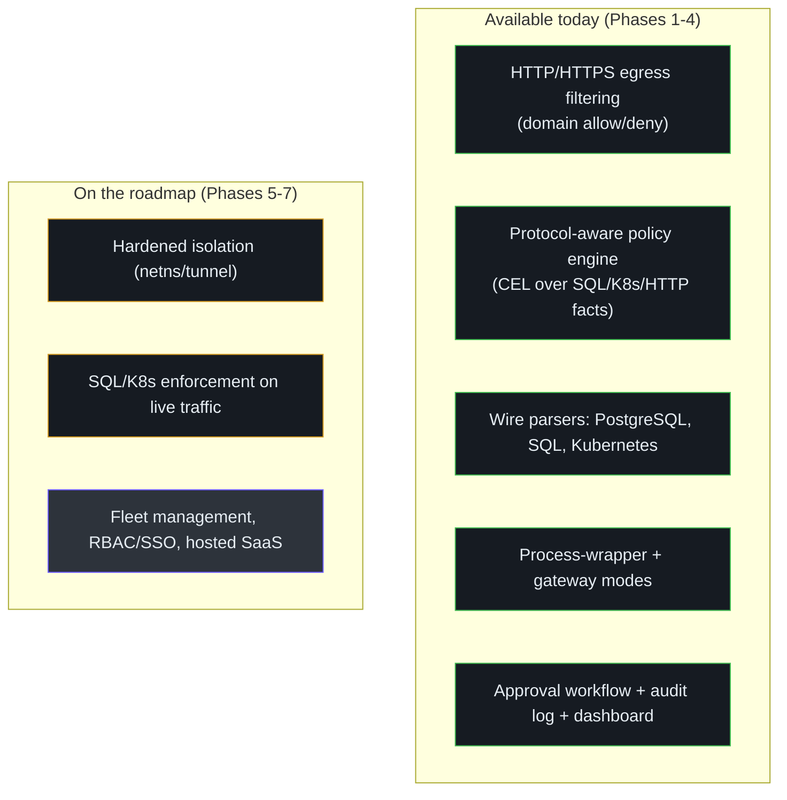
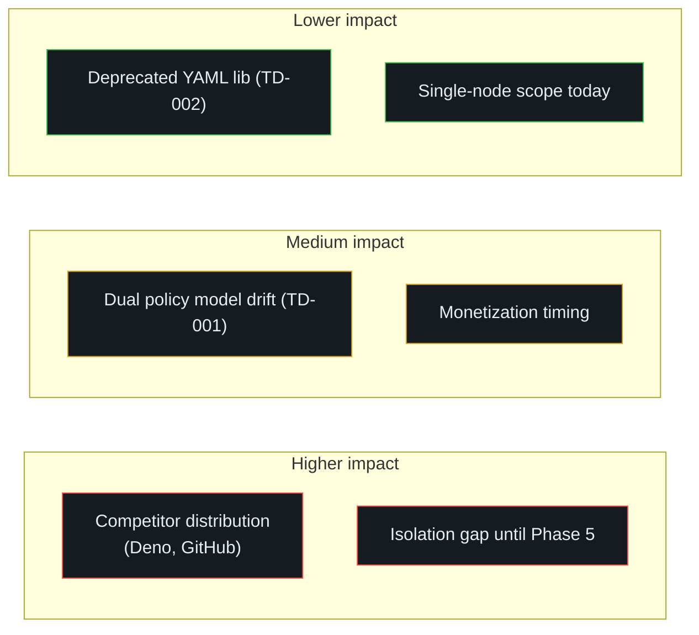
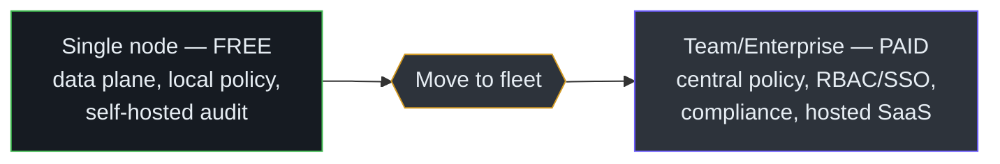

# Executive Guide

A briefing for VP/director-level engineering leaders evaluating Honmoon as a build, adopt, or
invest decision. No code — service-level view only. All claims are grounded in the repository's
own design docs and current state.

## What it is, in one paragraph

Honmoon is an **open-source security gateway for AI agents**: it sits between an agent (Claude
Code, an automated workflow) and the systems it can reach, and enforces a declarative policy on
every outbound connection — allow it, block it, or hold it for human approval. Its differentiator
is **protocol awareness**: beyond a domain allowlist, it inspects SQL, Kubernetes, and HTTP at the
wire level, so policy can say "never `DROP` the prod database" or "never delete a Kubernetes
secret," not merely "block this domain"
([product.md:6-29](https://github.com/pleaseai/honmoon/blob/main/.please/docs/knowledge/product.md#L6-L29)).

## The problem it addresses

AI agents now run shell commands, call APIs, and touch databases autonomously. A single bad
inference can exfiltrate data, run a destructive query, or delete production resources. Existing
controls are either too coarse (block all network) or too narrow (HTTP domain allowlists). Honmoon
targets the gap: fine-grained, protocol-aware enforcement at the network boundary
([product.md:13-18](https://github.com/pleaseai/honmoon/blob/main/.please/docs/knowledge/product.md#L13-L18)).

## Capability map

<!-- Sources: docs/roadmap.md:21-122, .please/docs/knowledge/product.md:20-29 -->

| Capability | Maturity | Notes |
|-----------|----------|-------|
| Egress domain filtering | working & tested | Enforces over HTTPS via a CONNECT proxy |
| Protocol policy engine (CEL) | working & tested | The differentiating moat |
| SQL / K8s parsing | working & tested | Not yet driven by live traffic (engineering follow-up) |
| Approval workflow + audit log + dashboard | working & tested (Phase 4) | `pause` holds a request for human approval; embedded dashboard |
| Hardened isolation | planned (Phase 5) | Today's wrapper is advisory, not enforcing |
| Fleet / enterprise / SaaS | planned (Phase 6-7) | The monetization surface |

## Maturity, honestly stated

This is an **early-stage project**, and its own guidelines forbid overstating it. About half of
the intended product is built: the policy engine, protocol parsers, and — as of Phase 4 — the
`pause` approval workflow, audit log, and management dashboard are all real, tested, and safe to
build on. Hardened isolation and live-traffic protocol enforcement remain roadmap
([product-guidelines.md:14-17](https://github.com/pleaseai/honmoon/blob/main/.please/docs/knowledge/product-guidelines.md#L14-L17)). Two gaps
materially affect "is it production-ready":

- **The single-process wrapper is advisory.** It routes a child's traffic by setting proxy
  environment variables; a process that ignores them bypasses the gateway. True enforcement
  (network-namespace isolation) is planned, not shipped.
- **Protocol rules are engine-validated, not yet traffic-driven.** The parsers are proven by
  tests; connecting them to live database/Kubernetes traffic is the next major data-plane effort.
  (Host-level `pause` rules over HTTPS *do* fire and hold today.)

The honest read: **adopt the gateway mode for HTTPS egress control + approvals + audit today;
treat live SQL/K8s enforcement and hardened isolation as near-future capabilities you can
influence, not yet deploy.**

## Risk assessment

<!-- Sources: docs/business-model.md:110-118, .please/docs/tracks/tech-debt-tracker.md:9-14 -->

| Risk | Severity | Mitigation in the plan |
|------|----------|------------------------|
| Competitors (Deno's clawpatrol, GitHub's gh-aw-firewall) have distribution | High | Differentiate on protocol awareness + self-host + unification ([business-model.md:77-90](https://github.com/pleaseai/honmoon/blob/main/docs/business-model.md#L77-L90)) |
| Process isolation is advisory until Phase 5 | High | Use gateway mode (not the wrapper) where enforcement matters; TD-003 prioritized High |
| Two hand-synced policy models can diverge | Medium | Generate both from JSON Schema (TD-001) |
| Building paid features before a team buyer exists | Medium | Phased strategy: adoption → team entry → monetization ([business-model.md:100-107](https://github.com/pleaseai/honmoon/blob/main/docs/business-model.md#L100-L107)) |

## Technology investment thesis

The architecture reflects a deliberate, defensible set of bets:

| Bet | Rationale | Leadership read |
|-----|-----------|-----------------|
| **Rust data plane** | Memory safety + performance for security-critical wire handling; single-binary deploy | Lower vuln surface; harder to staff than Go/TS |
| **Open-core** | Security buyers won't trust a black-box proxy; auditability *is* the product | Adoption-first; revenue deferred to fleet scale |
| **Protocol awareness** | The moat vs. commodity domain allowlists | The reason to choose this over incumbents |
| **Reversible framework choices** | Pingora decision was reversed cheaply mid-build | Engineering maturity signal; de-risks roadmap |

The open-core boundary is explicit and well-reasoned: the data plane stays 100% open source to
build trust; monetization begins where a customer moves from one node to operating a fleet —
central policy, compliance retention, approval routing, RBAC/SSO
([business-model.md:32-44](https://github.com/pleaseai/honmoon/blob/main/docs/business-model.md#L32-L44)).

## Cost & scaling model

<!-- Sources: docs/business-model.md:32-58, docs/roadmap.md:104-122 -->

- **Deployment unit:** a single self-hosted binary per host/container. No managed dependency
  required for the OSS core.
- **Hard constraint:** the wire-level core requires OS networking — it cannot run on serverless
  isolates (e.g. Cloudflare Workers can host only the egress filter + control plane)
  ([roadmap.md:137-144](https://github.com/pleaseai/honmoon/blob/main/docs/roadmap.md#L137-L144)). Budget for host/container infrastructure.
- **Monetization timing:** individual developers don't pay for security tools; the buyer is the
  platform/security team operating many agents. Revenue should follow team operation, not precede
  it ([business-model.md:94-98](https://github.com/pleaseai/honmoon/blob/main/docs/business-model.md#L94-L98)).

## Recommendations

| Horizon | Recommendation |
|---------|----------------|
| **Now** | Pilot **gateway mode** for HTTPS egress control of agent fleets. It is tested and enforcing. Avoid relying on the process-wrapper for hard isolation. |
| **Now** | Author protocol policies (SQL/K8s) against the engine to validate fit, knowing live-traffic enforcement is the next data-plane milestone (TD-006). |
| **Near-term** | If protocol-level enforcement is your driver, **fund/track TD-006 (live relay) and TD-003 (real isolation)** — they convert this from "promising engine" to "deployable control." |
| **Strategic** | The open-core thesis only works if the free core is generous. Resist pressure to gate the data plane; the moat and the trust both live there ([business-model.md:24-28](https://github.com/pleaseai/honmoon/blob/main/docs/business-model.md#L24-L28)). |

## Related Pages

- [Overview](/getting-started/overview) — the product in plain terms.
- [Roadmap & Open-Core Model](/deep-dive/roadmap-open-core) — phasing and the paid boundary.
- [Product Manager Guide](/onboarding/product-manager-guide) — user journeys and FAQ.
- [Staff Engineer Guide](/onboarding/staff-engineer-guide) — the architecture behind the thesis.

## References

- [.please/docs/knowledge/product.md](https://github.com/pleaseai/honmoon/blob/main/.please/docs/knowledge/product.md)
- [docs/business-model.md](https://github.com/pleaseai/honmoon/blob/main/docs/business-model.md)
- [docs/roadmap.md](https://github.com/pleaseai/honmoon/blob/main/docs/roadmap.md)
