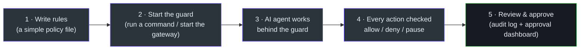
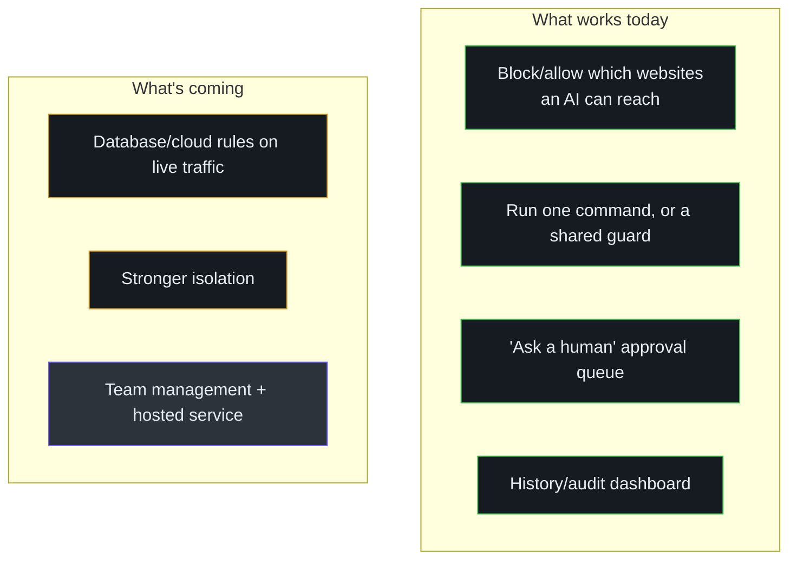

# Product Manager Guide

A plain-language guide for product managers and stakeholders. No engineering jargon. It explains
what Honmoon does for users, where they are in their journey, what it can and cannot do yet, and
how it handles data.

## What Honmoon is

Think of Honmoon as a **security checkpoint for AI assistants.** When an AI agent tries to reach
out to the internet, a database, or a cloud system, Honmoon checks that action against a set of
rules you wrote and decides one of three things:

- **Allow** — let it through.
- **Deny** — block it.
- **Pause** — hold it and ask a human to approve.

The rules are written in a simple, readable file. The product's standout feature is that it
understands *what kind* of action is being attempted — not just "which website," but "is this AI
trying to delete the production database?" ([Overview](/getting-started/overview)).

## Who it's for

| Audience | What they get | Source |
|----------|---------------|--------|
| **Platform / security teams** (the buyer) | Central control, audit, and approval over a fleet of AI agents | [product.md:31-37](https://github.com/pleaseai/honmoon/blob/master/.please/docs/knowledge/product.md#L31-L37) |
| **Individual developers / small teams** (the adopter) | A free, self-hosted guard for a single machine | [product.md:33-36](https://github.com/pleaseai/honmoon/blob/master/.please/docs/knowledge/product.md#L33-L36) |

The team that *pays* is the one that needs to manage many agents, prove compliance, and route
approvals. Individual developers get a strong free tool — that's deliberate.

## User journey

<!-- Sources: README.md:36-83, docs/roadmap.md:81-101 -->

All five steps work today (Phase 4). The gateway ships with a built-in dashboard for reviewing the
audit history and approving or rejecting held actions.

### A day-in-the-life example

> A developer uses an AI coding assistant that can run shell commands. They write a rule:
> "if the AI tries to reach a sensitive host, pause and ask me first."
> The AI, mid-task, attempts that connection. Honmoon catches it and **holds** the action; on the
> dashboard the developer sees it in the approval queue and clicks Approve or Deny — the held
> action then proceeds or is blocked accordingly. (For database/Kubernetes actions specifically,
> Honmoon's detection is built and tested, but connecting it to live traffic is the next step.)

## Feature capability map

<!-- Sources: docs/roadmap.md:32-122 -->

| Feature | Status | Plain meaning |
|---------|--------|---------------|
| Website allow/deny | works | Restrict where an AI can connect |
| "Pause for approval" | works | A flagged action is **held** until a human approves it (300s, else auto-deny) |
| Dashboard | works | Built-in screen to review activity and approve/deny requests |
| Audit log | works | Every decision recorded (optionally to a durable file) |
| Database / cloud rules | partly | Detection is built & tested; enforcing on **live** DB/cloud traffic is the next step |
| Team management | planned | Manage many machines and people centrally |

## Known limitations

Stated plainly, because honesty is a product principle for a security tool
([product-guidelines.md:14-17](https://github.com/pleaseai/honmoon/blob/master/.please/docs/knowledge/product-guidelines.md#L14-L17)):

| Limitation | What it means for users |
|-----------|--------------------------|
| Single-command mode is "advisory" | When guarding one command, a well-behaved AI tool is restricted, but a tool that *deliberately ignores standard settings* could slip past. The stronger, locked-down mode is planned. |
| Database/cloud rules aren't on live traffic yet | The brains that recognize a dangerous query are built and tested, but not yet connected to real live database/cloud traffic. That connection is the next big step. So the approval/hold works today for **website** rules; database/cloud holding waits on that step. |
| Approvals are single-node | The approval queue and dashboard run on one machine. Fleet-wide management, routing, and notifications are the (paid) roadmap. |
| Needs a real computer/server | It can't run on certain lightweight cloud-only platforms; it needs a normal host or container. |

## Data & privacy overview

This matters for positioning a security product:

| Question | Answer | Source |
|----------|--------|--------|
| Does it read the *content* of traffic? | No. It looks only at the minimum needed to make a decision (e.g. "this is a 'delete' on 'secrets'"), never the full message contents | [protocols.rs:7-8](https://github.com/pleaseai/honmoon/blob/master/crates/honmoon-core/src/protocols.rs#L7-L8), [product-guidelines.md:25-27](https://github.com/pleaseai/honmoon/blob/master/.please/docs/knowledge/product-guidelines.md#L25-L27) |
| Is the core open for inspection? | Yes — the part that inspects traffic is 100% open source, on purpose, so security teams can audit it | [business-model.md:12-18](https://github.com/pleaseai/honmoon/blob/master/docs/business-model.md#L12-L18) |
| Where does data live? | On your own machine/server (self-hosted). A hosted option is a future paid offering | [business-model.md:41-43](https://github.com/pleaseai/honmoon/blob/master/docs/business-model.md#L41-L43) |
| What happens if a rule is broken or missing? | It defaults to **blocking** — the safe choice — never to silently allowing | [product-guidelines.md:23-24](https://github.com/pleaseai/honmoon/blob/master/.please/docs/knowledge/product-guidelines.md#L23-L24) |

## FAQ

**Is this a replacement for a normal firewall?**
No. A normal firewall controls a whole network by address. Honmoon is purpose-built for AI agents
and understands the *actions* they take (which query, which cloud operation), not just addresses.

**Why is it free?**
The part that inspects your traffic is open source so you can trust it — security teams won't
adopt a "black box." The company plans to charge later for *team-scale* features (managing many
agents, compliance reports, approvals across an organization), not for the core
([business-model.md:24-28](https://github.com/pleaseai/honmoon/blob/master/docs/business-model.md#L24-L28)).

**Can I use it in production today?**
You can use the gateway mode now — website control, the audit log, and the approve/deny dashboard
all work on a single machine. For locked-down isolation and live database/cloud enforcement, plan
around the roadmap — those are the next milestones.

**Who are the competitors?**
Two open-source projects inspired Honmoon: GitHub's domain-filtering firewall and Deno's
protocol-aware gateway. Honmoon's pitch is to **unify both** — domain filtering *and* deep
protocol rules — and to be self-hostable ([README.md:201-206](https://github.com/pleaseai/honmoon/blob/master/README.md#L201-L206)).

**What does the name mean?**
"Honmoon" (혼문, 魂門) is a protective barrier from Korean lore — the barrier you raise between your
AI agents and your production systems ([README.md:19-23](https://github.com/pleaseai/honmoon/blob/master/README.md#L19-L23)).

## Related Pages

- [Overview](/getting-started/overview) — the product, slightly more technical.
- [Executive Guide](/onboarding/executive-guide) — capability, risk, and investment view.
- [Roadmap & Open-Core Model](/deep-dive/roadmap-open-core) — what ships when.

## References

- [README.md](https://github.com/pleaseai/honmoon/blob/master/README.md)
- [.please/docs/knowledge/product.md](https://github.com/pleaseai/honmoon/blob/master/.please/docs/knowledge/product.md)
- [docs/business-model.md](https://github.com/pleaseai/honmoon/blob/master/docs/business-model.md)
- [docs/roadmap.md](https://github.com/pleaseai/honmoon/blob/master/docs/roadmap.md)
