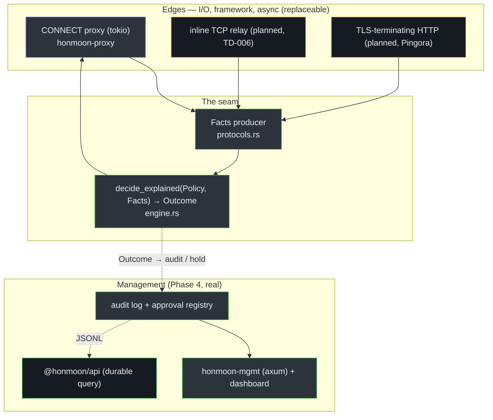

# Staff Engineer Guide

This is a dense briefing for engineers who will make architectural calls. It assumes you have
skimmed [Architecture](/deep-dive/architecture) and want the *why*, the tradeoffs, and the
decision log — not a tutorial.

## The one architectural insight

> **Honmoon's design is organized around a single seam: a transport-agnostic decision core
> (`honmoon-core`) that takes `Facts` and returns a `Verdict`, with every byte of I/O, protocol
> handling, and framework choice pushed to the edges around it.**

Everything else falls out of protecting that seam. The core has no `tokio`, no sockets, no async —
it is a pure function `(Policy, Facts) -> Verdict` plus the parsers that produce `Facts` from raw
bytes ([engine.rs:19-28](https://github.com/pleaseai/honmoon/blob/master/crates/honmoon-core/src/engine.rs#L19-L28), [lib.rs:1-4](https://github.com/pleaseai/honmoon/blob/master/crates/honmoon-core/src/lib.rs#L1-L4)).
This buys three properties that are otherwise expensive in a security product:

1. **Testability without infrastructure.** The entire policy semantics — egress precedence, CEL
   evaluation, fail-closed behavior, every parser edge case — is unit-tested with zero network,
   zero containers ([engine.rs:93-264](https://github.com/pleaseai/honmoon/blob/master/crates/honmoon-core/src/engine.rs#L93-L264)).
2. **Framework optionality.** Because the core doesn't know how bytes arrive, the team could
   reverse the Pingora decision mid-flight (ADR-0001 → ADR-0002) and ship raw tokio without
   touching a line of policy logic.
3. **Embeddability.** The same core can sit behind a CONNECT proxy today, an inline PostgreSQL
   relay tomorrow, or a TLS-terminating HTTP inspector later — each is just a different `Facts`
   producer.

If you internalize one thing: **protect the purity of `honmoon-core`.** A `tokio` import in that
crate is an architectural regression, not a convenience.

## System shape


<!-- Sources: ARCHITECTURE.md:30-49, crates/honmoon-core/src/engine.rs:38-53, crates/honmoon-mgmt/src/lib.rs:1-16 -->

## The decision core, as pseudocode

Expressed in Python to strip away Rust syntax — this *is* the policy semantics
([engine.rs:19-91](https://github.com/pleaseai/honmoon/blob/master/crates/honmoon-core/src/engine.rs#L19-L91)):

```python
def decide(policy, facts) -> Verdict:
    # Stage 1: protocol rules, in order. First match wins.
    for rule in policy.rules:
        if endpoint_matches(rule.endpoint, facts.endpoint) \
           and eval_cel(rule.condition, facts):   # any error => False
            return rule.verdict
    # Stage 2: egress lists. deny > allow > default(deny).
    if facts.domain:
        if any(matches_domain(p, facts.domain) for p in policy.egress.deny):
            return DENY
        if any(matches_domain(p, facts.domain) for p in policy.egress.allow):
            return ALLOW
    return policy.egress.default            # defaults to DENY

def eval_cel(condition, facts) -> bool:
    program = compile(condition)            # compile error => return False
    if program is None: return False
    ctx = {name: facts[name] for name in ("http","sql","k8s") if facts[name]}
    return run(program, ctx) is True        # non-bool / runtime error => not a match
```

The asymmetry is the point: **every failure path resolves to no-match, then falls through to
`egress.default`** — which is `deny` out of the box (and should stay that way in
security-sensitive policies). No malformed input *upgrades* a verdict past the egress default; a
policy that explicitly sets `egress.default: allow` is choosing to opt out of fail-closed.

## Design tradeoffs worth knowing

| Decision | Chosen | Rejected | Why | Cost accepted |
|----------|--------|----------|-----|---------------|
| Decision core coupling | Transport-agnostic pure fn | Proxy-embedded policy | Test + embed + framework optionality | Facts must be marshaled at the edge |
| Phase-1 proxy | Raw tokio CONNECT (~130 LOC) | Pingora framework | YAGNI; Pingora's CONNECT is proxy-chaining, not terminating | Two code paths long-term |
| Rule language | CEL | HCL, custom DSL | Rust+TS+Go impls → portable across planes | A CEL dependency + sandboxing semantics |
| SQL parsing | Verb/table heuristic | Full SQL grammar | Enough to gate dangerous verbs cheaply | Not a parser; won't model arbitrary SQL |
| Policy model | Duplicated Rust + TS (TD-001) | Single generated model | Each plane needs it natively *now* | Manual sync risk until schema-gen lands |
| Failure mode | Fail closed everywhere | Fail open on parse error | Security correctness | A buggy rule silently denies (needs observability) |
| `honmoon run` isolation | Env-var proxy (advisory) | netns/NetworkExtension now | Ship Phase 1 fast | Trivially bypassable until TD-003 |

The two rows that should shape *your* judgment when extending the system are **fail closed** and
**transport-agnostic core** — they are invariants, not preferences
([ARCHITECTURE.md:82-100](https://github.com/pleaseai/honmoon/blob/master/ARCHITECTURE.md#L82-L100)).

## The Pingora reversal — a model decision

ADR-0001 adopted Pingora on a documentation-derived premise. During Phase 1, that premise was
tested against the real Pingora 0.8.1 source and a prototype, and **disproven**: `HttpProxy` is
reverse-proxy oriented and `allow_connect_method_proxying` does proxy *chaining*, not terminating
tunnels. ADR-0002 reversed course to ~130 LOC of tokio and deferred the framework to the phase
that actually terminates TLS ([.please/docs/decisions/0002-phase1-connect-proxy-on-tokio.md:10-44](https://github.com/pleaseai/honmoon/blob/master/.please/docs/decisions/0002-phase1-connect-proxy-on-tokio.md#L10-L44)).

```mermaid
sequenceDiagram
  autonumber
  participant A as ADR-0001 (premise)
  participant P as Phase 1 prototype
  participant B as ADR-0002 (correction)
  A->>P: "Pingora CONNECT proxying = terminating forward proxy"
  P->>P: test against Pingora 0.8.1 source
  P-->>B: InvalidHTTPHeader — premise false
  B->>B: ship tokio CONNECT; defer Pingora to TLS phase (YAGNI)
```
<!-- Sources: .please/docs/decisions/0001-adopt-pingora-http-data-plane.md:1-12, .please/docs/decisions/0002-phase1-connect-proxy-on-tokio.md:10-44 -->

The transferable lesson: the transport-agnostic seam made a load-bearing framework decision
**cheaply reversible.** Architectures that make their biggest bets reversible age well.

## Where the bodies are buried

Be precise about maturity when you plan work ([tech-debt-tracker.md:9-14](https://github.com/pleaseai/honmoon/blob/master/.please/docs/tracks/tech-debt-tracker.md#L9-L14)):

| Reality | Implication for planning |
|---------|--------------------------|
| Parsers are engine-complete but **not on a live socket** (TD-006) | "SQL policy works" is true in the engine, false end-to-end. The next high-leverage data-plane task is the inline relay + per-endpoint listener config. This also gates SQL/K8s `pause` rules. |
| `honmoon run` is **advisory** (TD-003) | Do not market it as isolation. Real enforcement needs netns/NetworkExtension. |
| `pause` **now holds** (Phase 4), but only host-level rules fire | The approval registry + management API are real and tested. Over CONNECT only `http.host`-based pause rules see facts; SQL/K8s pause waits on TD-006. |
| HTTPS rules are **host-level only** (TD-004) | `http.method`/`path`/`body_size` need TLS termination. Don't write body rules expecting enforcement yet. |
| Two audit surfaces | The live in-memory ring (Rust `honmoon-mgmt`, can resolve approvals) vs the durable JSONL query layer (`@honmoon/api`, read-only). Don't conflate them. |

## Scaling & deployment model

The data plane is single-binary, single-node by design today. The open-core thesis is that this
stays free and powerful, and monetization begins at the **fleet** boundary — central policy,
RBAC/SSO, approval routing, compliance retention ([business-model.md:32-44](https://github.com/pleaseai/honmoon/blob/master/docs/business-model.md#L32-L44)).
A hard platform constraint shapes scope: the wire-level core needs OS networking, so it cannot run
on serverless isolates (Cloudflare Workers can host the egress filter + control plane only)
([roadmap.md:137-144](https://github.com/pleaseai/honmoon/blob/master/docs/roadmap.md#L137-L144)). Treat "must own a host/container"
as a fixed assumption, not a temporary gap.

## Decision log

| ADR / TD | Subject | Status | Pointer |
|----------|---------|--------|---------|
| ADR-0001 | Pingora for HTTP data plane | Superseded | [0001](https://github.com/pleaseai/honmoon/blob/master/.please/docs/decisions/0001-adopt-pingora-http-data-plane.md) |
| ADR-0002 | Tokio CONNECT proxy; defer Pingora | Accepted | [0002](https://github.com/pleaseai/honmoon/blob/master/.please/docs/decisions/0002-phase1-connect-proxy-on-tokio.md) |
| TD-001 | Dual policy model → schema-gen | Open (Med) | [tracker](https://github.com/pleaseai/honmoon/blob/master/.please/docs/tracks/tech-debt-tracker.md#L9) |
| TD-003 | Real network isolation for `run` | Open (High) | [tracker](https://github.com/pleaseai/honmoon/blob/master/.please/docs/tracks/tech-debt-tracker.md#L11) |
| TD-006 | Live relay feeding parsers | Open (High) | [tracker](https://github.com/pleaseai/honmoon/blob/master/.please/docs/tracks/tech-debt-tracker.md#L14) |
| — | CEL over HCL; Rust core + Bun control | Not yet an ADR | [ARCHITECTURE.md:139](https://github.com/pleaseai/honmoon/blob/master/ARCHITECTURE.md#L139) |

## What I'd watch

- **TD-001 drift.** The hand-synced model now spans the *runtime* types too (audit events,
  pending approvals), so the drift surface grew with Phase 4. Schema-generation should land before
  the policy/runtime shape grows further.
- **Fail-closed observability.** Fail-closed is correct but silent; a buggy CEL rule denies with
  only a `warn!`. The Phase 4 audit log now records every `Outcome` (verdict + rule), so silent
  denials are at least visible after the fact — wire alerting on top as rule sets grow.
- **The two-path proxy.** When the TLS-inspection phase lands, resist letting the framework leak
  toward the core. The CONNECT tunnel and the inspected-HTTP path should remain distinct `Facts`
  producers feeding one `decide()`.

## Related Pages

- [Architecture](/deep-dive/architecture) · [Policy Engine](/deep-dive/policy-engine) · [Egress Gateway](/deep-dive/egress-gateway)
- [Roadmap & Open-Core Model](/deep-dive/roadmap-open-core) — phasing and the paid boundary.
- [Executive Guide](/onboarding/executive-guide) — the same system at the investment level.

## References

- [ARCHITECTURE.md](https://github.com/pleaseai/honmoon/blob/master/ARCHITECTURE.md)
- [.please/docs/decisions/0002-phase1-connect-proxy-on-tokio.md](https://github.com/pleaseai/honmoon/blob/master/.please/docs/decisions/0002-phase1-connect-proxy-on-tokio.md)
- [docs/business-model.md](https://github.com/pleaseai/honmoon/blob/master/docs/business-model.md)
- [.please/docs/tracks/tech-debt-tracker.md](https://github.com/pleaseai/honmoon/blob/master/.please/docs/tracks/tech-debt-tracker.md)
