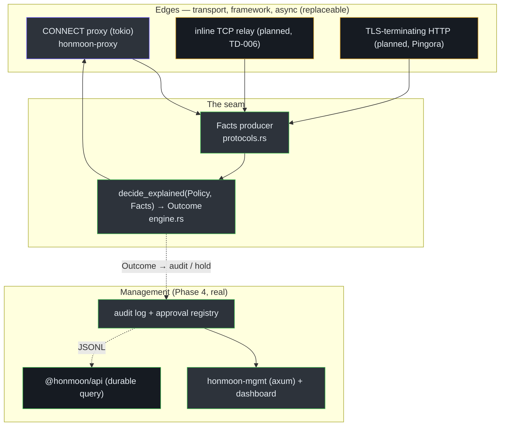

# Staff Engineer Guide

This is a dense briefing for engineers who will make architectural calls. It assumes you have
skimmed [Architecture](/deep-dive/architecture) and want the *why*, the tradeoffs, and the
decision log — not a tutorial.

## The one architectural insight

> **Honmoon's design is organized around a single seam: a transport-agnostic decision core
> (`honmoon-core`) that takes `Facts` and returns a `Verdict`, with the transport, the protocol
> handling, and the framework choice pushed to the edges around it.**

Everything else falls out of protecting that seam. The core has no `tokio`, no sockets, no async
runtime and no network client: the decision is a function `(Policy, Facts) -> Verdict`, and the
parsers that produce `Facts` are functions over raw bytes
([engine.rs:19-28](https://github.com/pleaseai/honmoon/blob/main/crates/honmoon-core/src/engine.rs#L19-L28), [lib.rs:1-11](https://github.com/pleaseai/honmoon/blob/main/crates/honmoon-core/src/lib.rs#L1-L11)).
The core does not know how the bytes reached it and has no way to find out. That buys three
properties which are otherwise expensive in a security product:

1. **Testability without infrastructure.** The entire policy semantics — egress precedence, CEL
   evaluation, fail-closed behavior, every parser edge case — is unit-tested with zero network,
   zero containers ([engine.rs:93-264](https://github.com/pleaseai/honmoon/blob/main/crates/honmoon-core/src/engine.rs#L93-L264)).
2. **Framework optionality.** Because the core doesn't know how bytes arrive, the team could
   reverse the Pingora decision mid-flight (ADR-0001 → ADR-0002) and ship raw tokio without
   touching a line of policy logic.
3. **Embeddability.** The same core can sit behind a CONNECT proxy today, an inline PostgreSQL
   relay tomorrow, or a TLS-terminating HTTP inspector later — each is just a different `Facts`
   producer.

### The seam is about transport, not purity

It is tempting to compress all of that to "`honmoon-core` is pure", and the compression is wrong in
a way that costs something. The core opens exactly one file: the operator's JSONL audit sink, in
`audit.rs`. It has done so since the sink existed, and
[issue #166](https://github.com/pleaseai/honmoon/issues/166) settled that it should — after the
crate's own boundary document had claimed the opposite for some time.

The reasoning is worth carrying, because this is the kind of call you will be asked to re-open.
`append_jsonl` writes synchronously on the decision path, which makes *what the descriptor turns
out to be* a correctness property of `AuditLog` itself rather than of whoever constructed it. A
FIFO where a regular file was expected blocks the short-lived `honmoon hook` process until the
agent times out — after which the invocation proceeds redacted by nothing at all. A path reached
through another user's symlink sends every record written through that descriptor — host, SQL
table, PII category — somewhere that user reads. So on Unix the open is hardened: `O_NOFOLLOW`, a
component-by-component `openat` walk, a trusted-directory rule, `O_NONBLOCK`, and a regular-file
`fstat` taken on the descriptor the walk already holds
([audit.rs:551-583](https://github.com/pleaseai/honmoon/blob/main/crates/honmoon-core/src/audit.rs#L551-L583)). The type whose own
correctness depends on all of that is the type that should establish it; handing `AuditLog` an
already-open `File` would turn a guarantee into a convention every caller has to remember
([audit.rs:416-426](https://github.com/pleaseai/honmoon/blob/main/crates/honmoon-core/src/audit.rs#L416-L426)).

Stated no more strongly than it is true, because a staff engineer is who gets asked whether a given
audit path is safe:

- <span class="status-caveat">Descriptor-scoped</span> — what the `fstat` settles (regular file,
  mode, owner, link count) is a property of the object `AuditLog` ends up holding. The walk's trust
  decisions are not purely that. For a **relative** path the walk's root is the process's own
  working directory, opened as `.` with no trust test of its own, and the trusted-directory rule
  reads the process's effective uid — so one path can be accepted under one caller and refused
  under another ([crates/AGENTS.md](https://github.com/pleaseai/honmoon/blob/main/crates/AGENTS.md)).
- <span class="status-caveat">Open gap</span> — the trusted-directory rule's Linux arm assumes
  POSIX.1e, so an NFSv4 ACL (an NFS mount, or OpenZFS with `acltype=nfsv4`) reports a mode that
  approximates the ACL rather than bounding it, and the directory reads as trusted. That is the
  blindness [#181](https://github.com/pleaseai/honmoon/issues/181) closed on macOS, still open on
  Linux as [#215](https://github.com/pleaseai/honmoon/issues/215).
- <span class="status-caveat">Unix only</span> — the `cfg(not(unix))` arm has neither `O_NOFOLLOW`
  nor `openat`, so the regular-file check is all that applies there, and none of the
  `audit-sink-*` degradation events fire
  ([audit.rs:899-909](https://github.com/pleaseai/honmoon/blob/main/crates/honmoon-core/src/audit.rs#L899-L909)). No shipped artifact takes
  that arm — the release matrix is Linux and macOS — but the crate compiles for it.

None of that moves the decision about where the open lives; it is what a review of a *change* to
the open has to hold against.

That makes the real rule sharper than "no I/O", and the sharper version is the one to review
against:

- **Never** an async runtime, a socket, a network client, an environment read, a spawned process,
  or a *second* open file. A new file the crate wants to own is a new decision; the sink's
  precedent does not grant it.
- **Never** a second way to populate the sink. A constructor or setter assigning `AuditLog`'s sink
  from a descriptor that `open_sink` did not produce adds no dependency, opens no second file and
  reads no environment — it satisfies every clause above while bypassing the entire hardening at
  once, in a diff that reads as a layering cleanup. Watch for this one precisely because a list of
  forbidden capabilities does not catch it
  ([audit.rs:380-388](https://github.com/pleaseai/honmoon/blob/main/crates/honmoon-core/src/audit.rs#L380-L388)).

So: a `tokio` import in that crate is an architectural regression rather than a convenience, and
`crates/honmoon-core/tests/crate_boundary.rs` fails the build if the crate's dependency set moves.
Know what that check reaches, though, or it will stop you looking. It covers what genuinely needs
a new crate — an async runtime, an HTTP client such as `hyper` or `reqwest`. A socket does not:
`std::net` is in the standard library, and the `libc` already present for the sink open exposes
`socket`, `connect` and `bind`. Neither does an environment read, a spawned process, or a second
file. The manifest does not move for any of them and the test stays green
([crate_boundary.rs:1-21](https://github.com/pleaseai/honmoon/blob/main/crates/honmoon-core/tests/crate_boundary.rs#L1-L21)). Those halves
of the rule are held by review, which is to say by you. `crates/AGENTS.md` states the boundary in
full ([crates/AGENTS.md](https://github.com/pleaseai/honmoon/blob/main/crates/AGENTS.md)).

## System shape


```mermaid
flowchart TB
  subgraph edge["Edges — transport, framework, async (replaceable)"]
    connect["CONNECT proxy (tokio)<br>honmoon-proxy"]
    relay["inline TCP relay (planned, TD-006)"]
    tls["TLS-terminating HTTP (planned, Pingora)"]
  end
  subgraph seam["The seam"]
    facts["Facts producer<br>protocols.rs"]
    decide["decide_explained(Policy, Facts) → Outcome<br>engine.rs"]
  end
  subgraph mgmt["Management (Phase 4, real)"]
    audit["audit log + approval registry"]
    api["honmoon-mgmt (axum) + dashboard"]
    tapi["@honmoon/api (durable query)"]
  end
  connect --> facts
  relay --> facts
  tls --> facts
  facts --> decide
  decide --> connect
  decide -. "Outcome → audit / hold" .-> audit
  audit --> api
  audit -. "JSONL" .-> tapi
  style connect fill:#2d333b,stroke:#6d5dfc,color:#e6edf3
  style relay fill:#161b22,stroke:#d29922,color:#e6edf3
  style tls fill:#161b22,stroke:#d29922,color:#e6edf3
  style facts fill:#2d333b,stroke:#3fb950,color:#e6edf3
  style decide fill:#2d333b,stroke:#3fb950,color:#e6edf3
  style audit fill:#2d333b,stroke:#3fb950,color:#e6edf3
  style api fill:#2d333b,stroke:#3fb950,color:#e6edf3
  style tapi fill:#161b22,stroke:#3fb950,color:#e6edf3
```
<!-- Sources: ARCHITECTURE.md:30-49, crates/honmoon-core/src/engine.rs:38-53, crates/honmoon-mgmt/src/lib.rs:1-16 -->

## The decision core, as pseudocode

Expressed in Python to strip away Rust syntax — this *is* the policy semantics
([engine.rs:19-91](https://github.com/pleaseai/honmoon/blob/main/crates/honmoon-core/src/engine.rs#L19-L91)):

```python
def decide(policy, facts) -> Verdict:
    # Stage 1: protocol rules, in order. First match wins.
    for rule in policy.rules:
        if endpoint_matches(rule.endpoint, facts.endpoint) \
           and eval_cel(rule.condition, facts):   # any error => False
            return rule.verdict
    # Stage 2: egress lists. deny > allow > default(deny).
    if facts.domain:
        if any(matches_domain(p, facts.domain) for p in policy.egress.deny):
            return DENY
        if any(matches_domain(p, facts.domain) for p in policy.egress.allow):
            return ALLOW
    return policy.egress.default            # defaults to DENY

def eval_cel(condition, facts) -> bool:
    program = compile(condition)            # compile error => return False
    if program is None: return False
    ctx = {name: facts[name] for name in ("http","sql","k8s") if facts[name]}
    return run(program, ctx) is True        # non-bool / runtime error => not a match
```

The asymmetry is the point: **every failure path resolves to no-match, then falls through to
`egress.default`** — which is `deny` out of the box (and should stay that way in
security-sensitive policies). No malformed input *upgrades* a verdict past the egress default; a
policy that explicitly sets `egress.default: allow` is choosing to opt out of fail-closed.

## Design tradeoffs worth knowing

| Decision | Chosen | Rejected | Why | Cost accepted |
|----------|--------|----------|-----|---------------|
| Decision core coupling | Transport-agnostic pure fn | Proxy-embedded policy | Test + embed + framework optionality | Facts must be marshaled at the edge |
| Phase-1 proxy | Raw tokio CONNECT (~130 LOC) | Pingora framework | YAGNI; Pingora's CONNECT is proxy-chaining, not terminating | Two code paths long-term |
| Rule language | CEL | HCL, custom DSL | Rust+TS+Go impls → portable across planes | A CEL dependency + sandboxing semantics |
| SQL parsing | Verb/table heuristic | Full SQL grammar | Enough to gate dangerous verbs cheaply | Not a parser; won't model arbitrary SQL |
| Policy model | Duplicated Rust + TS (TD-001) | Single generated model | Each plane needs it natively *now* | Manual sync risk until schema-gen lands |
| Failure mode | Fail closed everywhere | Fail open on parse error | Security correctness | A buggy rule silently denies (needs observability) |
| `honmoon run` isolation | Empty user+network namespace on Linux, Seatbelt profile on macOS (ADR-0005); env-var proxy elsewhere | Every platform hardened at once; a macOS `NETransparentProxyProvider` system extension | Ship Phase 1 fast, then harden the platforms agents actually run on — `sandbox-exec` needs no entitlement, signing or notarization | Advisory on other platforms; root/`CAP_SYS_ADMIN` escapes; fails open where the namespace is refused or the profile stops compiling; `sandbox-exec` is deprecated by Apple |

The two rows that should shape *your* judgment when extending the system are **fail closed** and
**transport-agnostic core** — they are invariants, not preferences
([ARCHITECTURE.md:89-113](https://github.com/pleaseai/honmoon/blob/main/ARCHITECTURE.md#L89-L113)).

## The Pingora reversal — a model decision

ADR-0001 adopted Pingora on a documentation-derived premise. During Phase 1, that premise was
tested against the real Pingora 0.8.1 source and a prototype, and **disproven**: `HttpProxy` is
reverse-proxy oriented and `allow_connect_method_proxying` does proxy *chaining*, not terminating
tunnels. ADR-0002 reversed course to ~130 LOC of tokio and deferred the framework to the phase
that actually terminates TLS ([.please/docs/decisions/0002-phase1-connect-proxy-on-tokio.md:10-44](https://github.com/pleaseai/honmoon/blob/main/.please/docs/decisions/0002-phase1-connect-proxy-on-tokio.md#L10-L44)).

```mermaid
sequenceDiagram
  autonumber
  participant A as ADR-0001 (premise)
  participant P as Phase 1 prototype
  participant B as ADR-0002 (correction)
  A->>P: "Pingora CONNECT proxying = terminating forward proxy"
  P->>P: test against Pingora 0.8.1 source
  P-->>B: InvalidHTTPHeader — premise false
  B->>B: ship tokio CONNECT; defer Pingora to TLS phase (YAGNI)
```
<!-- Sources: .please/docs/decisions/0001-adopt-pingora-http-data-plane.md:1-12, .please/docs/decisions/0002-phase1-connect-proxy-on-tokio.md:10-44 -->

The transferable lesson: the transport-agnostic seam made a load-bearing framework decision
**cheaply reversible.** Architectures that make their biggest bets reversible age well.

## Where the bodies are buried

Be precise about maturity when you plan work ([tech-debt-tracker.md:9-14](https://github.com/pleaseai/honmoon/blob/main/.please/docs/tracks/tech-debt-tracker.md#L9-L14)):

| Reality | Implication for planning |
|---------|--------------------------|
| Parsers are engine-complete but **not on a live socket** (TD-006) | "SQL policy works" is true in the engine, false end-to-end. The next high-leverage data-plane task is the inline relay + per-endpoint listener config. This also gates SQL/K8s `pause` rules. |
| `honmoon run` **enforces on Linux and macOS, is advisory elsewhere** (TD-003) | Call it isolation only for an unprivileged child on those two. root/`CAP_SYS_ADMIN`/passwordless `sudo` still escape, neither mechanism touches the filesystem (so Unix sockets living there stay reachable), and `run` fails open to advisory where the namespace is refused — the default Docker seccomp profile blocks `unshare(CLONE_NEWUSER)`, so containerized agents get the advisory path — or where the Seatbelt profile stops compiling. |
| `pause` **now holds** (Phase 4), but only host-level rules fire | The approval registry + management API are real and tested. Over CONNECT only `http.host`-based pause rules see facts; SQL/K8s pause waits on TD-006. |
| HTTPS rules are **host-level only** (TD-004) | `http.method`/`path`/`body_size` need TLS termination. Don't write body rules expecting enforcement yet. |
| Two audit surfaces | The live in-memory ring (Rust `honmoon-mgmt`, can resolve approvals) vs the durable JSONL query layer (`@honmoon/api`, read-only). Don't conflate them. |

## Scaling & deployment model

The data plane is single-binary, single-node by design today. The open-core thesis is that this
stays free and powerful, and monetization begins at the **fleet** boundary — central policy,
RBAC/SSO, approval routing, compliance retention ([business-model.md:32-44](https://github.com/pleaseai/honmoon/blob/main/docs/business-model.md#L32-L44)).
A hard platform constraint shapes scope: the wire-level core needs OS networking, so it cannot run
on serverless isolates (Cloudflare Workers can host the egress filter + control plane only)
([roadmap.md:137-144](https://github.com/pleaseai/honmoon/blob/main/docs/roadmap.md#L137-L144)). Treat "must own a host/container"
as a fixed assumption, not a temporary gap.

## Decision log

| ADR / TD | Subject | Status | Pointer |
|----------|---------|--------|---------|
| ADR-0001 | Pingora for HTTP data plane | Superseded | [0001](https://github.com/pleaseai/honmoon/blob/main/.please/docs/decisions/0001-adopt-pingora-http-data-plane.md) |
| ADR-0002 | Tokio CONNECT proxy; defer Pingora | Accepted | [0002](https://github.com/pleaseai/honmoon/blob/main/.please/docs/decisions/0002-phase1-connect-proxy-on-tokio.md) |
| ADR-0005 | Empty namespace + bridged proxy sockets for `run` | Accepted | [0005](https://github.com/pleaseai/honmoon/blob/main/.please/docs/decisions/0005-empty-namespace-and-bridged-proxy-sockets.md) |
| TD-001 | Dual policy model → schema-gen | Open (Med) | [tracker](https://github.com/pleaseai/honmoon/blob/main/.please/docs/tracks/tech-debt-tracker.md#L9) |
| TD-003 | Real network isolation for `run` | Open (Medium) — Linux and macOS done for an unprivileged child; other platforms + privileged/fail-open remain | [tracker](https://github.com/pleaseai/honmoon/blob/main/.please/docs/tracks/tech-debt-tracker.md#L11) |
| TD-006 | Live relay feeding parsers | Open (High) | [tracker](https://github.com/pleaseai/honmoon/blob/main/.please/docs/tracks/tech-debt-tracker.md#L14) |
| — | CEL over HCL; Rust core + Bun control | Not yet an ADR | [ARCHITECTURE.md:139](https://github.com/pleaseai/honmoon/blob/main/ARCHITECTURE.md#L139) |

## What I'd watch

- **TD-001 drift.** The hand-synced model now spans the *runtime* types too (audit events,
  pending approvals), so the drift surface grew with Phase 4. Schema-generation should land before
  the policy/runtime shape grows further.
- **Fail-closed observability.** Fail-closed is correct but silent; a buggy CEL rule denies with
  only a `warn!`. The Phase 4 audit log now records every `Outcome` (verdict + rule), so silent
  denials are at least visible after the fact — wire alerting on top as rule sets grow.
- **The two-path proxy.** When the TLS-inspection phase lands, resist letting the framework leak
  toward the core. The CONNECT tunnel and the inspected-HTTP path should remain distinct `Facts`
  producers feeding one `decide()`.

## Related Pages

- [Architecture](/deep-dive/architecture) · [Policy Engine](/deep-dive/policy-engine) · [Egress Gateway](/deep-dive/egress-gateway)
- [Roadmap & Open-Core Model](/deep-dive/roadmap-open-core) — phasing and the paid boundary.
- [Executive Guide](/onboarding/executive-guide) — the same system at the investment level.

## References

- [ARCHITECTURE.md](https://github.com/pleaseai/honmoon/blob/main/ARCHITECTURE.md)
- [.please/docs/decisions/0002-phase1-connect-proxy-on-tokio.md](https://github.com/pleaseai/honmoon/blob/main/.please/docs/decisions/0002-phase1-connect-proxy-on-tokio.md)
- [docs/business-model.md](https://github.com/pleaseai/honmoon/blob/main/docs/business-model.md)
- [.please/docs/tracks/tech-debt-tracker.md](https://github.com/pleaseai/honmoon/blob/main/.please/docs/tracks/tech-debt-tracker.md)
